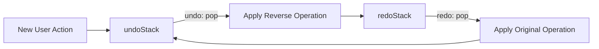
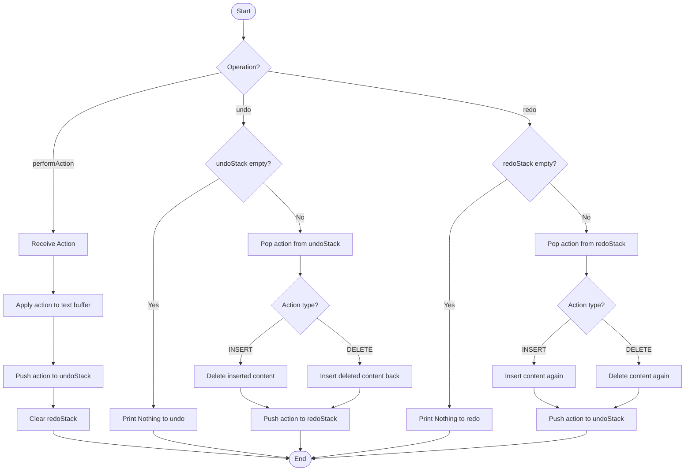
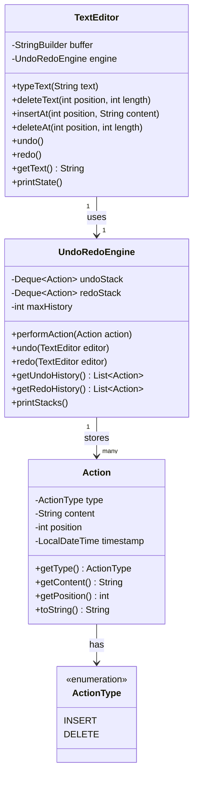
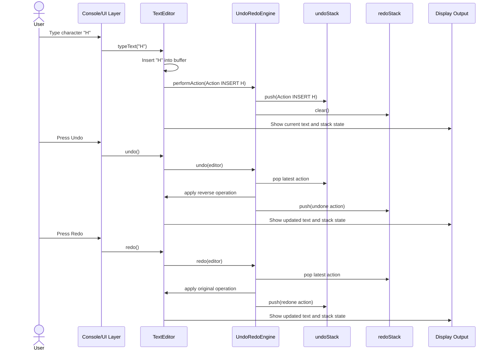

# CSD201 Project Planning — Undo/Redo Engine for Text Editors

## Lời mở đầu

Chào cả nhóm! Đây là tài liệu lập kế hoạch đầy đủ cho project CSD201 với chủ đề **Undo/Redo Engine for Text Editors**. Mục tiêu của project không chỉ là viết được chương trình chạy đúng, mà còn là chứng minh rằng nhóm hiểu rõ cách dùng **Stack** để giải quyết một bài toán thực tế giống như cơ chế Undo/Redo trong Microsoft Word, VS Code hoặc Google Docs.

Project này rất phù hợp với môn Data Structures & Algorithms vì nó biến một cấu trúc dữ liệu tưởng như đơn giản — **Stack** — thành một chức năng quen thuộc mà ai cũng dùng hằng ngày. Nếu nhóm làm tốt phần phân tích, thiết kế, code, test và báo cáo, đây sẽ là một project rất thuyết phục.

---

# STEP 1 — CT Analysis: Computational Thinking Breakdown

Computational Thinking gồm 4 trụ cột chính:

1. **Decomposition** — Chia nhỏ vấn đề.
2. **Pattern Recognition** — Nhận diện mẫu lặp lại.
3. **Abstraction** — Trừu tượng hóa phần quan trọng.
4. **Algorithm Design** — Thiết kế thuật toán từng bước.

Trong project này, nhóm nên trình bày CT như “xương sống” của toàn bộ quá trình phân tích.

---

## 1.1 Decomposition — Chia nhỏ bài toán Undo/Redo Engine

Bài toán lớn: xây dựng một engine mô phỏng Undo/Redo cho text editor.

Ta chia thành các thành phần nhỏ hơn như sau:

### A. Text Buffer

Đây là nơi lưu nội dung hiện tại của editor.

Ví dụ:

```text
Current text: "Hel"
```

Text buffer cần hỗ trợ các thao tác cơ bản:

- Thêm ký tự hoặc chuỗi tại một vị trí.
- Xóa ký tự hoặc chuỗi tại một vị trí.
- Hiển thị nội dung hiện tại.

Trong phiên bản đơn giản cho CSD201, nhóm có thể dùng `StringBuilder` trong Java hoặc `list/string` trong Python để lưu text.

---

### B. Action / Command

Mỗi thao tác có thể undo/redo được sẽ được lưu thành một object gọi là `Action` hoặc `Command`.

Một action cần trả lời được các câu hỏi:

- Loại thao tác là gì? `INSERT` hay `DELETE`?
- Nội dung bị thêm/xóa là gì?
- Vị trí xảy ra thao tác ở đâu?
- Thời điểm thao tác xảy ra khi nào?

Ví dụ:

```text
Action(type=INSERT, content="H", position=0)
Action(type=DELETE, content="e", position=1)
```

---

### C. Undo Stack

`undoStack` lưu các action đã thực hiện.

Khi người dùng làm một thao tác mới:

```text
Type "H" → push Action(INSERT, "H", 0) vào undoStack
```

Khi undo:

```text
pop action mới nhất từ undoStack
đảo ngược action đó
push action đó sang redoStack
```

---

### D. Redo Stack

`redoStack` lưu các action vừa bị undo và có thể redo lại.

Khi redo:

```text
pop action mới nhất từ redoStack
thực hiện lại action đó
push action đó về undoStack
```

Nếu người dùng undo xong nhưng lại thực hiện một action mới, redoStack phải bị xóa vì lịch sử redo cũ không còn hợp lệ.

Ví dụ:

```text
Type H, Type e, Undo, Type a
```

Sau khi `Type a`, thao tác redo cho `e` không còn hợp lệ nữa.

---

### E. Engine Logic

`UndoRedoEngine` là bộ não quản lý hai stack.

Nhiệm vụ chính:

- Nhận action mới.
- Push action vào undoStack.
- Clear redoStack khi có action mới.
- Undo action mới nhất.
- Redo action mới nhất.
- Cung cấp lịch sử thao tác để hiển thị/debug.

---

### F. User Interface / Simulation Layer

Với project CSD201, nhóm không cần làm GUI phức tạp. Một console simulation là đủ nếu trình bày rõ.

Simulation có thể gồm các lựa chọn:

```text
1. Type text
2. Delete character
3. Undo
4. Redo
5. Show text
6. Show stacks
0. Exit
```

Hoặc demo tự động:

```text
Type H
Type e
Type l
Type l
Type o
Undo
Undo
Redo
Type !
```

---

## 1.2 Pattern Recognition — Nhận diện mẫu từ editor thực tế

Các editor như Microsoft Word, VS Code, Notepad++, Google Docs đều có hành vi Undo/Redo tương tự.

### Pattern 1: Thao tác mới nhất được undo trước

Đây chính là nguyên tắc **Last In, First Out — LIFO** của Stack.

Ví dụ người dùng gõ:

```text
H → e → l → l → o
```

Nếu bấm Undo, ký tự bị hủy đầu tiên là `o`, sau đó là `l`, sau đó là `l`, rồi `e`, rồi `H`.

Thứ tự undo:

```text
o → l → l → e → H
```

Đây là lý do Stack phù hợp tự nhiên với Undo.

---

### Pattern 2: Redo chỉ có sau Undo

Trong editor thật, nút Redo chỉ hoạt động sau khi người dùng đã Undo.

Nếu chưa undo gì, redoStack rỗng:

```text
Redo unavailable
```

Điều này map trực tiếp sang Stack:

```text
redoStack.isEmpty() == true
```

---

### Pattern 3: Action mới sau Undo sẽ xóa Redo history

Trong VS Code hoặc Word:

1. Gõ `Hello`.
2. Undo thành `Hell`.
3. Gõ `!`.
4. Không thể Redo lại `o` nữa.

Vì người dùng đã tạo một nhánh lịch sử mới.

Trong project:

```text
performAction(newAction):
    undoStack.push(newAction)
    redoStack.clear()
```

---

### Pattern 4: Undo và Redo là hai thao tác đối xứng

Nếu action gốc là `INSERT`, undo của nó là xóa nội dung đó.

Nếu action gốc là `DELETE`, undo của nó là chèn lại nội dung đã xóa.

Bảng đối xứng:

| Action gốc | Undo sẽ làm gì? | Redo sẽ làm gì? |
|---|---|---|
| INSERT | DELETE cùng content tại cùng position | INSERT lại content |
| DELETE | INSERT lại content tại cùng position | DELETE lại content |

---

## 1.3 Abstraction — Trừu tượng hóa dữ liệu cần lưu

Trong project, ta không cần mô phỏng toàn bộ Microsoft Word. Ta chỉ cần lưu những gì đủ để undo/redo chính xác.

### Cần lưu

Mỗi action nên có:

| Field | Ý nghĩa | Ví dụ |
|---|---|---|
| `type` | Loại thao tác | `INSERT`, `DELETE` |
| `content` | Ký tự/chuỗi được thêm hoặc xóa | `"H"`, `"abc"` |
| `position` | Vị trí trong text buffer | `0`, `3`, `5` |
| `timestamp` | Thời điểm thao tác xảy ra | `2026-05-23T10:30:00` |

### Có thể bỏ qua

Để project vừa sức CSD201, nhóm có thể bỏ qua:

- Font chữ.
- Màu chữ.
- Căn lề.
- Copy/paste phức tạp.
- Multi-cursor như VS Code.
- Undo theo group nhiều ký tự.
- File saving/loading.
- Collaboration nhiều người cùng edit.

### Lý do abstraction như vậy là hợp lý

Vì yêu cầu chính của đề tài là mô phỏng Undo/Redo bằng Stack. Nếu nhóm thêm quá nhiều tính năng phụ, project dễ bị rối, khó test, và có thể làm mờ trọng tâm data structure.

Cách tốt nhất là:

```text
Focus on correctness first, polish second.
```

---

## 1.4 Algorithm Design — Thiết kế thuật toán bằng ngôn ngữ tự nhiên

Phần này nên viết trước khi code. Khi thuật toán rõ, code sẽ dễ hơn rất nhiều.

---

### A. Type Character / Insert Text

Khi người dùng gõ một ký tự hoặc một chuỗi:

1. Xác định nội dung cần chèn.
2. Xác định vị trí chèn trong text buffer.
3. Chèn nội dung vào text buffer.
4. Tạo một `Action` có type là `INSERT`.
5. Lưu content, position, timestamp vào action.
6. Push action vào `undoStack`.
7. Xóa toàn bộ `redoStack` vì action mới làm redo history cũ không còn hợp lệ.
8. Hiển thị text hiện tại và trạng thái stack.

Ví dụ:

```text
Current text: "H"
User types "e" at position 1
New text: "He"
undoStack: [INSERT H, INSERT e]
redoStack: []
```

---

### B. Delete Character / Delete Text

Khi người dùng xóa một ký tự hoặc chuỗi:

1. Kiểm tra vị trí xóa có hợp lệ không.
2. Lấy nội dung sắp bị xóa để lưu lại.
3. Xóa nội dung khỏi text buffer.
4. Tạo một `Action` có type là `DELETE`.
5. Lưu content đã bị xóa, position, timestamp.
6. Push action vào `undoStack`.
7. Clear `redoStack`.
8. Hiển thị text và stack state.

Ví dụ:

```text
Current text: "Hello"
Delete character at position 4: "o"
New text: "Hell"
undoStack: [..., DELETE o]
redoStack: []
```

---

### C. Undo

Khi người dùng bấm Undo:

1. Kiểm tra `undoStack` có rỗng không.
2. Nếu rỗng, báo: “Nothing to undo”.
3. Nếu không rỗng, pop action mới nhất từ `undoStack`.
4. Nếu action là `INSERT`, xóa content đó khỏi text buffer tại position đã lưu.
5. Nếu action là `DELETE`, chèn lại content đó vào text buffer tại position đã lưu.
6. Push action vừa undo sang `redoStack`.
7. Hiển thị text và stack state.

Ví dụ:

```text
Text: "Hel"
undoStack top: INSERT l at position 2
Undo → delete "l" at position 2
Text becomes: "He"
Move action to redoStack
```

---

### D. Redo

Khi người dùng bấm Redo:

1. Kiểm tra `redoStack` có rỗng không.
2. Nếu rỗng, báo: “Nothing to redo”.
3. Nếu không rỗng, pop action mới nhất từ `redoStack`.
4. Nếu action là `INSERT`, chèn lại content vào text buffer tại position đã lưu.
5. Nếu action là `DELETE`, xóa lại content khỏi text buffer tại position đã lưu.
6. Push action vừa redo về `undoStack`.
7. Hiển thị text và stack state.

Ví dụ:

```text
Text: "He"
redoStack top: INSERT l at position 2
Redo → insert "l" at position 2
Text becomes: "Hel"
Move action back to undoStack
```

---

# STEP 2 — Data Structure Design

## 2.1 Action / Command Object

Một undo-able operation nên được biểu diễn bằng object `Action`.

### Java-style structure

```java
class Action {
    ActionType type;      // INSERT or DELETE
    String content;       // text inserted or deleted
    int position;         // location in the text buffer
    LocalDateTime timestamp;
}
```

### Ý nghĩa từng field

| Field | Kiểu dữ liệu | Mục đích |
|---|---|---|
| `type` | enum | Xác định action là INSERT hay DELETE |
| `content` | String | Nội dung được thêm hoặc bị xóa |
| `position` | int | Vị trí trong text buffer |
| `timestamp` | LocalDateTime | Hỗ trợ hiển thị lịch sử thao tác |

---

## 2.2 Two-Stack Model

Mô hình chính của project là hai stack:

- `undoStack`: chứa các thao tác đã thực hiện.
- `redoStack`: chứa các thao tác đã undo và có thể redo.



ASCII version:

```text
              New Action
                  |
                  v
            +-------------+
            | undoStack   |
            |-------------|
            | latest      | <- top
            | previous    |
            | oldest      |
            +-------------+
                  |
               undo pop
                  v
            +-------------+
            | redoStack   |
            |-------------|
            | undone      | <- top
            +-------------+
                  |
               redo pop
                  v
            back to undoStack
```

---

## 2.3 Push/Pop Behavior

### Case 1: Perform INSERT

```text
1. Apply INSERT to text buffer.
2. Push INSERT action to undoStack.
3. Clear redoStack.
```

Stack behavior:

```text
undoStack.push(insertAction)
redoStack.clear()
```

---

### Case 2: Perform DELETE

```text
1. Save deleted content.
2. Apply DELETE to text buffer.
3. Push DELETE action to undoStack.
4. Clear redoStack.
```

Stack behavior:

```text
undoStack.push(deleteAction)
redoStack.clear()
```

---

### Case 3: Undo INSERT

```text
1. Pop INSERT from undoStack.
2. Delete inserted content from text buffer.
3. Push that action to redoStack.
```

Stack behavior:

```text
action = undoStack.pop()
reverse(action)
redoStack.push(action)
```

---

### Case 4: Undo DELETE

```text
1. Pop DELETE from undoStack.
2. Insert deleted content back into text buffer.
3. Push that action to redoStack.
```

---

### Case 5: Redo INSERT

```text
1. Pop INSERT from redoStack.
2. Insert content again.
3. Push action back to undoStack.
```

---

### Case 6: Redo DELETE

```text
1. Pop DELETE from redoStack.
2. Delete content again.
3. Push action back to undoStack.
```

---

## 2.4 Edge Cases

### Edge Case 1: Undo khi undoStack rỗng

Nếu không có action nào để undo:

```text
undoStack.isEmpty() == true
```

Chương trình nên in:

```text
Nothing to undo.
```

Không được crash.

---

### Edge Case 2: Redo khi redoStack rỗng

Nếu không có action nào vừa bị undo:

```text
redoStack.isEmpty() == true
```

Chương trình nên in:

```text
Nothing to redo.
```

---

### Edge Case 3: Redo sau khi có action mới

Ví dụ:

```text
Type H
Type e
Undo
Type a
Redo
```

Sau khi `Type a`, redoStack phải clear. Vì vậy Redo không còn thao tác nào.

---

### Edge Case 4: Delete ở vị trí không hợp lệ

Ví dụ text hiện tại là `"Hi"` nhưng user muốn xóa ở position `10`.

Chương trình nên kiểm tra:

```text
position >= 0 && position < text.length()
```

Nếu không hợp lệ:

```text
Invalid delete position.
```

---

### Edge Case 5: Max History Limit

Trong editor thật, lịch sử undo thường có giới hạn để tránh tốn bộ nhớ.

Ví dụ đặt:

```text
MAX_HISTORY = 100
```

Nếu undoStack vượt quá giới hạn, xóa action cũ nhất.

Vì Stack chuẩn chỉ thao tác ở top, nếu muốn xóa phần cũ nhất dễ dàng, nhóm có thể dùng `Deque<Action>` trong Java:

```java
Deque<Action> undoStack = new ArrayDeque<>();
```

Khi quá giới hạn:

```java
undoStack.removeLast(); // nếu top nằm ở đầu deque
```

Tuy nhiên, để giữ project đơn giản, nhóm có thể:

- Implement max history như một tính năng bonus.
- Hoặc chỉ giải thích trong report nếu chưa code.

---

# STEP 3 — System Diagrams

Tất cả diagram dưới đây dùng Mermaid để có thể render trong Obsidian.

---

## 3.1 Stack State Diagram

Chuỗi thao tác mẫu:

```text
Type "H"
Type "e"
Type "l"
Undo
Undo
Redo
```

```mermaid
flowchart TD
    S0[Start<br/>Text: ""<br/>Undo: []<br/>Redo: []]
    S1[Type H<br/>Text: "H"<br/>Undo: [INSERT H]<br/>Redo: []]
    S2[Type e<br/>Text: "He"<br/>Undo: [INSERT H, INSERT e]<br/>Redo: []]
    S3[Type l<br/>Text: "Hel"<br/>Undo: [INSERT H, INSERT e, INSERT l]<br/>Redo: []]
    S4[Undo<br/>Text: "He"<br/>Undo: [INSERT H, INSERT e]<br/>Redo: [INSERT l]]
    S5[Undo<br/>Text: "H"<br/>Undo: [INSERT H]<br/>Redo: [INSERT l, INSERT e]]
    S6[Redo<br/>Text: "He"<br/>Undo: [INSERT H, INSERT e]<br/>Redo: [INSERT l]]

    S0 --> S1 --> S2 --> S3 --> S4 --> S5 --> S6
```

Ghi chú: Trong diagram, phần tử bên phải của list có thể hiểu là top của stack.

---

## 3.2 Flowchart — performAction(), undo(), redo()



---

## 3.3 Class/Object Diagram



---

## 3.4 Sequence Diagram — From Keystroke to Display



---

# STEP 4 — Team Task Assignment

Nhóm có 4 thành viên. Phân công nên cân bằng giữa code, report, diagram và testing. Leader không nên ôm hết việc; vai trò của leader là điều phối và đảm bảo tích hợp cuối cùng.

| Member | Role | Main Responsibilities |
|---|---|---|
| Member 1 (Leader) | Project Manager + Core Engine Dev | Quản lý tiến độ, thiết kế engine, tích hợp cuối |
| Member 2 | Data Structure Specialist | Thiết kế Action, Stack behavior, edge cases |
| Member 3 | UI / Simulation Layer | Console UI, demo runner, hiển thị text và stack |
| Member 4 | Report Writer + Tester | Report chính, test cases, diagram polish |

---

## 4.1 Member 1 — Leader / Project Manager + Core Engine Developer

### Code files/modules owned

- `UndoRedoEngine.java`
- Integration logic giữa `TextEditor` và `UndoRedoEngine`
- Final merge/check trước khi nộp

### Coding responsibilities

- Implement `undoStack` và `redoStack`.
- Implement `performAction(Action action)`.
- Implement `undo(TextEditor editor)`.
- Implement `redo(TextEditor editor)`.
- Đảm bảo redoStack bị clear khi có action mới.
- Review code của các member khác để thống nhất style.

### Report sections owned

- Project overview.
- Algorithm Explanation.
- Implementation: Core Engine.
- Integration summary.

### Diagrams responsible

- Flowchart for `performAction()`, `undo()`, `redo()`.
- Review toàn bộ Mermaid diagram trước khi nộp.

### Estimated effort

| Task | Hours |
|---|---:|
| Design engine logic | 2 |
| Implement engine | 4 |
| Integration | 2 |
| Review and final fixes | 2 |
| Report contribution | 2 |
| **Total** | **12 hours** |

---

## 4.2 Member 2 — Data Structure Specialist

### Code files/modules owned

- `Action.java`
- `ActionType.java`
- Stack history formatting utilities if needed

### Coding responsibilities

- Define `Action` object clearly.
- Define enum `ActionType`.
- Ensure action stores enough information for undo/redo.
- Help design max history limit.
- Write helper method `toString()` for readable stack output.
- Verify Stack LIFO behavior with small tests.

### Report sections owned

- Data Structure Design.
- Stack justification.
- Edge cases.
- Explanation of push/pop behavior.

### Diagrams responsible

- Stack State Diagram.
- Two-stack model diagram.

### Estimated effort

| Task | Hours |
|---|---:|
| Design Action model | 2 |
| Implement Action and ActionType | 2 |
| Stack behavior documentation | 2 |
| Edge case analysis | 2 |
| Diagram creation | 2 |
| **Total** | **10 hours** |

---

## 4.3 Member 3 — UI / Simulation Layer

### Code files/modules owned

- `TextEditor.java`
- `Main.java`
- Optional: `ConsoleMenu.java` if nhóm muốn làm menu tương tác

### Coding responsibilities

- Implement text buffer operations.
- Implement `typeText()`.
- Implement `deleteText()`.
- Connect editor actions to engine.
- Build demo sequence:
  - type 5 chars
  - undo 2
  - redo 1
  - type 1 more
- Print text and stack state after each operation.

### Report sections owned

- Demo scenario.
- User guide / how to run.
- Implementation: TextEditor and Main.

### Diagrams responsible

- Sequence Diagram.
- Optional screenshot/demo output section.

### Estimated effort

| Task | Hours |
|---|---:|
| Implement TextEditor | 3 |
| Implement Main demo | 2 |
| Console output formatting | 2 |
| Integration with engine | 2 |
| Report/demo explanation | 1 |
| **Total** | **10 hours** |

---

## 4.4 Member 4 — Report Writer + Tester

### Code files/modules owned

- `UndoRedoTest.java` if using unit tests
- Or `TestCases.md` / test case table in report
- Final report file

### Coding/testing responsibilities

- Prepare manual test cases.
- Test undo on empty stack.
- Test redo on empty stack.
- Test insert + undo + redo.
- Test delete + undo + redo.
- Test redoStack clear after new action.
- Compare actual output with expected output.

### Report sections owned

- Introduction.
- CT Analysis.
- Testing section.
- Conclusion and lessons learned.
- References.
- Final formatting and consistency.

### Diagrams responsible

- Class/Object Diagram.
- Final diagram formatting in Obsidian.

### Estimated effort

| Task | Hours |
|---|---:|
| Draft report structure | 2 |
| Write CT analysis | 3 |
| Prepare test cases | 3 |
| Execute tests and record results | 2 |
| Final editing | 2 |
| **Total** | **12 hours** |

---

## 4.5 Balanced Workload Summary

| Member | Estimated Hours |
|---|---:|
| Member 1 | 12 |
| Member 2 | 10 |
| Member 3 | 10 |
| Member 4 | 12 |

Phân công này khá cân bằng. Hai bạn có nhiều phần report/review hơn sẽ có số giờ tương đương hai bạn code nhiều hơn. Quan trọng nhất là nhóm phải có checkpoint chung mỗi tuần để tránh tình trạng “ai làm phần nấy nhưng đến cuối không ráp được”.

---

# STEP 5 — Implementation Roadmap

Giả sử nhóm có khoảng 3 tuần để hoàn thành project.

---

## Week 1 — Analysis, Design, Diagrams, Skeleton Code

### Goals

- Hiểu rõ yêu cầu đề bài.
- Chốt phạm vi project.
- Hoàn thành CT analysis.
- Thiết kế class và stack model.
- Tạo skeleton code.

### Tasks

| Task | Owner | Output |
|---|---|---|
| Requirement analysis | All | Danh sách chức năng chính |
| CT breakdown | Member 4 + Leader | Draft CT section |
| Define Action model | Member 2 | `Action.java`, `ActionType.java` |
| Design stack behavior | Member 2 + Leader | Stack design notes |
| Draw initial diagrams | Member 2, 3, 4 | Mermaid diagrams |
| Create project skeleton | Member 1 + 3 | Java files compile được |

### End-of-week checkpoint

Đến cuối Week 1, nhóm nên có:

- Class diagram bản đầu.
- Flowchart bản đầu.
- `Action`, `ActionType`, `UndoRedoEngine`, `TextEditor`, `Main` skeleton.
- Report outline.
- Demo sequence đã thống nhất.

### Milestone

```text
M1: Design approved + skeleton code compiles.
```

---

## Week 2 — Core Implementation, Unit Testing, Integration

### Goals

- Implement core Undo/Redo logic.
- Implement text buffer insert/delete.
- Test từng chức năng riêng.
- Tích hợp engine với editor.

### Tasks

| Task | Owner | Output |
|---|---|---|
| Implement `performAction()` | Member 1 | Action được push đúng |
| Implement `undo()` | Member 1 | Undo INSERT/DELETE hoạt động |
| Implement `redo()` | Member 1 | Redo INSERT/DELETE hoạt động |
| Implement `typeText()` | Member 3 | Gõ text cập nhật buffer |
| Implement `deleteText()` | Member 3 | Xóa text cập nhật buffer |
| Test Stack behavior | Member 2 | Stack output đúng LIFO |
| Prepare test cases | Member 4 | Test case table |
| Integration testing | All | Demo chạy đúng |

### End-of-week checkpoint

Đến cuối Week 2, nhóm nên có:

- Chương trình chạy được demo chính.
- Undo/Redo hoạt động đúng với insert.
- Delete và undo delete hoạt động.
- RedoStack clear đúng sau action mới.
- Bảng test cases có expected/actual.

### Milestone

```text
M2: Core engine works and passes main test cases.
```

---

## Week 3 — UI Polish, Report Writing, Final Review, Submission Prep

### Goals

- Làm output dễ đọc.
- Hoàn thiện report.
- Kiểm tra Mermaid diagrams render trong Obsidian.
- Chuẩn bị nộp project.

### Tasks

| Task | Owner | Output |
|---|---|---|
| Improve console output | Member 3 | Demo dễ hiểu |
| Finalize diagrams | Member 2 + 4 | Mermaid diagrams render được |
| Complete report | Member 4 | Full report draft |
| Review algorithm explanation | Member 1 | Logic chính xác |
| Run full test suite/manual tests | Member 4 + All | Test results |
| Final code cleanup | Member 1 + 2 + 3 | Code readable |
| Prepare presentation/demo script | All | Demo flow 3–5 phút |

### End-of-week checkpoint

Đến cuối Week 3, nhóm nên có:

- Working code.
- Report hoàn chỉnh.
- Diagram đầy đủ.
- Test case table hoàn chỉnh.
- Demo script.
- File nộp đã được kiểm tra.

### Milestone

```text
M3: Final deliverable ready for submission.
```

---

# STEP 6 — Core Code Skeleton

Ngôn ngữ được chọn: **Java**.

Lý do chọn Java:

- Phù hợp với nhiều môn lập trình tại đại học.
- Có `Deque` / `ArrayDeque` hỗ trợ stack tốt.
- OOP rõ ràng, dễ chia file cho nhóm 4 người.
- Dễ trình bày class diagram và object model.

> Lưu ý: Đây là starter code. Nhóm có thể tách mỗi class ra một file riêng trong project Java.

---

## 6.1 `ActionType.java`

```java
public enum ActionType {
    INSERT,
    DELETE
}
```

---

## 6.2 `Action.java`

```java
import java.time.LocalDateTime;
import java.time.format.DateTimeFormatter;

public class Action {
    private ActionType type;
    private String content;
    private int position;
    private LocalDateTime timestamp;

    public Action(ActionType type, String content, int position) {
        this.type = type;
        this.content = content;
        this.position = position;
        this.timestamp = LocalDateTime.now();
    }

    public ActionType getType() {
        return type;
    }

    public String getContent() {
        return content;
    }

    public int getPosition() {
        return position;
    }

    public LocalDateTime getTimestamp() {
        return timestamp;
    }

    @Override
    public String toString() {
        DateTimeFormatter formatter = DateTimeFormatter.ofPattern("HH:mm:ss");
        return type + "(\"" + content + "\", pos=" + position + ", time=" + timestamp.format(formatter) + ")";
    }
}
```

Giải thích ngắn:

- `type` cho biết thao tác là insert hay delete.
- `content` giúp undo/redo biết cần thêm hoặc xóa nội dung gì.
- `position` giúp thao tác xảy ra đúng vị trí.
- `timestamp` không bắt buộc cho thuật toán, nhưng hữu ích để hiển thị history trong report/demo.

---

## 6.3 `UndoRedoEngine.java`

```java
import java.util.ArrayDeque;
import java.util.ArrayList;
import java.util.Deque;
import java.util.List;

public class UndoRedoEngine {
    private Deque<Action> undoStack;
    private Deque<Action> redoStack;
    private int maxHistory;

    public UndoRedoEngine(int maxHistory) {
        this.undoStack = new ArrayDeque<>();
        this.redoStack = new ArrayDeque<>();
        this.maxHistory = maxHistory;
    }

    public void performAction(Action action) {
        // A new action creates a new editing path.
        // Therefore, old redo history is no longer valid.
        undoStack.push(action);
        redoStack.clear();

        // Keep memory usage controlled if maxHistory is enabled.
        trimHistoryIfNeeded();
    }

    public void undo(TextEditor editor) {
        if (undoStack.isEmpty()) {
            System.out.println("Nothing to undo.");
            return;
        }

        Action action = undoStack.pop();

        // Undo means applying the opposite of the original action.
        if (action.getType() == ActionType.INSERT) {
            editor.deleteAt(action.getPosition(), action.getContent().length(), false);
        } else if (action.getType() == ActionType.DELETE) {
            editor.insertAt(action.getPosition(), action.getContent(), false);
        }

        redoStack.push(action);
    }

    public void redo(TextEditor editor) {
        if (redoStack.isEmpty()) {
            System.out.println("Nothing to redo.");
            return;
        }

        Action action = redoStack.pop();

        // Redo means applying the original action again.
        if (action.getType() == ActionType.INSERT) {
            editor.insertAt(action.getPosition(), action.getContent(), false);
        } else if (action.getType() == ActionType.DELETE) {
            editor.deleteAt(action.getPosition(), action.getContent().length(), false);
        }

        undoStack.push(action);
    }

    private void trimHistoryIfNeeded() {
        if (maxHistory <= 0) {
            return;
        }

        while (undoStack.size() > maxHistory) {
            // ArrayDeque used as stack: push/pop operate at the front.
            // removeLast removes the oldest action.
            undoStack.removeLast();
        }
    }

    public List<Action> getUndoHistory() {
        return new ArrayList<>(undoStack);
    }

    public List<Action> getRedoHistory() {
        return new ArrayList<>(redoStack);
    }

    public void printStacks() {
        System.out.println("Undo Stack top -> " + undoStack);
        System.out.println("Redo Stack top -> " + redoStack);
    }
}
```

Điểm quan trọng:

- `performAction()` chỉ quản lý stack, còn việc sửa buffer do `TextEditor` làm trước đó.
- `undo()` và `redo()` nhận `TextEditor` để có thể sửa text buffer.
- Tham số `false` trong `insertAt/deleteAt` giúp tránh việc undo/redo tự tạo thêm action mới.

---

## 6.4 `TextEditor.java`

```java
public class TextEditor {
    private StringBuilder buffer;
    private UndoRedoEngine engine;

    public TextEditor(int maxHistory) {
        this.buffer = new StringBuilder();
        this.engine = new UndoRedoEngine(maxHistory);
    }

    public void typeText(String text) {
        int position = buffer.length();
        insertAt(position, text, true);
    }

    public void insertAt(int position, String content, boolean recordAction) {
        if (position < 0 || position > buffer.length()) {
            System.out.println("Invalid insert position: " + position);
            return;
        }

        buffer.insert(position, content);

        if (recordAction) {
            Action action = new Action(ActionType.INSERT, content, position);
            engine.performAction(action);
        }
    }

    public void deleteText(int position, int length) {
        deleteAt(position, length, true);
    }

    public void deleteAt(int position, int length, boolean recordAction) {
        if (position < 0 || length <= 0 || position + length > buffer.length()) {
            System.out.println("Invalid delete range: position=" + position + ", length=" + length);
            return;
        }

        String deletedContent = buffer.substring(position, position + length);
        buffer.delete(position, position + length);

        if (recordAction) {
            Action action = new Action(ActionType.DELETE, deletedContent, position);
            engine.performAction(action);
        }
    }

    public void undo() {
        engine.undo(this);
    }

    public void redo() {
        engine.redo(this);
    }

    public String getText() {
        return buffer.toString();
    }

    public void printState(String label) {
        System.out.println("\n=== " + label + " ===");
        System.out.println("Current Text: \"" + getText() + "\"");
        engine.printStacks();
    }
}
```

Giải thích quan trọng:

- `TextEditor` chịu trách nhiệm sửa text.
- `UndoRedoEngine` chịu trách nhiệm quản lý history.
- `recordAction = false` được dùng khi undo/redo để tránh bug phổ biến: undo lại bị ghi thành một action mới.

---

## 6.5 `Main.java`

```java
public class Main {
    public static void main(String[] args) {
        TextEditor editor = new TextEditor(100);

        editor.printState("Initial State");

        // Simulate typing 5 characters: H, e, l, l, o
        editor.typeText("H");
        editor.printState("After typing H");

        editor.typeText("e");
        editor.printState("After typing e");

        editor.typeText("l");
        editor.printState("After typing l");

        editor.typeText("l");
        editor.printState("After typing l");

        editor.typeText("o");
        editor.printState("After typing o");

        // Undo 2 actions: removes o, then l
        editor.undo();
        editor.printState("After undo 1");

        editor.undo();
        editor.printState("After undo 2");

        // Redo 1 action: brings back l
        editor.redo();
        editor.printState("After redo 1");

        // Type one more character.
        // This should clear the redo stack.
        editor.typeText("!");
        editor.printState("After typing !");
    }
}
```

---

## 6.6 Expected Console Output Example

Output thực tế có timestamp nên sẽ hơi khác, nhưng logic nên giống như sau:

```text
=== Initial State ===
Current Text: ""
Undo Stack top -> []
Redo Stack top -> []

=== After typing H ===
Current Text: "H"
Undo Stack top -> [INSERT("H", pos=0, time=10:30:01)]
Redo Stack top -> []

=== After typing e ===
Current Text: "He"
Undo Stack top -> [INSERT("e", pos=1, time=10:30:02), INSERT("H", pos=0, time=10:30:01)]
Redo Stack top -> []

=== After typing o ===
Current Text: "Hello"
Undo Stack top -> [INSERT("o", pos=4, time=...), INSERT("l", pos=3, time=...), ...]
Redo Stack top -> []

=== After undo 1 ===
Current Text: "Hell"
Undo Stack top -> [INSERT("l", pos=3, time=...), ...]
Redo Stack top -> [INSERT("o", pos=4, time=...)]

=== After undo 2 ===
Current Text: "Hel"
Undo Stack top -> [INSERT("l", pos=2, time=...), ...]
Redo Stack top -> [INSERT("l", pos=3, time=...), INSERT("o", pos=4, time=...)]

=== After redo 1 ===
Current Text: "Hell"
Undo Stack top -> [INSERT("l", pos=3, time=...), INSERT("l", pos=2, time=...), ...]
Redo Stack top -> [INSERT("o", pos=4, time=...)]

=== After typing ! ===
Current Text: "Hell!"
Undo Stack top -> [INSERT("!", pos=4, time=...), INSERT("l", pos=3, time=...), ...]
Redo Stack top -> []
```

---

# STEP 7 — Report Outline

Dưới đây là outline đầy đủ cho báo cáo. Nhóm có thể dùng gần như trực tiếp làm mục lục.

---

## 7.1 Introduction

### Nội dung nên có

- Giới thiệu bối cảnh: text editors hiện đại đều cần Undo/Redo.
- Nêu problem statement: xây dựng engine mô phỏng Undo/Redo bằng Stack.
- Nêu objectives:
  - Hiểu và áp dụng Stack.
  - Mô phỏng Undo/Redo cho thao tác insert/delete.
  - Thiết kế Action object.
  - Viết chương trình demo chạy được.
  - Trình bày CT analysis và diagram.

### Gợi ý viết

```text
The purpose of this project is to simulate the Undo/Redo mechanism commonly found in text editors. The project focuses on using two stacks to manage editing history: one stack for undo operations and another stack for redo operations.
```

---

## 7.2 Computational Thinking Analysis

Chia thành 4 phần:

### A. Decomposition

Trình bày các module:

- Text buffer.
- Action object.
- Undo stack.
- Redo stack.
- Undo/Redo engine.
- UI/demo layer.

### B. Pattern Recognition

Nêu các pattern:

- LIFO behavior.
- Redo chỉ có sau Undo.
- Action mới clear redoStack.
- INSERT và DELETE có thao tác đảo ngược.

### C. Abstraction

Nêu dữ liệu cần lưu:

- Type.
- Content.
- Position.
- Timestamp.

Nêu dữ liệu bỏ qua:

- Font.
- Color.
- Layout.
- Multi-user editing.

### D. Algorithm Design

Trình bày logic cho:

- Type/insert.
- Delete.
- Undo.
- Redo.

Có thể tham chiếu Flowchart ở phần diagram.

---

## 7.3 Data Structure Design

### Nội dung nên có

- Vì sao chọn Stack?
- Giải thích LIFO.
- Mô hình hai stack.
- Cấu trúc `Action`.
- Push/pop behavior.
- Edge cases.

### Stack choice justification

Stack phù hợp vì thao tác mới nhất luôn là thao tác đầu tiên cần được undo. Đây chính là nguyên tắc LIFO.

### Object model

Trình bày `Action`, `UndoRedoEngine`, `TextEditor` và quan hệ giữa chúng.

Tham chiếu:

- Class diagram.
- Stack state diagram.

---

## 7.4 Algorithm Explanation

### Nên có pseudocode

#### performAction

```text
function performAction(action):
    push action into undoStack
    clear redoStack
```

#### undo

```text
function undo():
    if undoStack is empty:
        print "Nothing to undo"
        return

    action = undoStack.pop()

    if action.type is INSERT:
        delete action.content at action.position
    else if action.type is DELETE:
        insert action.content at action.position

    redoStack.push(action)
```

#### redo

```text
function redo():
    if redoStack is empty:
        print "Nothing to redo"
        return

    action = redoStack.pop()

    if action.type is INSERT:
        insert action.content at action.position
    else if action.type is DELETE:
        delete action.content at action.position

    undoStack.push(action)
```

### Diagram references

- Flowchart: control flow.
- Stack State Diagram: stack transitions.
- Sequence Diagram: user interaction.

---

## 7.5 Implementation

### Nội dung nên có

- Ngôn ngữ sử dụng: Java.
- Các class chính:
  - `ActionType`
  - `Action`
  - `UndoRedoEngine`
  - `TextEditor`
  - `Main`
- Mô tả trách nhiệm từng class.
- Key implementation decisions:
  - Dùng `ArrayDeque` thay cho legacy `Stack`.
  - Dùng `StringBuilder` cho text buffer.
  - Dùng `recordAction` flag để tránh undo/redo bị ghi vào history như action mới.
  - Clear redoStack khi có action mới.

---

## 7.6 Testing

### Test cases table

| Test ID | Input / Actions | Expected Result | Actual Result | Status |
|---|---|---|---|---|
| TC01 | Start program | Text empty, both stacks empty | Text empty, both stacks empty | Pass |
| TC02 | Type `H`, `e`, `l`, `l`, `o` | Text = `Hello`, undoStack has 5 actions | Text = `Hello`, undoStack has 5 actions | Pass |
| TC03 | Undo once after `Hello` | Text = `Hell`, redoStack has `INSERT o` | Text = `Hell`, redoStack has `INSERT o` | Pass |
| TC04 | Undo twice after `Hello` | Text = `Hel`, redoStack has 2 actions | Text = `Hel`, redoStack has 2 actions | Pass |
| TC05 | Redo once | Text = `Hell`, redoStack has 1 action | Text = `Hell`, redoStack has 1 action | Pass |
| TC06 | Type `!` after undo/redo | Text = `Hell!`, redoStack cleared | Text = `Hell!`, redoStack cleared | Pass |
| TC07 | Undo on empty stack | Print `Nothing to undo`, no crash | Print `Nothing to undo`, no crash | Pass |
| TC08 | Redo on empty stack | Print `Nothing to redo`, no crash | Print `Nothing to redo`, no crash | Pass |
| TC09 | Delete character then undo | Deleted char restored | Deleted char restored | Pass |
| TC10 | Delete invalid position | Print error, text unchanged | Print error, text unchanged | Pass |

### Testing advice

Nhóm nên chụp hoặc copy console output vào report để chứng minh chương trình chạy thật.

---

## 7.7 Conclusion + Lessons Learned

### Nội dung nên có

- Tóm tắt project đã làm được gì.
- Khẳng định Stack phù hợp với Undo/Redo vì LIFO.
- Nêu bài học:
  - Tầm quan trọng của việc lưu đủ dữ liệu trong `Action`.
  - Tầm quan trọng của edge cases.
  - Vì sao redoStack phải clear khi action mới xảy ra.
  - Cách chia module giúp code dễ hiểu hơn.

### Gợi ý viết

```text
Through this project, our team learned how a simple data structure such as Stack can be used to implement a practical feature found in modern text editors. The two-stack model provides a clear and efficient way to manage undo and redo history.
```

---

## 7.8 References

Nhóm có thể tham khảo:

- Course slides for Stack data structure.
- Java documentation for `Deque` and `ArrayDeque`.
- Basic editor Undo/Redo behavior from Microsoft Word or VS Code.
- Mermaid documentation for diagrams.

Ví dụ format:

```text
[1] Oracle Java Documentation, ArrayDeque Class.
[2] CSD201 Lecture Notes, Stack Data Structure.
[3] Mermaid.js Documentation, Flowchart and Class Diagram Syntax.
```

---

# STEP 8 — Tips & Common Pitfalls

Dưới đây là những lỗi rất hay gặp khi sinh viên làm project Undo/Redo. Nhóm nên đọc kỹ phần này trước khi code.

---

## 8.1 Lỗi 1: Chỉ lưu loại action, không lưu content và position

Một số bạn chỉ lưu:

```text
Action type = INSERT
```

Nhưng khi undo, chương trình không biết phải xóa ký tự nào và ở đâu.

### Cách tránh

Luôn lưu đủ:

```text
type + content + position
```

Nếu thiếu một trong ba thông tin này, undo/redo sẽ rất dễ sai.

---

## 8.2 Lỗi 2: Quên clear redoStack khi có action mới

Đây là lỗi logic phổ biến nhất.

Ví dụ:

```text
Type H
Type e
Undo
Type a
Redo
```

Nếu redoStack không bị clear, chương trình có thể redo lại `e` vào một lịch sử không còn đúng.

### Cách tránh

Trong `performAction()` luôn có:

```java
redoStack.clear();
```

---

## 8.3 Lỗi 3: Undo/Redo lại bị ghi thành action mới

Nếu trong lúc undo, chương trình gọi hàm insert/delete bình thường và hàm đó lại push action vào undoStack, lịch sử sẽ bị sai.

### Cách tránh

Dùng flag:

```java
insertAt(position, content, false);
deleteAt(position, length, false);
```

Ý nghĩa: sửa buffer nhưng không record action mới.

---

## 8.4 Lỗi 4: Không test stack rỗng

Nếu gọi `pop()` khi stack rỗng, chương trình có thể crash.

### Cách tránh

Luôn kiểm tra trước:

```java
if (undoStack.isEmpty()) {
    System.out.println("Nothing to undo.");
    return;
}
```

Tương tự cho redoStack.

---

## 8.5 Lỗi 5: Nhầm top của stack khi in ra màn hình

Khi dùng `ArrayDeque`, nếu dùng `push()`, phần tử mới nhất nằm ở đầu deque.

Output có thể gây nhầm nếu không nói rõ:

```text
Undo Stack top -> [latest, previous, oldest]
```

### Cách tránh

Trong demo/report, ghi rõ:

```text
The leftmost action is the top of the stack.
```

---

## 8.6 Lỗi 6: Làm UI quá phức tạp trước khi engine chạy đúng

Một số nhóm dành quá nhiều thời gian làm menu đẹp, GUI, màu sắc, nhưng Undo/Redo chưa đúng.

### Cách tránh

Thứ tự đúng:

```text
Correct engine → simple demo → better output → optional UI polish
```

Chức năng đúng quan trọng hơn giao diện đẹp.

---

## 8.7 Lỗi 7: Report chỉ mô tả code, không giải thích tư duy thuật toán

CSD201 là môn Data Structures & Algorithms. Báo cáo không nên chỉ chụp code. Giảng viên muốn thấy nhóm hiểu:

- Vì sao dùng Stack?
- Vì sao cần hai Stack?
- Action lưu dữ liệu gì?
- Undo/Redo hoạt động theo LIFO như thế nào?
- Edge cases xử lý ra sao?

### Cách tránh

Report nên có đủ:

- CT Analysis.
- Stack diagrams.
- Pseudocode.
- Test cases.
- Explanation of design decisions.

---

# Final Advice from a Senior Mentor

Project này không khó nếu nhóm giữ đúng trọng tâm: **Stack + Action history + clear algorithm**.

Cách làm tốt nhất là:

1. Đừng code ngay khi chưa thống nhất Action lưu gì.
2. Vẽ stack state bằng tay trước.
3. Implement insert trước, rồi undo insert.
4. Sau đó mới thêm delete và undo delete.
5. Cuối cùng mới polish output và report.

Nếu nhóm demo được sequence sau một cách rõ ràng, project đã rất ổn:

```text
Type H
Type e
Type l
Type l
Type o
Undo
Undo
Redo
Type !
```

Kết quả mong muốn:

```text
Hello → Hell → Hel → Hell → Hell!
```

Quan trọng hơn cả: khi thầy/cô hỏi “Tại sao dùng Stack?”, cả nhóm nên trả lời được ngay:

```text
Because Undo always reverses the most recent action first, which matches the Last In, First Out behavior of Stack. Redo also needs a separate stack to store undone actions in the correct order.
```

Chúc nhóm làm project thật chắc, dễ hiểu, và tự tin khi demo!

---
