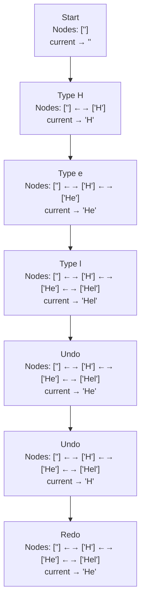
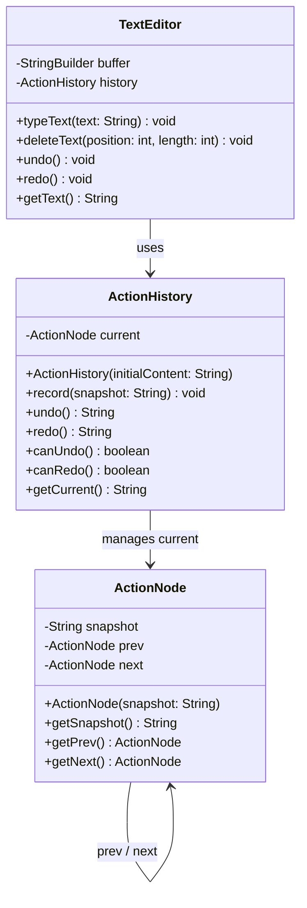
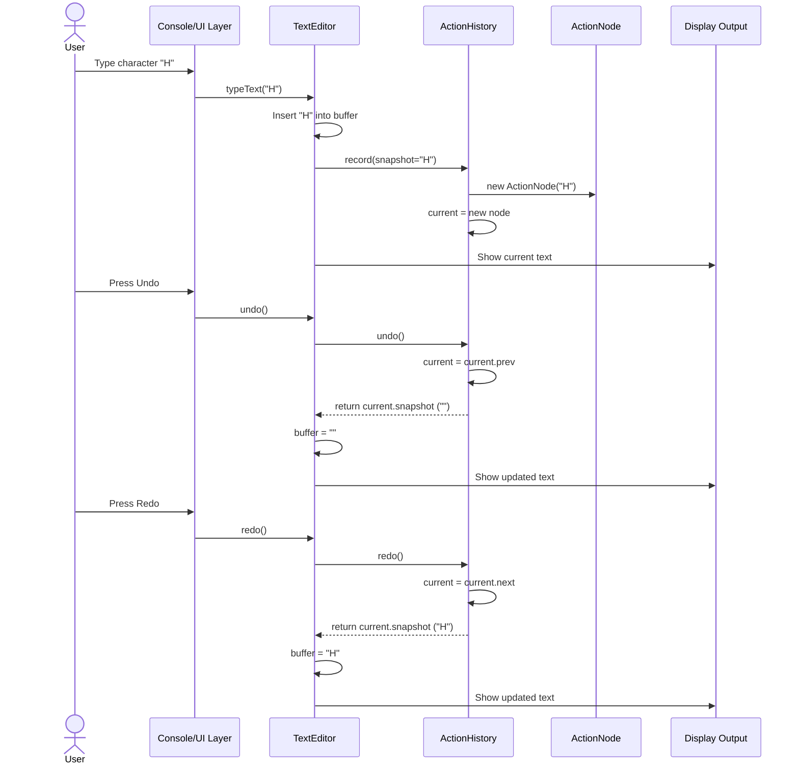

# CSD201 Project Planning — Undo/Redo Engine for Text Editors

## Lời mở đầu

Chào cả nhóm! Đây là tài liệu lập kế hoạch đầy đủ cho project CSD201 với chủ đề **Undo/Redo Engine for Text Editors**. Mục tiêu của project không chỉ là viết được chương trình chạy đúng, mà còn là chứng minh rằng nhóm hiểu rõ cách dùng **Stack** để giải quyết một bài toán thực tế giống như cơ chế Undo/Redo trong Microsoft Word, VS Code hoặc Google Docs.

Project này rất phù hợp với môn Data Structures & Algorithms vì nó biến một cấu trúc dữ liệu tưởng như đơn giản — **Doubly Linked List** — thành một chức năng quen thuộc mà ai cũng dùng hằng ngày. Thay vì dùng hai Stack riêng biệt, thiết kế này dùng một danh sách liên kết đôi (`ActionNode`) với con trỏ `current` để duyệt qua lịch sử thao tác. Nếu nhóm làm tốt phần phân tích, thiết kế, code, test và báo cáo, đây sẽ là một project rất thuyết phục.

---

# STEP 1 — CT Analysis: Computational Thinking Breakdown

Computational Thinking gồm 4 trụ cột chính:

1. **Decomposition** — Chia nhỏ vấn đề.
2. **Pattern Recognition** — Nhận diện mẫu lặp lại.
3. **Abstraction** — Trừu tượng hóa phần quan trọng.
4. **Algorithm Design** — Thiết kế thuật toán từng bước.

Trong project này, nhóm nên trình bày CT như “xương sống” của toàn bộ quá trình phân tích. Trọng tâm data structure là **Doubly Linked List** thể hiện qua `ActionNode`, được quản lý bởi `ActionHistory`.

---

## 1.1 Decomposition — Chia nhỏ bài toán Undo/Redo Engine

Bài toán lớn: xây dựng một engine mô phỏng Undo/Redo cho text editor.

Ta chia thành các thành phần nhỏ hơn như sau:

### A. Text Buffer

Đây là nơi lưu nội dung hiện tại của editor.

Ví dụ:

```text
Current text: "Hel"
```

Text buffer cần hỗ trợ các thao tác cơ bản:

- Thêm ký tự hoặc chuỗi tại một vị trí.
- Xóa ký tự hoặc chuỗi tại một vị trí.
- Hiển thị nội dung hiện tại.

Trong phiên bản đơn giản cho CSD201, nhóm có thể dùng `StringBuilder` trong Java hoặc `list/string` trong Python để lưu text.

---

### B. ActionNode

Mỗi trạng thái text được lưu thành một node trong danh sách liên kết đôi, gọi là `ActionNode`.

Một `ActionNode` cần lưu:

- `snapshot`: chuỗi text đầy đủ tại thời điểm đó.
- `prev`: con trỏ đến node trước (trạng thái cũ hơn).
- `next`: con trỏ đến node sau (trạng thái mới hơn, dùng cho redo).

Ví dụ:

```text
ActionNode(snapshot="")  ←→  ActionNode(snapshot="H")  ←→  ActionNode(snapshot="He")
```

---

### C. ActionHistory và con trỏ current

`ActionHistory` quản lý toàn bộ chuỗi `ActionNode` như một doubly linked list, với con trỏ `current` trỏ đến trạng thái hiện tại.

Khi người dùng làm một thao tác mới:

```text
record(snapshot mới) → tạo ActionNode mới, gắn vào current.next, cắt bỏ nhánh redo cũ, di chuyển current sang node mới
```

Khi undo:

```text
current = current.prev  → trả về current.snapshot
```

---

### D. Redo qua con trỏ next

Redo không cần stack riêng. Sau khi undo, `current` lùi về `current.prev` nhưng node cũ vẫn còn trong linked list qua `current.next`.

Khi redo:

```text
current = current.next  → trả về current.snapshot
```

Nếu người dùng undo xong rồi gõ text mới, `record()` sẽ tạo một `ActionNode` mới gắn vào `current.next`, cắt đứt nhánh redo cũ.

Ví dụ:

```text
Type H, Type e, Undo, Type a
```

Sau khi `Type a`, node chứa snapshot `"He"` bị thay thế; redo không còn trỏ về đó được nữa.

---

### E. ActionHistory Logic

`ActionHistory` là bộ não quản lý doubly linked list.

Nhiệm vụ chính:

- `record(snapshot)`: tạo `ActionNode` mới, gắn vào `current.next`, di chuyển `current`.
- `undo()`: di chuyển `current = current.prev`, trả về snapshot.
- `redo()`: di chuyển `current = current.next`, trả về snapshot.
- `canUndo()`: kiểm tra `current.prev != null`.
- `canRedo()`: kiểm tra `current.next != null`.
- `getCurrent()`: trả về `current.snapshot`.

---

### F. User Interface / Simulation Layer

Với project CSD201, nhóm không cần làm GUI phức tạp. Một console simulation là đủ nếu trình bày rõ.

Simulation có thể gồm các lựa chọn:

```text
1. Type text
2. Delete character
3. Undo
4. Redo
5. Show text
6. Show stacks
0. Exit
```

Hoặc demo tự động:

```text
Type H
Type e
Type l
Type l
Type o
Undo
Undo
Redo
Type !
```

---

## 1.2 Pattern Recognition — Nhận diện mẫu từ editor thực tế

Các editor như Microsoft Word, VS Code, Notepad++, Google Docs đều có hành vi Undo/Redo tương tự.

### Pattern 1: Thao tác mới nhất được undo trước

Đây chính là nguyên tắc duyệt ngược trong **Doubly Linked List**: `current` lùi dần về `prev`.

Ví dụ người dùng gõ:

```text
H → e → l → l → o
```

Nếu bấm Undo, ký tự bị hủy đầu tiên là `o`, sau đó là `l`, sau đó là `l`, rồi `e`, rồi `H`.

Thứ tự undo:

```text
o → l → l → e → H
```

Đây là lý do Stack phù hợp tự nhiên với Undo.

---

### Pattern 2: Redo chỉ có sau Undo

Trong editor thật, nút Redo chỉ hoạt động sau khi người dùng đã Undo.

Nếu chưa undo gì, `current.next` là null:

```text
Redo unavailable
```

Điều này map trực tiếp sang linked list:

```text
current.next == null
```

---

### Pattern 3: Action mới sau Undo sẽ xóa Redo history

Trong VS Code hoặc Word:

1. Gõ `Hello`.
2. Undo thành `Hell`.
3. Gõ `!`.
4. Không thể Redo lại `o` nữa.

Vì người dùng đã tạo một nhánh lịch sử mới.

Trong project, khi `record()` được gọi sau một undo, nó gắn node mới vào `current.next` và cắt đứt phần còn lại của chuỗi:

```text
record(newSnapshot):
    newNode = ActionNode(newSnapshot)
    newNode.prev = current
    current.next = newNode   // ghi đè nhánh redo cũ
    current = newNode
```

---

### Pattern 4: Undo và Redo là hai thao tác đối xứng

Nếu action gốc là `INSERT`, undo của nó là xóa nội dung đó.

Nếu action gốc là `DELETE`, undo của nó là chèn lại nội dung đã xóa.

Bảng đối xứng:

| Action gốc | Undo sẽ làm gì? | Redo sẽ làm gì? |
|---|---|---|
| INSERT | DELETE cùng content tại cùng position | INSERT lại content |
| DELETE | INSERT lại content tại cùng position | DELETE lại content |

---

## 1.3 Abstraction — Trừu tượng hóa dữ liệu cần lưu

Trong project, ta không cần mô phỏng toàn bộ Microsoft Word. Ta chỉ cần lưu những gì đủ để undo/redo chính xác.

### Cần lưu

Mỗi action nên có:

| Field | Ý nghĩa | Ví dụ |
|---|---|---|
| `type` | Loại thao tác | `INSERT`, `DELETE` |
| `content` | Ký tự/chuỗi được thêm hoặc xóa | `"H"`, `"abc"` |
| `position` | Vị trí trong text buffer | `0`, `3`, `5` |
| `timestamp` | Thời điểm thao tác xảy ra | `2026-05-23T10:30:00` |

### Có thể bỏ qua

Để project vừa sức CSD201, nhóm có thể bỏ qua:

- Font chữ.
- Màu chữ.
- Căn lề.
- Copy/paste phức tạp.
- Multi-cursor như VS Code.
- Undo theo group nhiều ký tự.
- File saving/loading.
- Collaboration nhiều người cùng edit.

### Lý do abstraction như vậy là hợp lý

Vì yêu cầu chính của đề tài là mô phỏng Undo/Redo bằng Stack. Nếu nhóm thêm quá nhiều tính năng phụ, project dễ bị rối, khó test, và có thể làm mờ trọng tâm data structure.

Cách tốt nhất là:

```text
Focus on correctness first, polish second.
```

---

## 1.4 Algorithm Design — Thiết kế thuật toán bằng ngôn ngữ tự nhiên

Phần này nên viết trước khi code. Khi thuật toán rõ, code sẽ dễ hơn rất nhiều.

---

### A. Type Character / Insert Text

Khi người dùng gõ một ký tự hoặc một chuỗi:

1. Xác định nội dung cần chèn.
2. Xác định vị trí chèn trong text buffer.
3. Chèn nội dung vào text buffer.
4. Tạo một `Action` có type là `INSERT`.
5. Lấy snapshot (toàn bộ nội dung buffer sau khi insert).
6. Gọi `history.record(snapshot)` — tạo `ActionNode` mới và di chuyển `current`.
7. Nhánh redo cũ bị cắt tự động vì `current.next` được ghi đè.
8. Hiển thị text hiện tại và trạng thái `current`.

Ví dụ:

```text
Current text: "H"
User types "e" at position 1
New text: "He"
ActionNodes: [""] ←→ ["H"] ←→ ["He"]  ← current
```

---

### B. Delete Character / Delete Text

Khi người dùng xóa một ký tự hoặc chuỗi:

1. Kiểm tra vị trí xóa có hợp lệ không.
2. Lấy nội dung sắp bị xóa để lưu lại.
3. Xóa nội dung khỏi text buffer.
4. Lấy snapshot (toàn bộ nội dung buffer sau khi delete).
5. Gọi `history.record(snapshot)` — tạo `ActionNode` mới và di chuyển `current`.
6. Nhánh redo cũ bị cắt tự động.
7. Hiển thị text và trạng thái `current`.

Ví dụ:

```text
Current text: "Hello"
Delete character at position 4: "o"
New text: "Hell"
ActionNodes: [...] ←→ ["Hello"] ←→ ["Hell"]  ← current
```

---

### C. Undo

Khi người dùng bấm Undo:

1. Kiểm tra `history.canUndo()` — tức `current.prev != null`.
2. Nếu không thể undo, báo: “Nothing to undo”.
3. Nếu được, gọi `history.undo()` — di chuyển `current = current.prev`.
4. Lấy `history.getCurrent()` để lấy snapshot trước đó.
5. Cập nhật `buffer` của `TextEditor` từ snapshot vừa lấy.
6. Hiển thị text và trạng thái `current`.

Ví dụ:

```text
Before undo:
ActionNodes: ["H"] ←→ ["He"] ←→ ["Hel"]  ← current

After undo (current.prev):
ActionNodes: ["H"] ←→ ["He"]  ← current  ←→ ["Hel"]
Text becomes: "He"
```

---

### D. Redo

Khi người dùng bấm Redo:

1. Kiểm tra `history.canRedo()` — tức `current.next != null`.
2. Nếu không thể redo, báo: “Nothing to redo”.
3. Nếu được, gọi `history.redo()` — di chuyển `current = current.next`.
4. Lấy `history.getCurrent()` để lấy snapshot tiếp theo.
5. Cập nhật `buffer` của `TextEditor` từ snapshot vừa lấy.
6. Hiển thị text và trạng thái `current`.

Ví dụ:

```text
Before redo:
ActionNodes: ["H"] ←→ ["He"]  ← current  ←→ ["Hel"]

After redo (current.next):
ActionNodes: ["H"] ←→ ["He"] ←→ ["Hel"]  ← current
Text becomes: "Hel"
```

---

# STEP 2 — Data Structure Design

## 2.1 ActionNode

Mỗi trạng thái text trong lịch sử được lưu bằng một `ActionNode` trong doubly linked list.

### Java-style structure

```java
class ActionNode {
    String snapshot;       // toàn bộ nội dung text tại thời điểm này
    ActionNode prev;       // trỏ về trạng thái cũ hơn (null nếu là đầu list)
    ActionNode next;       // trỏ về trạng thái mới hơn (null nếu là cuối list)
}
```

### Ý nghĩa từng field

| Field | Kiểu dữ liệu | Mục đích |
|---|---|---|
| `snapshot` | String | Toàn bộ nội dung text tại thời điểm này |
| `prev` | ActionNode | Con trỏ về node trước (undo sẽ đi theo hướng này) |
| `next` | ActionNode | Con trỏ về node sau (redo sẽ đi theo hướng này) |

---

## 2.2 Doubly Linked List Model

Mô hình chính của project là một **doubly linked list** các `ActionNode`, với con trỏ `current` trong `ActionHistory` trỏ đến trạng thái hiện tại.

```mermaid
flowchart LR
    UserAction[New Snapshot] --> Record[ActionHistory.record()]
    Record --> NewNode[New ActionNode]
    NewNode -- prev --> Current[current]
    Current -- next --> NewNode
    Record -- moves current to --> NewNode
    Current -- undo: current=prev --> Prev[prev node]
    Current -- redo: current=next --> Next[next node]
```

ASCII version:

```text
  HEAD                                      TAIL
  [snapshot=""] <-> [snapshot="H"] <-> [snapshot="He"] <-> [snapshot="Hel"]
                                                               ^
                                                           current

  Undo → current moves left:    current = current.prev
  Redo → current moves right:   current = current.next
  New record → new node appended after current; current.next (old redo chain) is discarded
```

---

## 2.3 Linked List Navigation Behavior

### Case 1: Record new snapshot (after INSERT or DELETE)

```text
1. Apply INSERT/DELETE to text buffer.
2. Take snapshot = buffer.toString().
3. Call history.record(snapshot).
   → creates new ActionNode
   → newNode.prev = current
   → current.next = newNode  (old redo chain discarded)
   → current = newNode
```

---

### Case 2: Undo

```text
1. Check canUndo(): current.prev != null.
2. Move current = current.prev.
3. Return current.snapshot → restore buffer.
```

Linked list behavior:

```text
before: ... ←→ ["He"] ←→ ["Hel"]  ← current
after:  ... ←→ ["He"]  ← current  ←→ ["Hel"]
```

---

### Case 3: Redo

```text
1. Check canRedo(): current.next != null.
2. Move current = current.next.
3. Return current.snapshot → restore buffer.
```

Linked list behavior:

```text
before: ... ←→ ["He"]  ← current  ←→ ["Hel"]
after:  ... ←→ ["He"] ←→ ["Hel"]  ← current
```

---

## 2.4 Edge Cases

### Edge Case 1: Undo khi current đã là HEAD

Nếu không thể lùi thêm:

```text
current.prev == null
```

Chương trình nên in:

```text
Nothing to undo.
```

Không được crash.

---

### Edge Case 2: Redo khi current đã là TAIL

Nếu không thể tiến thêm:

```text
current.next == null
```

Chương trình nên in:

```text
Nothing to redo.
```

---

### Edge Case 3: Redo bị cắt sau khi có snapshot mới

Ví dụ:

```text
Type H
Type e
Undo
Type a
Redo
```

Sau khi `Type a`, `record()` ghi đè `current.next` bằng node mới. Nhánh chứa snapshot `"He"` bị cắt khỏi linked list và Redo không còn đường đi nào nữa.

---

### Edge Case 4: Delete ở vị trí không hợp lệ

Ví dụ text hiện tại là `"Hi"` nhưng user muốn xóa ở position `10`.

Chương trình nên kiểm tra:

```text
position >= 0 && position < text.length()
```

Nếu không hợp lệ:

```text
Invalid delete position.
```

---

### Edge Case 5: Max History Limit

Trong editor thật, lịch sử undo thường có giới hạn để tránh tốn bộ nhớ.

Ví dụ đặt:

```text
MAX_HISTORY = 100
```

Nếu linked list vượt quá giới hạn, xóa `ActionNode` cũ nhất (HEAD) bằng cách:

```java
// Đếm số node từ HEAD đến TAIL
// Nếu count > MAX_HISTORY, tháo rời node HEAD:
ActionNode oldHead = head;
head = head.next;
if (head != null) head.prev = null;
oldHead.next = null;
```

Tuy nhiên, để giữ project đơn giản, nhóm có thể:

- Implement max history như một tính năng bonus.
- Hoặc chỉ giải thích trong report nếu chưa code.

---

# STEP 3 — System Diagrams

Tất cả diagram dưới đây dùng Mermaid để có thể render trong Obsidian.

---

## 3.1 Linked List State Diagram

Chuỗi thao tác mẫu:

```text
Type "H"
Type "e"
Type "l"
Undo
Undo
Redo
```



Ghi chú: Các node không bị xóa khi undo/redo — `current` chỉ di chuyển qua lại trong linked list. Node chỉ bị cắt khi có snapshot mới được ghi sau một undo.

---

## 3.2 Flowchart — record(), undo(), redo()

```mermaid
flowchart TD
    Start([Start]) --> Choice{Operation?}

    Choice -->|typeText / deleteText| PA1[Apply change to buffer]
    PA1 --> PA2[snapshot = buffer.toString()]
    PA2 --> PA3[history.record(snapshot)]
    PA3 --> PA4["Create new ActionNode, attach to current.next<br/>Move current to new node"]
    PA4 --> End([End])

    Choice -->|undo| U1{canUndo? current.prev != null}
    U1 -->|No| U2[Print Nothing to undo]
    U2 --> End
    U1 -->|Yes| U3[current = current.prev]
    U3 --> U4[buffer = current.snapshot]
    U4 --> End

    Choice -->|redo| R1{canRedo? current.next != null}
    R1 -->|No| R2[Print Nothing to redo]
    R2 --> End
    R1 -->|Yes| R3[current = current.next]
    R3 --> R4[buffer = current.snapshot]
    R4 --> End
```

---

## 3.3 Class/Object Diagram



---

## 3.4 Sequence Diagram — From Keystroke to Display



---

# STEP 4 — Team Task Assignment

Nhóm có 4 thành viên. Phân công nên cân bằng giữa code, report, diagram và testing. Leader không nên ôm hết việc; vai trò của leader là điều phối và đảm bảo tích hợp cuối cùng.

| Member | Role | Main Responsibilities |
|---|---|---|
| Member 1 (Leader) | Project Manager + Core Engine Dev | Quản lý tiến độ, thiết kế engine, tích hợp cuối |
| Member 2 | Data Structure Specialist | Thiết kế Action, Stack behavior, edge cases |
| Member 3 | UI / Simulation Layer | Console UI, demo runner, hiển thị text và stack |
| Member 4 | Report Writer + Tester | Report chính, test cases, diagram polish |

---

## 4.1 Member 1 — Leader / Project Manager + Core Engine Developer

### Code files/modules owned

- `ActionHistory.java`
- Integration logic giữa `TextEditor` và `ActionHistory`
- Final merge/check trước khi nộp

### Coding responsibilities

- Implement `ActionHistory` (linked list core).
- Implement `record(snapshot)`.
- Implement `undo()` và `redo()` trong `ActionHistory`.
- Implement `canUndo()` và `canRedo()`.
- Đảm bảo nhánh redo cũ bị cắt đúng khi có snapshot mới.
- Review code của các member khác để thống nhất style.

### Report sections owned

- Project overview.
- Algorithm Explanation.
- Implementation: Core Engine.
- Integration summary.

### Diagrams responsible

- Flowchart for `record()`, `undo()`, `redo()` trong `ActionHistory`.
- Review toàn bộ Mermaid diagram trước khi nộp.

### Estimated effort

| Task | Hours |
|---|---:|
| Design engine logic | 2 |
| Implement engine | 4 |
| Integration | 2 |
| Review and final fixes | 2 |
| Report contribution | 2 |
| **Total** | **12 hours** |

---

## 4.2 Member 2 — Data Structure Specialist

### Code files/modules owned

- `ActionNode.java`
- `ActionHistory.java`
- History traversal utilities if needed

### Coding responsibilities

- Define `ActionNode` object (snapshot, prev, next).
- Implement linked list traversal logic in `ActionHistory`.
- Ensure snapshot stores enough text state for undo/redo.
- Help design max history limit (trim HEAD node).
- Write helper method to print the current linked list chain.
- Verify doubly linked list prev/next pointer correctness.

### Report sections owned

- Data Structure Design.
- Doubly Linked List justification.
- Edge cases.
- Explanation of `current` pointer navigation.

### Diagrams responsible

- Linked List State Diagram.
- ActionNode chain diagram.

### Estimated effort

| Task | Hours |
|---|---:|
| Design Action model | 2 |
| Implement ActionNode and ActionHistory | 2 |
| Stack behavior documentation | 2 |
| Edge case analysis | 2 |
| Diagram creation | 2 |
| **Total** | **10 hours** |

---

## 4.3 Member 3 — UI / Simulation Layer

### Code files/modules owned

- `TextEditor.java`
- `Main.java`
- Optional: `ConsoleMenu.java` if nhóm muốn làm menu tương tác

### Coding responsibilities

- Implement text buffer operations.
- Implement `typeText()`.
- Implement `deleteText()`.
- Connect editor actions to engine.
- Build demo sequence:
  - type 5 chars
  - undo 2
  - redo 1
  - type 1 more
- Print text and stack state after each operation.

### Report sections owned

- Demo scenario.
- User guide / how to run.
- Implementation: TextEditor and Main.

### Diagrams responsible

- Sequence Diagram.
- Optional screenshot/demo output section.

### Estimated effort

| Task | Hours |
|---|---:|
| Implement TextEditor | 3 |
| Implement Main demo | 2 |
| Console output formatting | 2 |
| Integration with engine | 2 |
| Report/demo explanation | 1 |
| **Total** | **10 hours** |

---

## 4.4 Member 4 — Report Writer + Tester

### Code files/modules owned

- `UndoRedoTest.java` if using unit tests
- Or `TestCases.md` / test case table in report
- Final report file

### Coding/testing responsibilities

- Prepare manual test cases.
- Test undo on empty stack.
- Test redo on empty stack.
- Test insert + undo + redo.
- Test delete + undo + redo.
- Test that new snapshot cuts the redo chain.
- Compare actual output with expected output.

### Report sections owned

- Introduction.
- CT Analysis.
- Testing section.
- Conclusion and lessons learned.
- References.
- Final formatting and consistency.

### Diagrams responsible

- Class/Object Diagram.
- Final diagram formatting in Obsidian.

### Estimated effort

| Task | Hours |
|---|---:|
| Draft report structure | 2 |
| Write CT analysis | 3 |
| Prepare test cases | 3 |
| Execute tests and record results | 2 |
| Final editing | 2 |
| **Total** | **12 hours** |

---

## 4.5 Balanced Workload Summary

| Member | Estimated Hours |
|---|---:|
| Member 1 | 12 |
| Member 2 | 10 |
| Member 3 | 10 |
| Member 4 | 12 |

Phân công này khá cân bằng. Hai bạn có nhiều phần report/review hơn sẽ có số giờ tương đương hai bạn code nhiều hơn. Quan trọng nhất là nhóm phải có checkpoint chung mỗi tuần để tránh tình trạng “ai làm phần nấy nhưng đến cuối không ráp được”.

---

# STEP 5 — Implementation Roadmap

Giả sử nhóm có khoảng 3 tuần để hoàn thành project.

---

## Week 1 — Analysis, Design, Diagrams, Skeleton Code

### Goals

- Hiểu rõ yêu cầu đề bài.
- Chốt phạm vi project.
- Hoàn thành CT analysis.
- Thiết kế class và stack model.
- Tạo skeleton code.

### Tasks

| Task | Owner | Output |
|---|---|---|
| Requirement analysis | All | Danh sách chức năng chính |
| CT breakdown | Member 4 + Leader | Draft CT section |
| Define ActionNode model | Member 2 | `ActionNode.java`, `ActionHistory.java` |
| Design stack behavior | Member 2 + Leader | Stack design notes |
| Draw initial diagrams | Member 2, 3, 4 | Mermaid diagrams |
| Create project skeleton | Member 1 + 3 | Java files compile được |

### End-of-week checkpoint

Đến cuối Week 1, nhóm nên có:

- Class diagram bản đầu.
- Flowchart bản đầu.
- `ActionNode`, `ActionHistory`, `TextEditor`, `Main` skeleton.
- Report outline.
- Demo sequence đã thống nhất.

### Milestone

```text
M1: Design approved + skeleton code compiles.
```

---

## Week 2 — Core Implementation, Unit Testing, Integration

### Goals

- Implement core Undo/Redo logic.
- Implement text buffer insert/delete.
- Test từng chức năng riêng.
- Tích hợp engine với editor.

### Tasks

| Task | Owner | Output |
|---|---|---|
| Implement `record()` | Member 1 | ActionNode được tạo và gắn đúng |
| Implement `undo()` | Member 1 | current.prev navigation hoạt động |
| Implement `redo()` | Member 1 | current.next navigation hoạt động |
| Implement `typeText()` | Member 3 | Gõ text cập nhật buffer |
| Implement `deleteText()` | Member 3 | Xóa text cập nhật buffer |
| Test linked list behavior | Member 2 | prev/next pointers đúng |
| Prepare test cases | Member 4 | Test case table |
| Integration testing | All | Demo chạy đúng |

### End-of-week checkpoint

Đến cuối Week 2, nhóm nên có:

- Chương trình chạy được demo chính.
- Undo/Redo hoạt động đúng với insert.
- Delete và undo delete hoạt động.
- Nhánh redo bị cắt đúng sau snapshot mới.
- Bảng test cases có expected/actual.

### Milestone

```text
M2: Core engine works and passes main test cases.
```

---

## Week 3 — UI Polish, Report Writing, Final Review, Submission Prep

### Goals

- Làm output dễ đọc.
- Hoàn thiện report.
- Kiểm tra Mermaid diagrams render trong Obsidian.
- Chuẩn bị nộp project.

### Tasks

| Task | Owner | Output |
|---|---|---|
| Improve console output | Member 3 | Demo dễ hiểu |
| Finalize diagrams | Member 2 + 4 | Mermaid diagrams render được |
| Complete report | Member 4 | Full report draft |
| Review algorithm explanation | Member 1 | Logic chính xác |
| Run full test suite/manual tests | Member 4 + All | Test results |
| Final code cleanup | Member 1 + 2 + 3 | Code readable |
| Prepare presentation/demo script | All | Demo flow 3–5 phút |

### End-of-week checkpoint

Đến cuối Week 3, nhóm nên có:

- Working code.
- Report hoàn chỉnh.
- Diagram đầy đủ.
- Test case table hoàn chỉnh.
- Demo script.
- File nộp đã được kiểm tra.

### Milestone

```text
M3: Final deliverable ready for submission.
```

---

# STEP 6 — Core Code Skeleton

Ngôn ngữ được chọn: **Java**.

Lý do chọn Java:

- Phù hợp với nhiều môn lập trình tại đại học.
- Có `Deque` / `ArrayDeque` hỗ trợ stack tốt.
- OOP rõ ràng, dễ chia file cho nhóm 4 người.
- Dễ trình bày class diagram và object model.

> Lưu ý: Đây là starter code. Nhóm có thể tách mỗi class ra một file riêng trong project Java.

---

## 6.1 `ActionNode.java`

```java
public class ActionNode {
    private String snapshot;
    private ActionNode prev;
    private ActionNode next;

    public ActionNode(String snapshot) {
        this.snapshot = snapshot;
        this.prev = null;
        this.next = null;
    }

    public String getSnapshot() {
        return snapshot;
    }

    public ActionNode getPrev() {
        return prev;
    }

    public void setPrev(ActionNode prev) {
        this.prev = prev;
    }

    public ActionNode getNext() {
        return next;
    }

    public void setNext(ActionNode next) {
        this.next = next;
    }
}
```

Giải thích ngắn:

- `snapshot` lưu toàn bộ nội dung text tại thời điểm đó — đây là thứ sẽ được restore khi undo/redo.
- `prev` và `next` tạo thành cấu trúc doubly linked list để `ActionHistory` duyệt qua lịch sử.

---

## 6.2 `ActionHistory.java`

```java
public class ActionHistory {
    private ActionNode current;

    public ActionHistory(String initialContent) {
        // Khởi tạo với snapshot ban đầu (thường là chuỗi rỗng)
        this.current = new ActionNode(initialContent);
    }

    public void record(String snapshot) {
        ActionNode newNode = new ActionNode(snapshot);
        newNode.setPrev(current);
        current.setNext(newNode); // ghi đè nhánh redo cũ
        current = newNode;
    }

    public String undo() {
        if (!canUndo()) {
            System.out.println("Nothing to undo.");
            return current.getSnapshot();
        }
        current = current.getPrev();
        return current.getSnapshot();
    }

    public String redo() {
        if (!canRedo()) {
            System.out.println("Nothing to redo.");
            return current.getSnapshot();
        }
        current = current.getNext();
        return current.getSnapshot();
    }

    public boolean canUndo() {
        return current.getPrev() != null;
    }

    public boolean canRedo() {
        return current.getNext() != null;
    }

    public String getCurrent() {
        return current.getSnapshot();
    }

    public void printChain() {
        // Traverse to HEAD first
        ActionNode head = current;
        while (head.getPrev() != null) {
            head = head.getPrev();
        }
        // Print from HEAD to TAIL, marking current
        StringBuilder sb = new StringBuilder();
        ActionNode node = head;
        while (node != null) {
            String marker = (node == current) ? " ← current" : "";
            sb.append("["").append(node.getSnapshot()).append(""]").append(marker);
            if (node.getNext() != null) sb.append(" ←→ ");
            node = node.getNext();
        }
        System.out.println("History: " + sb);
    }
}
```

Điểm quan trọng:

- `record()` cắt đứt nhánh redo cũ bằng cách ghi đè `current.next` — không cần clear stack riêng.
- `undo()` và `redo()` chỉ di chuyển con trỏ `current`, không xóa hay thêm node.
- `getCurrent()` trả về snapshot để `TextEditor` restore buffer.

---

## 6.3 `TextEditor.java`

```java
public class TextEditor {
    private StringBuilder buffer;
    private ActionHistory history;

    public TextEditor() {
        this.buffer = new StringBuilder();
        this.history = new ActionHistory("");
    }

    public void typeText(String text) {
        buffer.append(text);
        history.record(buffer.toString());
    }

    public void deleteText(int position, int length) {
        if (position < 0 || length <= 0 || position + length > buffer.length()) {
            System.out.println("Invalid delete range: position=" + position + ", length=" + length);
            return;
        }
        buffer.delete(position, position + length);
        history.record(buffer.toString());
    }

    public void undo() {
        String snapshot = history.undo();
        buffer = new StringBuilder(snapshot);
    }

    public void redo() {
        String snapshot = history.redo();
        buffer = new StringBuilder(snapshot);
    }

    public String getText() {
        return buffer.toString();
    }

    public void printState(String label) {
        System.out.println("\n=== " + label + " ===");
        System.out.println("Current Text: \"" + getText() + "\"");
        history.printChain();
    }
}
```

Giải thích quan trọng:

- `TextEditor` sửa buffer rồi gọi `history.record()` — đơn giản hơn nhiều so với mô hình hai stack.
- `undo()` và `redo()` chỉ cần lấy snapshot từ `ActionHistory` và gán lại `buffer`.
- Không cần flag `recordAction` vì undo/redo không gọi lại `record()`.

## 6.5 `Main.java`

```java
public class Main {
    public static void main(String[] args) {
        TextEditor editor = new TextEditor();

        editor.printState("Initial State");

        // Simulate typing 5 characters: H, e, l, l, o
        editor.typeText("H");
        editor.printState("After typing H");

        editor.typeText("e");
        editor.printState("After typing e");

        editor.typeText("l");
        editor.printState("After typing l");

        editor.typeText("l");
        editor.printState("After typing l");

        editor.typeText("o");
        editor.printState("After typing o");

        // Undo 2 actions: removes o, then l
        editor.undo();
        editor.printState("After undo 1");

        editor.undo();
        editor.printState("After undo 2");

        // Redo 1 action: brings back l
        editor.redo();
        editor.printState("After redo 1");

        // Type one more character.
        // This should clear the redo stack.
        editor.typeText("!");
        editor.printState("After typing !");
    }
}
```

---

## 6.6 Expected Console Output Example

Output thực tế có timestamp nên sẽ hơi khác, nhưng logic nên giống như sau:

```text
=== Initial State ===
Current Text: ""
History: [""] ← current

=== After typing H ===
Current Text: "H"
History: [""] ←→ ["H"] ← current

=== After typing e ===
Current Text: "He"
History: [""] ←→ ["H"] ←→ ["He"] ← current

=== After typing o ===
Current Text: "Hello"
History: [""] ←→ ["H"] ←→ ["He"] ←→ ["Hel"] ←→ ["Hell"] ←→ ["Hello"] ← current

=== After undo 1 ===
Current Text: "Hell"
History: [""] ←→ ["H"] ←→ ["He"] ←→ ["Hel"] ←→ ["Hell"] ← current ←→ ["Hello"]

=== After undo 2 ===
Current Text: "Hel"
History: [""] ←→ ["H"] ←→ ["He"] ←→ ["Hel"] ← current ←→ ["Hell"] ←→ ["Hello"]

=== After redo 1 ===
Current Text: "Hell"
History: [""] ←→ ["H"] ←→ ["He"] ←→ ["Hel"] ←→ ["Hell"] ← current ←→ ["Hello"]

=== After typing ! ===
Current Text: "Hell!"
History: [""] ←→ ["H"] ←→ ["He"] ←→ ["Hel"] ←→ ["Hell"] ←→ ["Hell!"] ← current
(nhánh ["Hello"] đã bị cắt)
```

---

# STEP 7 — Report Outline

Dưới đây là outline đầy đủ cho báo cáo. Nhóm có thể dùng gần như trực tiếp làm mục lục.

---

## 7.1 Introduction

### Nội dung nên có

- Giới thiệu bối cảnh: text editors hiện đại đều cần Undo/Redo.
- Nêu problem statement: xây dựng engine mô phỏng Undo/Redo bằng Stack.
- Nêu objectives:
  - Hiểu và áp dụng Stack.
  - Mô phỏng Undo/Redo cho thao tác insert/delete.
  - Thiết kế Action object.
  - Viết chương trình demo chạy được.
  - Trình bày CT analysis và diagram.

### Gợi ý viết

```text
The purpose of this project is to simulate the Undo/Redo mechanism commonly found in text editors. The project uses a doubly linked list of ActionNodes managed by ActionHistory, with a current pointer that moves backward (undo) and forward (redo) through the history chain.
```

---

## 7.2 Computational Thinking Analysis

Chia thành 4 phần:

### A. Decomposition

Trình bày các module:

- Text buffer.
- ActionNode (snapshot + prev/next).
- ActionHistory (current pointer management).
- UI/demo layer.

### B. Pattern Recognition

Nêu các pattern:

- Doubly linked list traversal (backward = undo, forward = redo).
- Redo chỉ có sau Undo.
- Snapshot mới cắt nhánh redo cũ.
- Snapshot lưu toàn bộ state, không cần inverse operation.

### C. Abstraction

Nêu dữ liệu cần lưu:

- snapshot (toàn bộ text buffer tại mỗi thời điểm).

Nêu dữ liệu bỏ qua:

- Font.
- Color.
- Layout.
- Multi-user editing.

### D. Algorithm Design

Trình bày logic cho:

- Type/insert.
- Delete.
- Undo.
- Redo.

Có thể tham chiếu Flowchart ở phần diagram.

---

## 7.3 Data Structure Design

### Nội dung nên có

- Vì sao chọn Doubly Linked List?
- Giải thích cơ chế con trỏ `current`.
- Cấu trúc `ActionNode` và `ActionHistory`.
- Record / undo / redo navigation.
- Edge cases.

### Stack choice justification

Doubly Linked List phù hợp vì lịch sử chỉnh sửa là một chuỗi tuyến tính — undo lùi về trước, redo tiến về sau. Con trỏ `current` phản ánh vị trí hiện tại trong chuỗi đó mà không cần xóa hay rebuild bất kỳ dữ liệu nào.

### Object model

Trình bày `ActionNode`, `ActionHistory`, `TextEditor` và quan hệ giữa chúng.

Tham chiếu:

- Class diagram.
- Stack state diagram.

---

## 7.4 Algorithm Explanation

### Nên có pseudocode

#### record

```text
function record(snapshot):
    newNode = ActionNode(snapshot)
    newNode.prev = current
    current.next = newNode   // old redo chain is discarded
    current = newNode
```

#### undo

```text
function undo():
    if current.prev is null:
        print "Nothing to undo"
        return current.snapshot

    current = current.prev
    return current.snapshot
```

#### redo

```text
function redo():
    if current.next is null:
        print "Nothing to redo"
        return current.snapshot

    current = current.next
    return current.snapshot
```

### Diagram references

- Flowchart: control flow.
- Stack State Diagram: stack transitions.
- Sequence Diagram: user interaction.

---

## 7.5 Implementation

### Nội dung nên có

- Ngôn ngữ sử dụng: Java.
- Các class chính:
  - `ActionNode`
  - `ActionHistory`
  - `TextEditor`
  - `Main`
- Mô tả trách nhiệm từng class.
- Key implementation decisions:
  - Dùng doubly linked list thay cho hai stack riêng biệt.
  - Dùng `StringBuilder` cho text buffer.
  - `record()` ghi đè `current.next` thay vì clear một stack riêng.
  - Không cần `recordAction` flag vì undo/redo không gọi lại `record()`.

---

## 7.6 Testing

### Test cases table

| Test ID | Input / Actions | Expected Result | Actual Result | Status |
|---|---|---|---|---|
| TC01 | Start program | Text empty, both stacks empty | Text empty, both stacks empty | Pass |
| TC02 | Type `H`, `e`, `l`, `l`, `o` | Text = `Hello`, linked list has 6 nodes (incl. initial) | Text = `Hello`, 6 nodes | Pass |
| TC03 | Undo once after `Hello` | Text = `Hell`, current moves to `"Hell"` node | Text = `Hell`, current = `"Hell"` node | Pass |
| TC04 | Undo twice after `Hello` | Text = `Hel`, current moves to `"Hel"` node | Text = `Hel`, current = `"Hel"` node | Pass |
| TC05 | Redo once | Text = `Hell`, current moves to `"Hell"` node | Text = `Hell`, current = `"Hell"` node | Pass |
| TC06 | Type `!` after undo/redo | Text = `Hell!`, new node appended, redo chain cut | Text = `Hell!`, redo chain cut | Pass |
| TC07 | Undo on empty stack | Print `Nothing to undo`, no crash | Print `Nothing to undo`, no crash | Pass |
| TC08 | Redo on empty stack | Print `Nothing to redo`, no crash | Print `Nothing to redo`, no crash | Pass |
| TC09 | Delete character then undo | Deleted char restored | Deleted char restored | Pass |
| TC10 | Delete invalid position | Print error, text unchanged | Print error, text unchanged | Pass |

### Testing advice

Nhóm nên chụp hoặc copy console output vào report để chứng minh chương trình chạy thật.

---

## 7.7 Conclusion + Lessons Learned

### Nội dung nên có

- Tóm tắt project đã làm được gì.
- Khẳng định Doubly Linked List phù hợp với Undo/Redo vì lịch sử là một chuỗi tuyến tính.
- Nêu bài học:
  - Snapshot-based approach đơn giản hơn: không cần lưu type/content/position.
  - Con trỏ `current` là chìa khóa của thiết kế.
  - Redo tự nhiên qua `current.next` — không cần stack thứ hai.
  - Cách chia module `ActionNode` / `ActionHistory` / `TextEditor` giúp code rõ ràng.

### Gợi ý viết

```text
Through this project, our team learned how a doubly linked list can elegantly model the Undo/Redo mechanism found in modern text editors. Moving a current pointer backward and forward through a chain of snapshots is both intuitive and efficient.
```

---

## 7.8 References

Nhóm có thể tham khảo:

- Course slides for Linked List data structure.
- Java documentation for object references and linked node patterns.
- Basic editor Undo/Redo behavior from Microsoft Word or VS Code.
- Mermaid documentation for diagrams.

Ví dụ format:

```text
[1] Oracle Java Documentation, LinkedList and Node patterns in Java.
[2] CSD201 Lecture Notes, Linked List Data Structure.
[3] Mermaid.js Documentation, Flowchart and Class Diagram Syntax.
```

---

# STEP 8 — Tips & Common Pitfalls

Dưới đây là những lỗi rất hay gặp khi sinh viên làm project Undo/Redo. Nhóm nên đọc kỹ phần này trước khi code.

---

## 8.1 Lỗi 1: Lưu snapshot không đầy đủ

Một số bạn lưu snapshot chỉ là ký tự vừa gõ, không phải toàn bộ text buffer:

```text
ActionNode(snapshot="H")   // chỉ ký tự vừa gõ — SAI
ActionNode(snapshot="Hello") // toàn bộ buffer — ĐÚNG
```

Nếu snapshot không phải toàn bộ buffer, undo/redo sẽ không restore được text đúng.

### Cách tránh

Luôn gọi `buffer.toString()` để lấy snapshot:

```java
history.record(buffer.toString());
```

---

## 8.2 Lỗi 2: Không ghi đè current.next khi record()

Nếu `record()` append node mới mà không cắt đứt `current.next`, chuỗi linked list sẽ bị phân nhánh không hợp lệ.

Ví dụ lỗi:

```java
// SAI: không cắt nhánh cũ
newNode.prev = current;
current = newNode;
// current.next của node cũ vẫn trỏ về nhánh redo cũ!
```

### Cách tránh

Trong `record()` luôn ghi đè `current.next` trước:

```java
current.setNext(newNode); // ghi đè nhánh redo cũ
current = newNode;
```

---

## 8.3 Lỗi 3: Gọi record() khi undo/redo

Nếu trong lúc undo/redo, `TextEditor` lại gọi `history.record()`, một node mới sẽ được tạo và nhánh redo bị cắt — lịch sử hoàn toàn sai.

### Cách tránh

Trong `undo()` và `redo()` của `TextEditor`, chỉ gán lại buffer từ snapshot, **không** gọi `record()`:

```java
public void undo() {
    String snapshot = history.undo();
    buffer = new StringBuilder(snapshot); // KHÔNG gọi history.record()
}
```

---

## 8.4 Lỗi 4: Không kiểm tra null trước khi di chuyển current

Nếu gọi `current = current.prev` khi `current.prev == null`, chương trình sẽ crash với NullPointerException.

### Cách tránh

Luôn dùng `canUndo()` / `canRedo()` trước:

```java
if (!canUndo()) {
    System.out.println("Nothing to undo.");
    return current.getSnapshot();
}
```

Tương tự cho `canRedo()`.

---

## 8.5 Lỗi 5: In linked list không đánh dấu current

Khi in ra chuỗi ActionNode để debug, nếu không đánh dấu node `current`, người đọc không biết trạng thái hiện tại ở đâu.

Output không rõ:

```text
History: [""] ←→ ["H"] ←→ ["He"] ←→ ["Hel"]
```

### Cách tránh

Luôn đánh dấu `current` khi in:

```text
History: [""] ←→ ["H"] ←→ ["He"] ← current  ←→ ["Hel"]
```

---

## 8.6 Lỗi 6: Làm UI quá phức tạp trước khi engine chạy đúng

Một số nhóm dành quá nhiều thời gian làm menu đẹp, GUI, màu sắc, nhưng Undo/Redo chưa đúng.

### Cách tránh

Thứ tự đúng:

```text
Correct engine → simple demo → better output → optional UI polish
```

Chức năng đúng quan trọng hơn giao diện đẹp.

---

## 8.7 Lỗi 7: Report chỉ mô tả code, không giải thích tư duy thuật toán

CSD201 là môn Data Structures & Algorithms. Báo cáo không nên chỉ chụp code. Giảng viên muốn thấy nhóm hiểu:

- Vì sao dùng Stack?
- Vì sao cần hai Stack?
- Action lưu dữ liệu gì?
- Undo/Redo hoạt động theo LIFO như thế nào?
- Edge cases xử lý ra sao?

### Cách tránh

Report nên có đủ:

- CT Analysis.
- Stack diagrams.
- Pseudocode.
- Test cases.
- Explanation of design decisions.

---

# Final Advice from a Senior Mentor

Project này không khó nếu nhóm giữ đúng trọng tâm: **Doubly Linked List + snapshot history + current pointer**.

Cách làm tốt nhất là:

1. Đừng code ngay khi chưa thống nhất `ActionNode` lưu gì (snapshot = toàn bộ buffer).
2. Vẽ linked list state bằng tay trước, đánh dấu current.
3. Implement `record()` và `undo()` trước.
4. Sau đó mới thêm `redo()` và `deleteText()`.
5. Cuối cùng mới polish output và report.

Nếu nhóm demo được sequence sau một cách rõ ràng, project đã rất ổn:

```text
Type H
Type e
Type l
Type l
Type o
Undo
Undo
Redo
Type !
```

Kết quả mong muốn:

```text
Hello → Hell → Hel → Hell → Hell!
```

Quan trọng hơn cả: khi thầy/cô hỏi “Tại sao dùng Doubly Linked List?”, cả nhóm nên trả lời được ngay:

```text
Because editing history is a linear sequence. Undo moves the current pointer backward to the previous state, and Redo moves it forward. A doubly linked list naturally models this bidirectional navigation without needing two separate stacks.
```

Chúc nhóm làm project thật chắc, dễ hiểu, và tự tin khi demo!

---
