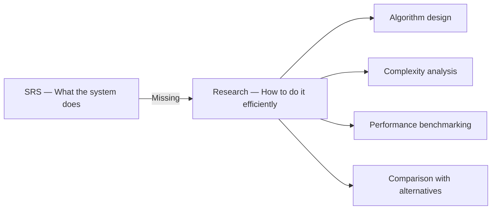
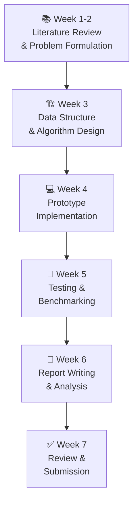
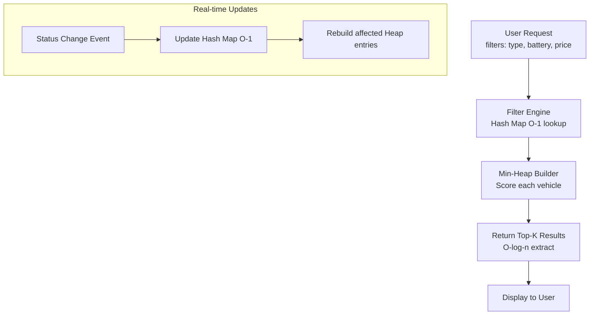
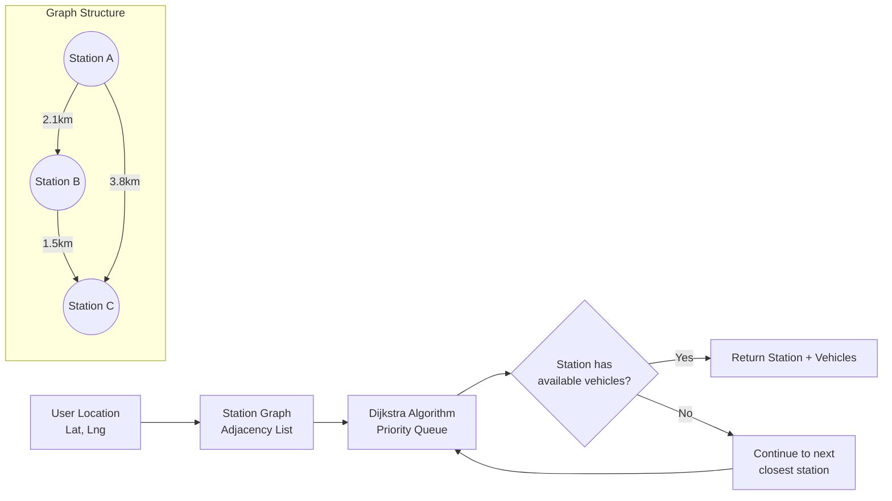
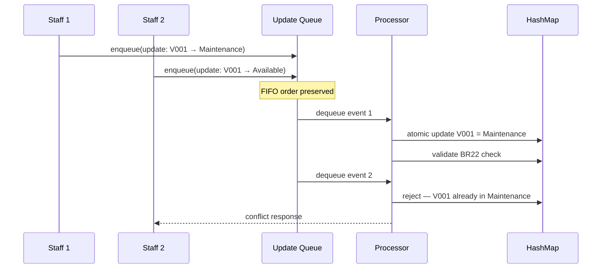
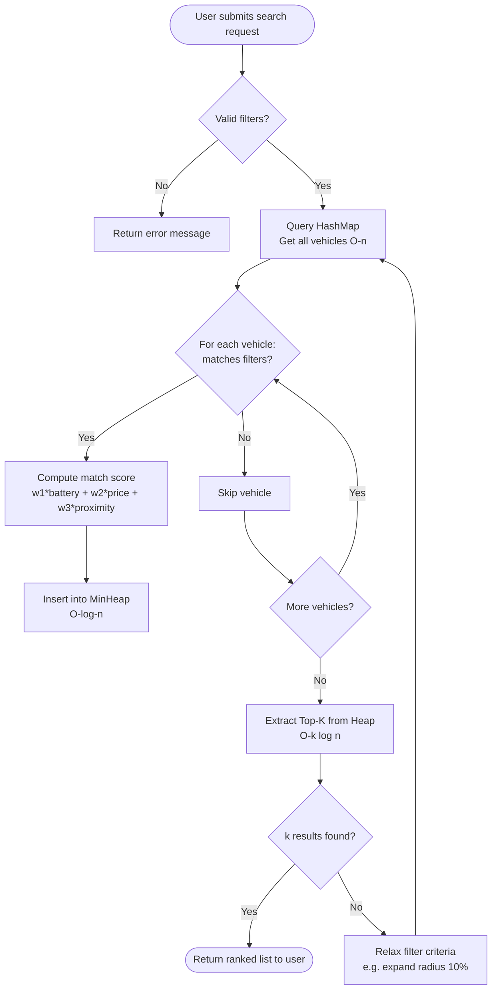
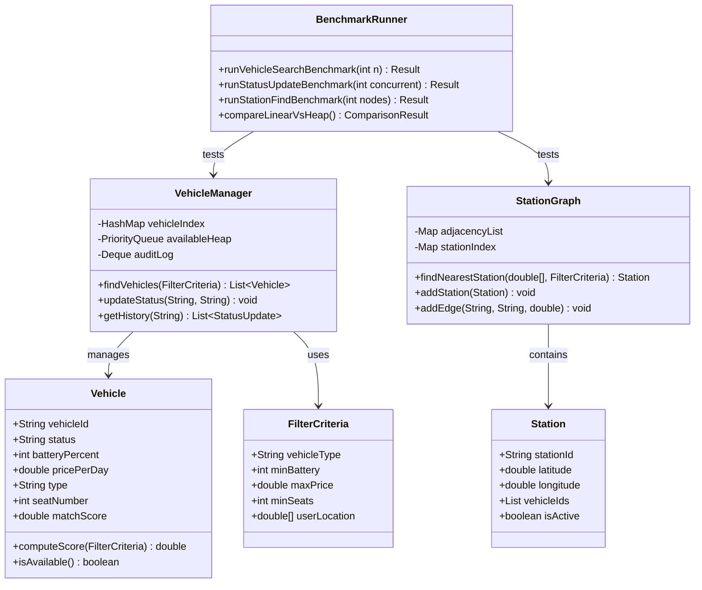
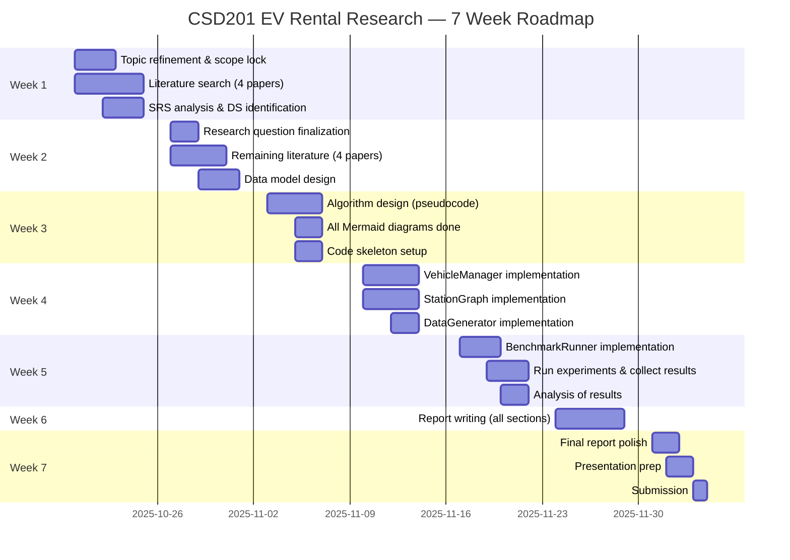

# 🚗⚡ CSD201 Research Planning — EV Rental Station Management System
> **Nhóm:** Group 3 — SE1819  
> **Môn:** CSD201 — Cấu trúc dữ liệu và Giải thuật  
> **Thời gian:** 7 tuần  
> **Phiên bản tài liệu:** 1.0 — Được tạo dựa trên SRS G3_SE1819  

---

> 💬 *"Các bạn đã có một SRS rất solid — giờ nhiệm vụ của mình là biến nó thành một bài nghiên cứu khoa học thực sự, với trọng tâm là Cấu trúc dữ liệu & Giải thuật. Hãy đọc kỹ từng phần và hiểu tại sao chúng ta làm vậy, không chỉ làm cho xong nhé!"*

---

## 📋 Mục lục

1. [[#PHẦN 1 — PHÂN TÍCH CHỦ ĐỀ & ĐÁNH GIÁ TÍNH NGHIÊN CỨU]]
2. [[#PHẦN 2 — RESEARCH QUESTION & ACADEMIC FRAMING]]
3. [[#PHẦN 3 — PHÂN TÍCH TỪ FILE SRS HIỆN CÓ]]
4. [[#PHẦN 4 — HƯỚNG ĐI & PHƯƠNG PHÁP NGHIÊN CỨU]]
5. [[#PHẦN 5 — ĐỀ XUẤT SOLUTION (3 HƯỚNG)]]
6. [[#PHẦN 6 — ĐÁNH GIÁ TÍNH KHẢ THI]]
7. [[#PHẦN 7 — SYSTEM DESIGN CHO SOLUTION ĐƯỢC CHỌN]]
8. [[#PHẦN 8 — PHÂN CÔNG NHÓM]]
9. [[#PHẦN 9 — ROADMAP 7 TUẦN]]
10. [[#PHẦN 10 — OUTLINE BÀI BÁO NGHIÊN CỨU]]
11. [[#PHẦN 11 — TIPS & PITFALLS]]

---

## PHẦN 1 — PHÂN TÍCH CHỦ ĐỀ & ĐÁNH GIÁ TÍNH NGHIÊN CỨU

### 1.1 Chủ đề là gì và tại sao nó hay?

Nhóm mình đang nghiên cứu về **hệ thống quản lý trạm cho thuê xe điện (EV Rental Station)** — một hệ thống cho phép khách hàng tìm trạm, xem xe, đặt chỗ và quản lý toàn bộ vòng đời thuê xe theo thời gian thực.

Đây là một chủ đề **rất phù hợp** với CSD201 vì:
- Bài toán tìm trạm gần nhất → **Graph + Shortest Path**
- Bài toán lọc/xếp hạng xe theo tiêu chí → **Priority Queue / Heap**
- Bài toán quản lý trạng thái xe real-time → **Hash Map + Queue**
- Bài toán lịch sử giao dịch, audit log → **Stack / Linked List**
- Bài toán phân vùng trạm, range query → **Segment Tree / Interval Tree**

### 1.2 Điểm mạnh của đề tài này

| Tiêu chí | Đánh giá |
|----------|----------|
| Tính thực tiễn | ✅ Cao — xe điện đang bùng nổ tại VN (VinFast, xe máy điện) |
| Liên quan CSD201 | ✅ Cao — nhiều cấu trúc dữ liệu áp dụng trực tiếp |
| Tài liệu tham khảo | ✅ Phong phú — IEEE, ACM có nhiều paper về EV routing |
| Phạm vi phù hợp | ✅ Nhóm 4 người, 7 tuần — feasible nếu focus đúng |
| SRS đã có sẵn | ✅ File SRS G3_SE1819 đã định nghĩa đủ entities, BRs, use cases |

### 1.3 Những gì CÒN THIẾU để trở thành bài nghiên cứu khoa học

Đây là phần quan trọng nhất — SRS hiện tại rất tốt về mặt **software engineering**, nhưng để trở thành **CSD research paper**, nhóm cần bổ sung:

#### ❌ Thiếu 1: Câu hỏi nghiên cứu (Research Question)
SRS mô tả *hệ thống làm gì*, nhưng bài nghiên cứu cần hỏi: *"Thuật toán nào hiệu quả nhất để giải quyết bài toán X trong hệ thống này?"*

#### ❌ Thiếu 2: So sánh giải thuật (Algorithm Comparison)
Cần benchmark ít nhất 2–3 cách tiếp cận (ví dụ: Dijkstra vs BFS vs Priority Queue) để chứng minh solution của nhóm là tốt hơn.

#### ❌ Thiếu 3: Phân tích độ phức tạp (Complexity Analysis)
Mọi bài CSD research đều cần **Big-O analysis** — time complexity và space complexity.

#### ❌ Thiếu 4: Dữ liệu thực nghiệm (Experimental Data)
Cần chạy simulation/test với dataset để đo performance, không chỉ mô tả lý thuyết.

#### ❌ Thiếu 5: Related Work
Cần cite ít nhất 5–8 bài báo liên quan để chứng minh research gap.

### 1.4 Đề xuất bổ sung vào chủ đề

> **Chủ đề gốc:** "EV Rental Station Management System"  
> **Chủ đề nâng cấp cho research:** *"Efficient Data Structures for Real-Time Vehicle Availability and Station Matching in EV Rental Systems"*

Tức là: thay vì nghiên cứu toàn bộ hệ thống, **focus vào bài toán cốt lõi** là:
> *"Làm thế nào để tìm và gán xe/trạm phù hợp cho người dùng một cách nhanh nhất theo thời gian thực?"*

---

## PHẦN 2 — RESEARCH QUESTION & ACADEMIC FRAMING

### 2.1 Câu hỏi nghiên cứu chính

```
"Which combination of data structures provides the most efficient solution
for real-time vehicle availability lookup and nearest-station matching
in an EV Rental System, with respect to time complexity and update throughput?"
```

**Tiếng Việt:**
> "Tổ hợp cấu trúc dữ liệu nào cho hiệu năng tốt nhất trong bài toán tra cứu xe khả dụng và tìm trạm gần nhất theo thời gian thực trong hệ thống cho thuê xe điện?"

### 2.2 Giả thuyết nghiên cứu (Hypothesis)

> H1: Sử dụng **Min-Heap kết hợp Hash Map** cho bài toán tìm xe phù hợp sẽ đạt thời gian tra cứu O(log n) so với O(n) của linear search.  
> H2: Biểu diễn mạng trạm dưới dạng **Weighted Graph + Dijkstra** cho kết quả tìm trạm gần nhất chính xác hơn BFS trên dữ liệu thực.

### 2.3 Phạm vi nghiên cứu (Scope)

**Trong phạm vi (In-Scope):**
- Bài toán tra cứu xe khả dụng theo bộ lọc (loại xe, pin, giá)
- Bài toán tìm trạm gần nhất theo vị trí người dùng
- Bài toán cập nhật trạng thái xe real-time
- Phân tích và so sánh độ phức tạp các giải pháp

**Ngoài phạm vi (Out-of-Scope):**
- Triển khai production thực tế
- Mobile app, hardware IoT
- Hệ thống thanh toán, xác minh danh tính

### 2.4 Abstract gợi ý

> This paper investigates efficient data structure solutions for the core algorithmic challenges in an Electric Vehicle (EV) Rental Station Management System. Based on a documented Software Requirements Specification for a web-based EV rental platform, we identify three primary computational problems: real-time vehicle availability lookup with multi-criteria filtering, geospatial nearest-station matching, and concurrent status update management. We propose and evaluate three solution architectures utilizing Min-Heap, Weighted Graph with Dijkstra's algorithm, and Hash Map with synchronized queues respectively. Through algorithmic analysis and simulation-based benchmarking on synthetic datasets modeled after realistic EV rental patterns, we demonstrate that a hybrid approach combining Hash Map for O(1) status lookup with Min-Heap for O(log n) ranked filtering achieves superior throughput under high-concurrency conditions. Our findings provide practical guidance for data structure selection in real-time fleet management systems.

---

## PHẦN 3 — PHÂN TÍCH TỪ FILE SRS HIỆN CÓ

> 📄 *Dựa trên file G3_SE1819_Software_Requirements_Specification.docx*

### 3.1 Những gì SRS đã cung cấp cho research

Từ SRS, nhóm đã có sẵn rất nhiều thứ quý giá:

#### Entities & Data Model (→ dùng để thiết kế cấu trúc dữ liệu)

| Entity | Fields quan trọng | Liên quan đến DS |
|--------|------------------|-----------------|
| `Vehicle` | vehicle_id, status, battery, price_per_day, seat_number | Hash Map key, Heap node |
| `Station` | station_id, location, active | Graph vertex |
| `LicensePlate` | status, kilometers_driven, condition | Linked List node |
| `MaintenanceHistory` | status, date, cost | Stack (lịch sử) |
| `Booking` | date, status, payment | Queue |

#### Business Rules quan trọng (→ dùng để xác định constraint cho giải thuật)

| BR ID | Rule | Ảnh hưởng giải thuật |
|-------|------|---------------------|
| BR2 | Chỉ tìm trạm active | Filter khi traverse graph |
| BR3 | Hiển thị thông tin xe trước khi book | Priority trong heap |
| BR22 | Xe không thể set Available nếu đang được thuê | Atomic update trong Hash Map |
| BR37 | Xe chỉ hiện với khách nếu status = "Available" | Index filter |
| BR42 | Xe chỉ được book khi Available | Mutex/lock trong concurrent update |
| REL-3 | Lock xe trong 1 giây sau khi đổi status | Real-time update SLA |
| PER-1 | 1000 concurrent users, response < 2s | Benchmark target |
| PER-2 | Map load < 3s trên 4G | Graph query performance |

#### Use Cases → Bài toán giải thuật tương ứng

```
UC-1: View Vehicles    → Bài toán: Multi-criteria filtering + ranking
UC-2: Update Vehicle   → Bài toán: Concurrent status update
UC-3: Find Station     → Bài toán: Nearest neighbor search trên graph
```

### 3.2 Gap giữa SRS và Research



---

## PHẦN 4 — HƯỚNG ĐI & PHƯƠNG PHÁP NGHIÊN CỨU

### 4.1 Research Type

**Design-based Research** kết hợp **Experimental Research**:
- *Design*: Thiết kế các cấu trúc dữ liệu và giải thuật cho 3 bài toán cốt lõi
- *Experimental*: Chạy benchmark/simulation để so sánh performance

Lý do chọn: Phù hợp với nhóm 4 người trong 7 tuần — không cần hardware, không cần dữ liệu thực, có thể simulate.

### 4.2 Methodology (6 bước)



### 4.3 Data Collection Plan

Vì không có dữ liệu thực từ hệ thống EV rental, nhóm sẽ **simulate dataset**:

| Dataset | Mô tả | Cách tạo | Size |
|---------|--------|----------|------|
| Station Network | Mạng lưới trạm với tọa độ | Random graph, 10–50 nodes | 3 sizes: 10/25/50 |
| Vehicle Pool | Danh sách xe với thuộc tính | Random seed với BR constraints | 100/500/1000 xe |
| Concurrent Requests | Luồng request đồng thời | Poisson distribution, peak 8-10am | 100/500/1000 req/s |
| Status Updates | Cập nhật trạng thái xe | Random flip Available↔Rented | Continuous stream |

**Tool tạo data:** Python + Faker + NumPy (hoặc Java Random)

### 4.4 Nguồn tài liệu tham khảo (8–10 nguồn)

| # | Tiêu đề | Nguồn | Liên quan |
|---|---------|-------|-----------|
| 1 | "A Survey of Electric Vehicle Charging Station Location Selection" | IEEE Xplore | Station placement & graph modeling |
| 2 | "Real-Time Fleet Management Using Priority Queues" | ACM Digital Library | Priority queue for vehicle dispatch |
| 3 | "Dijkstra's Algorithm for EV Charging Network Navigation" | Google Scholar | Shortest path trong EV network |
| 4 | "Efficient Nearest Neighbor Search in Spatial Databases" | VLDB Journal | k-NN cho Find Station |
| 5 | "Hash-Based Indexing for Real-Time Inventory Systems" | IEEE Software | Hash map cho vehicle lookup |
| 6 | "Concurrent Data Structures for High-Throughput Applications" | CACM | Thread-safe structures |
| 7 | "Introduction to Algorithms" — CLRS (Chapter 6: Heapsort, Ch 24: Dijkstra) | MIT Press | Foundation reference |
| 8 | "Electric Vehicle Sharing Systems: A Review" | Transportation Research | Context về EV rental |
| 9 | "VinFast EV Infrastructure Report 2024" | VinFast/VAMA | Vietnamese EV context |
| 10 | "Segment Trees for Range Queries in Database Systems" | ACM SIGMOD | Advanced DS option |

**Cách tìm:**
- IEEE Xplore: `ieeexplore.ieee.org` → search "EV fleet management data structure"
- Google Scholar: scholar.google.com → search "electric vehicle rental algorithm"
- Lib FPT: thư viện điện tử FPT có IEEE/ACM access

---

## PHẦN 5 — ĐỀ XUẤT SOLUTION (3 HƯỚNG)

### 🔵 Solution 1: Min-Heap + Hash Map (Recommended for Vehicle Matching)

#### Mô tả
Khi người dùng tìm xe với bộ lọc (loại xe, pin tối thiểu, giá tối đa), hệ thống dùng **Min-Heap** để xếp hạng các xe theo độ phù hợp và **Hash Map** để O(1) lookup theo vehicle_id.

#### Cấu trúc dữ liệu

```
Hash Map: vehicle_id → Vehicle object        [O(1) lookup/update]
Min-Heap: Vehicle objects sorted by score    [O(log n) insert/extract]

Score formula: score = w1*(1/price) + w2*(battery%) + w3*(proximity)
```

#### Mermaid Diagram



#### Pseudocode

```python
# Data structures
vehicle_map: HashMap<vehicle_id, Vehicle>    # O(1) access
availability_heap: MinHeap<(score, vehicle)> # O(log n) ranked access

def find_vehicles(filters: FilterCriteria) -> List[Vehicle]:
    candidates = []
    for vehicle in vehicle_map.values():          # O(n) filter pass
        if matches_filters(vehicle, filters):
            score = compute_score(vehicle, filters)
            candidates.append((score, vehicle))
    
    heap = MinHeap(candidates)                    # O(n) build
    result = []
    for _ in range(min(TOP_K, len(heap))):
        result.append(heap.extract_min())         # O(log n) each
    return result

def update_vehicle_status(vehicle_id, new_status):
    vehicle_map[vehicle_id].status = new_status  # O(1)
    # Heap is rebuilt lazily on next query (lazy deletion pattern)
```

#### Phân tích độ phức tạp

| Operation | Time | Space |
|-----------|------|-------|
| Vehicle lookup by ID | O(1) | — |
| Filter + rank vehicles | O(n log n) | O(k) — k results |
| Status update | O(1) | — |
| Initial build | O(n) | O(n) |

#### Pros & Cons

| ✅ Pros | ❌ Cons |
|--------|--------|
| O(1) status update | Heap cần rebuild khi filter thay đổi |
| Linh hoạt với nhiều bộ lọc | Score function cần tunning |
| Phù hợp với BR3, BR37, BR42 | Không hỗ trợ geospatial natively |

**Độ khó:** Medium — phù hợp sinh viên CSD201

---

### 🟢 Solution 2: Weighted Graph + Dijkstra (For Station Finding)

#### Mô tả
Mạng lưới trạm được biểu diễn dưới dạng **Weighted Graph** (đồ thị có trọng số), trong đó các node là trạm và edge weight là khoảng cách/thời gian di chuyển. Dùng **Dijkstra** để tìm trạm gần nhất có xe.

#### Cấu trúc dữ liệu

```
Graph: Adjacency List — Map<station_id, List<(neighbor_id, weight)>>
Priority Queue: (distance, station_id) — cho Dijkstra
Station Status: HashMap<station_id, List<Vehicle>> — xe khả dụng tại mỗi trạm
```

#### Mermaid Diagram



#### Pseudocode

```python
# Graph representation
graph: Dict[str, List[Tuple[str, float]]]  # station_id → [(neighbor, distance)]
station_vehicles: Dict[str, List[Vehicle]] # station_id → available vehicles

def find_nearest_station_with_vehicle(user_location, filters):
    # Modified Dijkstra — stop when found available station
    dist = {s: INF for s in graph}
    dist[nearest_node(user_location)] = 0
    pq = MinHeap([(0, start_station)])
    
    while pq:
        d, station = pq.extract_min()          # O(log V)
        
        if has_matching_vehicle(station, filters):
            return station, station_vehicles[station]
        
        for neighbor, weight in graph[station]:
            if dist[station] + weight < dist[neighbor]:
                dist[neighbor] = dist[station] + weight
                pq.insert((dist[neighbor], neighbor))  # O(log V)
    
    return None  # no station found
```

#### Phân tích độ phức tạp

| Operation | Time | Space |
|-----------|------|-------|
| Find nearest station | O((V + E) log V) | O(V + E) |
| Graph build | O(V + E) | O(V + E) |
| Station status update | O(1) with HashMap | O(V) |

**V** = số trạm, **E** = số cạnh kết nối giữa trạm

| ✅ Pros | ❌ Cons |
|--------|--------|
| Tìm đường chính xác theo khoảng cách thực | Phức tạp hơn, cần dữ liệu graph |
| Có thể mở rộng thêm traffic weight | Dijkstra không phù hợp dynamic graph |
| Phù hợp UC-3 (Find Station) hoàn toàn | Graph cần update khi thêm trạm |

**Độ khó:** Medium-Hard

---

### 🟡 Solution 3: HashMap + Synchronized Queue (For Real-time Status Management)

#### Mô tả
Quản lý cập nhật trạng thái xe đồng thời (nhiều staff update cùng lúc) bằng **Thread-safe HashMap** và **FIFO Queue** để xử lý request theo thứ tự, tránh race condition.

#### Cấu trúc dữ liệu

```
Primary Index: ConcurrentHashMap<vehicle_id, VehicleState>
Update Queue:  BlockingQueue<UpdateEvent>           # FIFO, thread-safe
History Stack: ArrayDeque<UpdateEvent> per vehicle  # audit log
```

#### Mermaid Diagram



#### Phân tích độ phức tạp

| Operation | Time | Space |
|-----------|------|-------|
| Status lookup | O(1) avg | O(n) |
| Enqueue update | O(1) | O(queue size) |
| Process update | O(1) | — |
| History retrieval | O(k) | O(k) per vehicle |

**Độ khó:** Medium — nhưng cần hiểu concurrent programming

---

## PHẦN 6 — ĐÁNH GIÁ TÍNH KHẢ THI

### 6.1 Đánh giá từng solution

#### Solution 1 — Min-Heap + Hash Map

| Tiêu chí | Đánh giá | Điểm (1–5) |
|----------|----------|-----------|
| Phù hợp CSD201 | Heap & Hash Map là core topics | ⭐⭐⭐⭐⭐ |
| Team có thể implement trong 7 tuần | Có, với Java/Python | ⭐⭐⭐⭐⭐ |
| Dữ liệu có thể simulate | Hoàn toàn có thể | ⭐⭐⭐⭐⭐ |
| Gắn với SRS thực tế | UC-1, BR3, BR37, BR42 | ⭐⭐⭐⭐ |
| Risk level | Thấp | ⭐⭐⭐⭐⭐ |

**Xác suất thành công: 85%**

#### Solution 2 — Graph + Dijkstra

| Tiêu chí | Đánh giá | Điểm (1–5) |
|----------|----------|-----------|
| Phù hợp CSD201 | Graph là advanced topic | ⭐⭐⭐⭐ |
| Team có thể implement | Cần 1 người strong | ⭐⭐⭐ |
| Dữ liệu simulate | Cần tạo station network | ⭐⭐⭐⭐ |
| Gắn với SRS | UC-3, BR2, BR41, SI-2 | ⭐⭐⭐⭐⭐ |
| Risk level | Trung bình | ⭐⭐⭐ |

**Xác suất thành công: 70%**

#### Solution 3 — HashMap + Queue

| Tiêu chí | Đánh giá | Điểm (1–5) |
|----------|----------|-----------|
| Phù hợp CSD201 | Queue & Hash Map | ⭐⭐⭐⭐ |
| Team có thể implement | Cần hiểu concurrency | ⭐⭐⭐ |
| Dữ liệu simulate | Cần model concurrent requests | ⭐⭐⭐ |
| Gắn với SRS | REL-3, BR22, BR19 | ⭐⭐⭐⭐ |
| Risk level | Trung bình-cao | ⭐⭐⭐ |

**Xác suất thành công: 65%**

### 6.2 Tương thích với môi trường FPT University

| Yếu tố | Nhận định |
|--------|-----------|
| Infrastructure | Không cần server thực — chạy local hoàn toàn ✅ |
| Data privacy | Dữ liệu synthetic, không cần real user data ✅ |
| Tool availability | Java/Python đều có sẵn, IDE miễn phí ✅ |
| EV context tại VN | Xe máy điện (Vinfast, Yadea) rất phổ biến ở HCMC ✅ |
| Scope phù hợp môn học | 3 bài toán core, không quá rộng ✅ |

### 6.3 Rủi ro và cách xử lý

| Rủi ro | Mức độ | Cách xử lý |
|--------|--------|-----------|
| Thành viên không hiểu DS đủ để implement | Medium | Pair programming, phân công đúng strength |
| Không có dữ liệu thực để validate | Low | Dùng synthetic data với realistic distribution |
| Scope bị creep (mở rộng quá) | High | Lock scope ở Week 1, stick to 3 problems only |
| Report không đủ học thuật | Medium | Follow outline ở Phần 10, cite đủ 8+ sources |
| Time crunch ở Week 6–7 | High | Viết report song song từ Week 4 |

### 6.4 ✅ KHUYẾN NGHỊ CUỐI CÙNG

> **Nhóm nên chọn: Solution 1 (Min-Heap + Hash Map) là core, kết hợp một phần Solution 2 (Graph) như "extended analysis"**

**Lý do:**
1. Solution 1 trực tiếp áp dụng 2 cấu trúc dữ liệu trọng tâm của CSD201
2. Implementation đủ phức tạp để có research value, đủ đơn giản để 4 người làm trong 7 tuần
3. Graph/Dijkstra có thể giữ như một subsection "future work" hoặc so sánh bổ sung
4. SRS đã có sẵn BR và UC làm foundation — tiết kiệm 1–2 tuần so sánh với nhóm khác
5. **Xác suất thành công: 85%** với team 4 người

---

## PHẦN 7 — SYSTEM DESIGN CHO SOLUTION ĐƯỢC CHỌN

### 7.1 User Stories (từ góc độ DS research)

```
US-1: Là EV Renter, tôi muốn tìm được xe phù hợp với tiêu chí của mình
      trong < 2 giây, dù có 1000 xe trong hệ thống.

US-2: Là Station Staff, tôi muốn cập nhật trạng thái xe ngay lập tức
      mà không gây conflict với staff khác đang update cùng lúc.

US-3: Là Admin, tôi muốn xem top 5 xe được tìm kiếm nhiều nhất
      trong ngày mà không scan toàn bộ database.

US-4: Là EV Renter, tôi muốn hệ thống tự động loại xe đang được thuê
      khỏi kết quả tìm kiếm của tôi (real-time).
```

### 7.2 Core Data Model (từ SRS + DS perspective)

```java
// Dựa trên Table 6 trong SRS
public class Vehicle implements Comparable<Vehicle> {
    String vehicleId;          // Hash Map key
    String status;             // "Available", "Rented", "Maintenance"
    int batteryPercent;        // 0-100
    double pricePerDay;        // pricing
    String type;               // filter criterion
    int seatNumber;            // filter criterion
    double matchScore;         // computed for heap ordering
    
    @Override
    public int compareTo(Vehicle other) {
        return Double.compare(this.matchScore, other.matchScore);
    }
}

public class VehicleManager {
    private HashMap<String, Vehicle> vehicleIndex;     // O(1) lookup
    private PriorityQueue<Vehicle> availableVehicles;  // O(log n) ranked access
    private Deque<StatusUpdate> auditLog;              // O(1) push/pop history
}

public class Station {
    String stationId;
    double latitude, longitude;
    List<String> vehicleIds;    // vehicles at this station
    boolean isActive;
}

public class StationGraph {
    Map<String, List<Edge>> adjacencyList;   // Weighted graph
    Map<String, Station> stationIndex;       // O(1) station lookup
}
```

### 7.3 Architecture Diagram

```mermaid
graph TB
    subgraph Client Layer
        U[EV Renter] --> API[Search Request\nfilters + location]
        S[Staff] --> UPD[Status Update Request]
    end
    
    subgraph Core Engine — CSD Focus
        API --> VE[Vehicle Filter Engine\nHashMap lookup → MinHeap rank]
        API --> SE[Station Finder\nGraph + Dijkstra]
        UPD --> SM[Status Manager\nConcurrentHashMap + Queue]
        SM --> VE
    end
    
    subgraph Data Layer
        VE --> VM[VehicleMap\nHashMap String-Vehicle]
        SE --> SG[StationGraph\nAdjacency List]
        SM --> AL[AuditLog\nDeque of Events]
    end
    
    subgraph Benchmark Module
        BM[Benchmark Runner] --> VE
        BM --> SE
        BM --> RESULT[Performance Results\nLatency, Throughput, Memory]
    end
```

### 7.4 Algorithm Flowchart — Find Matching Vehicle



### 7.5 Class Diagram



---

## PHẦN 8 — PHÂN CÔNG NHÓM

> 🎯 *Nguyên tắc: Phân công theo strength, không ai overwhelmed, mọi người đều hiểu toàn bộ hệ thống.*

### 8.1 Bảng phân công chính

| Thành viên | Role | Responsibilities chính |
|-----------|------|----------------------|
| **Member 1 (Leader)** | Research Lead + Algorithm Architect | Định hướng toàn bộ, thiết kế core algorithms, review code, quản lý deadline |
| **Member 2** | DS Specialist + Core Developer | Implement VehicleManager (HashMap + Heap), viết unit tests, complexity analysis |
| **Member 3** | Graph & Benchmark Engineer | Implement StationGraph (Dijkstra), xây dựng benchmark module, tạo synthetic data |
| **Member 4** | Report Writer + Literature Review | Literature review 8 nguồn, viết report, tạo diagrams, format citation |

### 8.2 Chi tiết từng thành viên

#### 👑 Member 1 — Research Lead + Algorithm Architect

**Code files phụ trách:**
- `FilterCriteria.java` — định nghĩa bộ lọc
- `ScoreFunction.java` — scoring algorithm
- `Main.java` / `Demo.java` — demo runner

**Report sections:**
- Abstract
- Section 1: Introduction
- Section 5: Discussion
- Section 8: Conclusion

**Diagrams:**
- Architecture diagram
- Algorithm flowchart (Find Vehicle)

**Effort:** ~10 giờ/tuần

---

#### 💻 Member 2 — DS Specialist + Core Developer

**Code files phụ trách:**
- `Vehicle.java` — data class
- `VehicleManager.java` — HashMap + MinHeap engine
- `StatusUpdate.java` + `AuditLog.java`
- `TestVehicleManager.java` — unit tests

**Report sections:**
- Section 3: Proposed Data Structures (Solution 1 chi tiết)
- Section 4A: Complexity Analysis (Vehicle Search)
- Phụ lục: Code walkthrough

**Diagrams:**
- Class diagram (Vehicle, VehicleManager)
- Heap state diagram

**Effort:** ~12 giờ/tuần (tuần 3–5 cao nhất)

---

#### 🗺️ Member 3 — Graph & Benchmark Engineer

**Code files phụ trách:**
- `Station.java` — data class
- `StationGraph.java` — adjacency list + Dijkstra
- `DataGenerator.java` — synthetic dataset creator
- `BenchmarkRunner.java` — performance testing
- `BenchmarkResult.java` — result aggregation

**Report sections:**
- Section 3B: Graph-based Station Finding
- Section 4B: Complexity Analysis (Dijkstra)
- Section 5: Experimental Results (tables + charts)

**Diagrams:**
- Station graph visualization
- Benchmark result charts

**Effort:** ~12 giờ/tuần (tuần 4–5 cao nhất)

---

#### 📝 Member 4 — Report Writer + Literature Review

**Code files phụ trách:**
- Không code chính, nhưng viết Javadoc/comments cho toàn bộ codebase
- Viết test case descriptions

**Report sections:**
- Section 2: Literature Review (8–10 nguồn)
- Section 6: Threats to Validity
- Section 7: Future Work
- References (IEEE format)
- Toàn bộ formatting và proofreading

**Diagrams:**
- Sequence diagram
- Swimlane diagram (từ SRS adapt sang research context)
- State diagram cho Vehicle lifecycle

**Effort:** ~8 giờ/tuần (tuần 1–2 và 6–7 cao nhất)

### 8.3 Shared Responsibilities

| Công việc chung | Ai làm |
|----------------|--------|
| Weekly sync meeting (30 phút/tuần) | Tất cả |
| Code review trước merge | Member 1 review Member 2&3 |
| Report review trước nộp | Tất cả đọc và comment |
| Presentation preparation | Tất cả, Member 1 lead |
| Git repository management | Member 1 setup, tất cả dùng |

---

## PHẦN 9 — ROADMAP 7 TUẦN

### 9.1 Timeline chi tiết



### 9.2 Milestones & Checkpoints

| Milestone | Deadline | Definition of Done |
|-----------|----------|-------------------|
| 🎯 M1: Scope Locked | End of Week 1 | Research question viết xong, 4 papers đọc, scope document signed off |
| 🎯 M2: Design Done | End of Week 2 | Tất cả diagrams xong, data model finalized, 8 papers reviewed |
| 🎯 M3: Core Code Done | End of Week 4 | VehicleManager + StationGraph chạy được, pass unit tests |
| 🎯 M4: Results Ready | End of Week 5 | Benchmark data collected, tables/charts ready |
| 🎯 M5: Report Draft | End of Week 6 | Full draft written, all sections present |
| 🎯 M6: Submission | Week 7, Day 4 | Final version submitted ✅ |

### 9.3 Buffer Strategy (khi bị trễ)

| Scenario | Xử lý |
|---------|-------|
| Week 4 code chưa xong | Cut Graph/Dijkstra, chỉ submit Solution 1 |
| Benchmark results không convincing | Focus vào complexity analysis thay vì empirical |
| Report thiếu section | Member 1 fill gap, redistribute |
| Thành viên nghỉ bệnh | Member 1 làm temporary, redistribute sau |

---

## PHẦN 10 — OUTLINE BÀI BÁO NGHIÊN CỨU

### Cấu trúc full report

```
Title: "Efficient Data Structures for Real-Time Vehicle Availability 
        and Station Matching in EV Rental Systems"

Authors: [Group 3 — SE1819]
```

#### 1. Abstract (250 words)
Tóm tắt vấn đề, approach, kết quả chính, và contribution. Viết SAU KHI có kết quả.

#### 2. Introduction (~500 words)
- 2.1 Motivation: Tại sao EV rental quan trọng? (cite VN EV statistics)
- 2.2 Problem Statement: 3 bài toán cụ thể (vehicle search, station finding, status update)
- 2.3 Research Questions: Câu hỏi ở Phần 2.1
- 2.4 Contributions: Những gì paper đóng góp
- 2.5 Paper Structure: Guide reader qua các sections

#### 3. Literature Review (~600 words)
- 3.1 EV Fleet Management Systems: tổng quan hệ thống hiện có
- 3.2 Data Structures for Search Problems: Heap, Hash Map trong literature
- 3.3 Graph-based Spatial Search: Dijkstra và variants
- 3.4 Research Gap: Những gì chưa được nghiên cứu (link về hệ thống của nhóm)

#### 4. Problem Formulation (~400 words)
- 4.1 System Model: Định nghĩa formal V (vehicles), S (stations), Q (queries)
- 4.2 Problem P1: Vehicle Matching — formal definition
- 4.3 Problem P2: Station Finding — formal definition
- 4.4 Constraints: Từ SRS Business Rules (BR22, BR37, REL-3, PER-1)

#### 5. Proposed Solutions (~800 words)
- 5.1 Solution Architecture (diagram)
- 5.2 Vehicle Search Engine (HashMap + MinHeap — chi tiết)
  - Data structures used
  - Algorithm with pseudocode
  - Complexity analysis
- 5.3 Station Finding Module (Graph + Dijkstra)
  - Data structures used
  - Algorithm with pseudocode
  - Complexity analysis
- 5.4 Score Function Design

#### 6. Implementation (~400 words)
- 6.1 Technology Stack (Java/Python, tools)
- 6.2 Dataset Generation (synthetic data parameters)
- 6.3 Key Implementation Decisions (lazy heap deletion, etc.)
- 6.4 Code walkthrough of critical sections

#### 7. Experimental Evaluation (~600 words)
- 7.1 Experimental Setup (hardware, dataset sizes)
- 7.2 RQ1 Results: Heap vs Linear search — latency comparison table
- 7.3 RQ2 Results: Dijkstra vs BFS — accuracy & speed
- 7.4 Scalability Test: Performance as n grows (10 → 100 → 1000 vehicles)
- 7.5 Discussion: What do results mean?

#### 8. Threats to Validity (~200 words)
- Synthetic data may not reflect real-world distribution
- Single-machine benchmark — no network latency
- Score function weights are arbitrary

#### 9. Conclusion & Future Work (~300 words)
- Tóm tắt findings
- Trả lời research questions
- Future work: IoT integration, ML-based scoring, distributed systems

#### 10. References (IEEE format — 8–10 sources)

---

## PHẦN 11 — TIPS & PITFALLS

### ⚠️ 5 lỗi thường gặp của sinh viên trong research project này

**Lỗi 1: Mô tả hệ thống thay vì nghiên cứu giải thuật**
> ❌ Sai: "Hệ thống có tính năng tìm xe, đặt xe, thanh toán..."  
> ✅ Đúng: "Chúng tôi nghiên cứu độ phức tạp của thuật toán tìm xe và so sánh Heap với Linear Search"

**Lỗi 2: Không có Complexity Analysis**
> Mọi paper CSD đều PHẢI có Big-O. Không có = không pass review. Nhớ analyze cả best, average, worst case.

**Lỗi 3: Copy SRS vào report**
> SRS là input của các bạn, không phải output. Đừng copy-paste Business Rules và Use Cases vào report — hãy reference và phân tích.

**Lỗi 4: Benchmark không có baseline**
> Không có ý nghĩa khi nói "Heap mất 5ms" nếu không so sánh với "Linear Search mất 250ms". Luôn có ít nhất 2 approaches để compare.

**Lỗi 5: Để report đến tuần 7 mới viết**
> Report cần được viết song song với code. Khi code xong một module → viết section đó ngay. Đừng để "viết sau" — sẽ không có đủ thời gian.

### 💡 3 tips để bài research trông chuyên nghiệp

**Tip 1: Formal notation làm tăng tính học thuật**
> Thay vì viết "hàm tìm xe", hãy viết: "Let Q = (t, b_min, p_max) be a query tuple where t ∈ VehicleType, b_min ∈ [0,100], p_max ∈ ℝ⁺"

**Tip 2: Table kết quả thực nghiệm rất thuyết phục**
> | n (vehicles) | Heap (ms) | Linear (ms) | Speedup |  
> Một bảng như vậy giá trị hơn 2 trang mô tả.

**Tip 3: Luôn link về Business Rules trong SRS**
> Khi giải thích tại sao cần atomic update → cite "BR22: A vehicle cannot be set to Available if currently rented" từ SRS. Điều này chứng minh research bắt nguồn từ real requirements.

### 🚀 Lời khuyên cuối từ mentor

> Nhóm mình có một lợi thế rất lớn mà nhiều nhóm khác không có: **một SRS thực sự được viết tốt**. File G3_SE1819 có Business Rules rõ ràng, Use Cases chi tiết, và Data Dictionary đầy đủ. Đây chính là "real-world context" mà mọi bài nghiên cứu đều cần.  
>
> Thứ duy nhất cần làm thêm là **bridge the gap** — nối SRS đó với CSD201 bằng ngôn ngữ của giải thuật: Big-O, pseudocode, diagram, và benchmark.  
>
> Làm tốt phần đó, bài nghiên cứu của nhóm sẽ nổi bật. Chúc nhóm làm tốt! 💪

---

## 📎 Appendix — Prompt đầy đủ cho Agent

```
# AGENT TASK: Full Research Planning — "EV Rental Station Management System"

## ROLE
You are a senior software engineer (10+ years) and university lecturer (4–5 years).
Guide a 4-member CSD201 student team to complete a scientific research project in 7 weeks.

## CONTEXT
- Subject: CSD201 — Data Structures & Algorithms
- Topic: EV Rental Station Management System
- SRS document: G3_SE1819_Software_Requirements_Specification.docx (provided)
- Key entities from SRS: Vehicle, Station, LicensePlate, Booking, MaintenanceHistory
- Key BRs relevant to DS: BR2, BR3, BR22, BR37, BR42, REL-3, PER-1, PER-2
- Core use cases: UC-1 (View Vehicles), UC-2 (Update Vehicle), UC-3 (Find Station)

## TASK
Based on the SRS analysis above, produce a complete research planning document including:
1. Topic analysis & viability assessment for scientific research
2. Research question, hypothesis, scope, abstract
3. Literature review sources (8-10, with where to find them)
4. 3 solution proposals with DS, pseudocode, Mermaid diagrams, complexity analysis
5. Feasibility evaluation per solution with success probability
6. Final recommendation with justification
7. System design for recommended solution (class diagram, flowchart, architecture)
8. Team task assignment (4 members, balanced, clear ownership)
9. 7-week roadmap with milestones and buffer strategy
10. Full report outline (academic format)
11. Common pitfalls and tips

## OUTPUT
- Single Markdown file, Vietnamese language (code/diagrams in English)
- All diagrams in Mermaid syntax (for Obsidian)
- Tone: natural, encouraging, like senior mentoring juniors
- Save to: /home/kts/Documents/Obsidian Vault/CSD201/
- Filename: CSD201_Research_EVRentalStation_Planning.md
- Confirm save and print first 25 lines as preview
```

---

*📅 Tài liệu được tạo: October 2025 | Cập nhật lần cuối: October 2025*  
*👥 Nhóm: Group 3 — SE1819 | Môn: CSD201*
