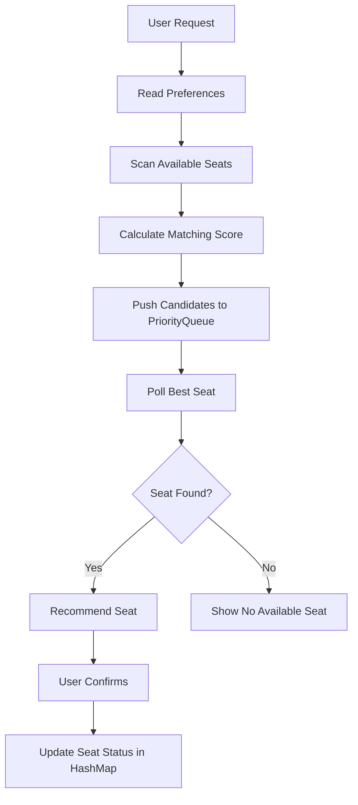
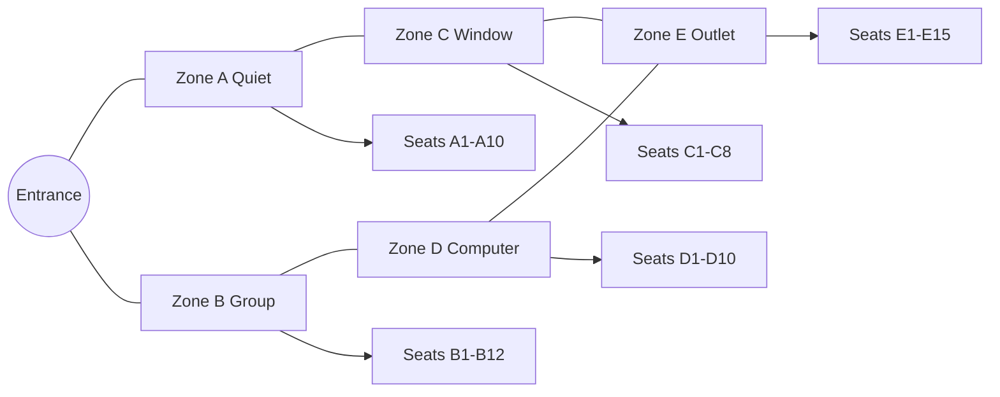
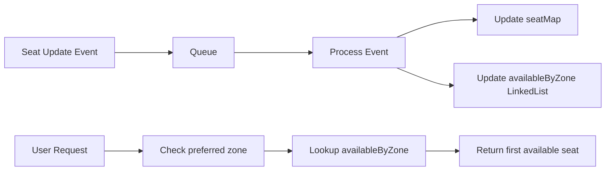
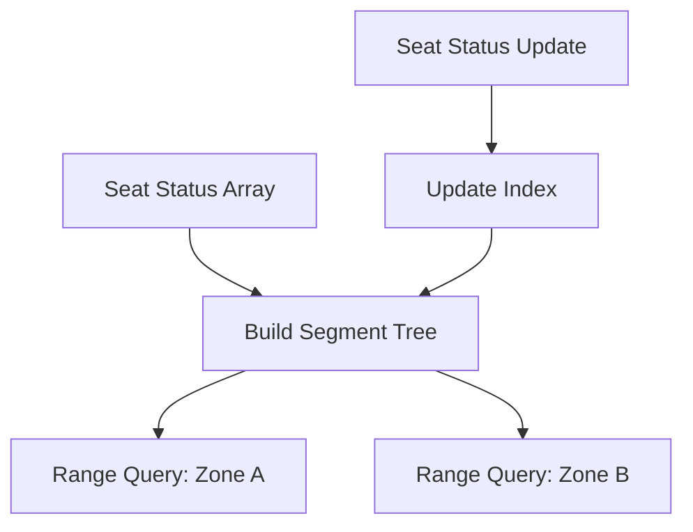
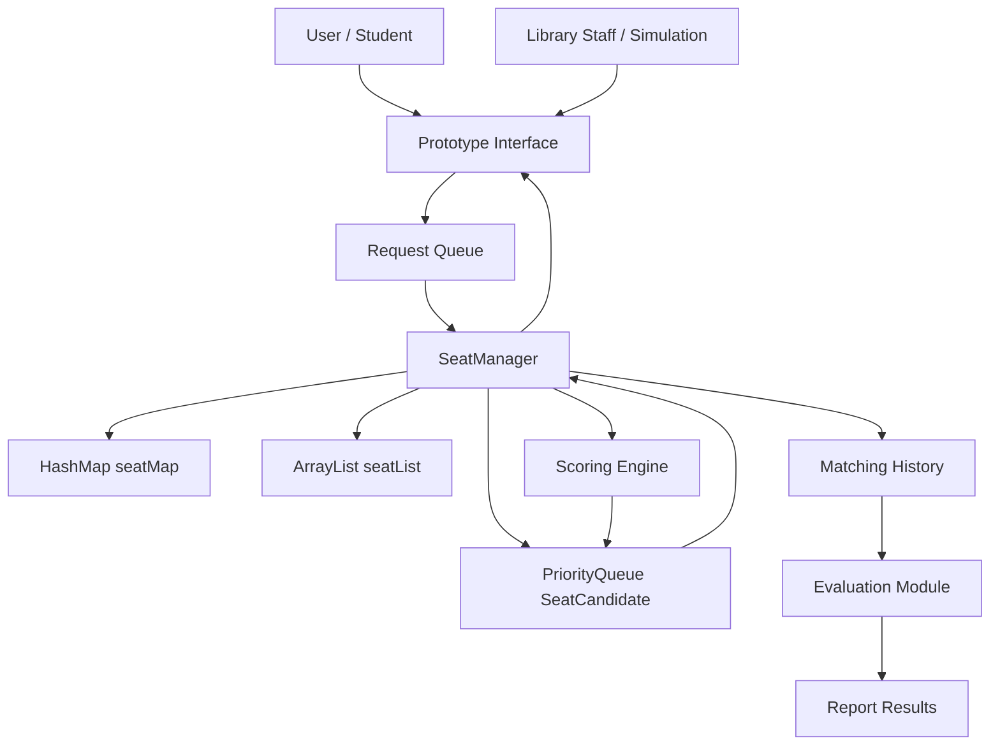
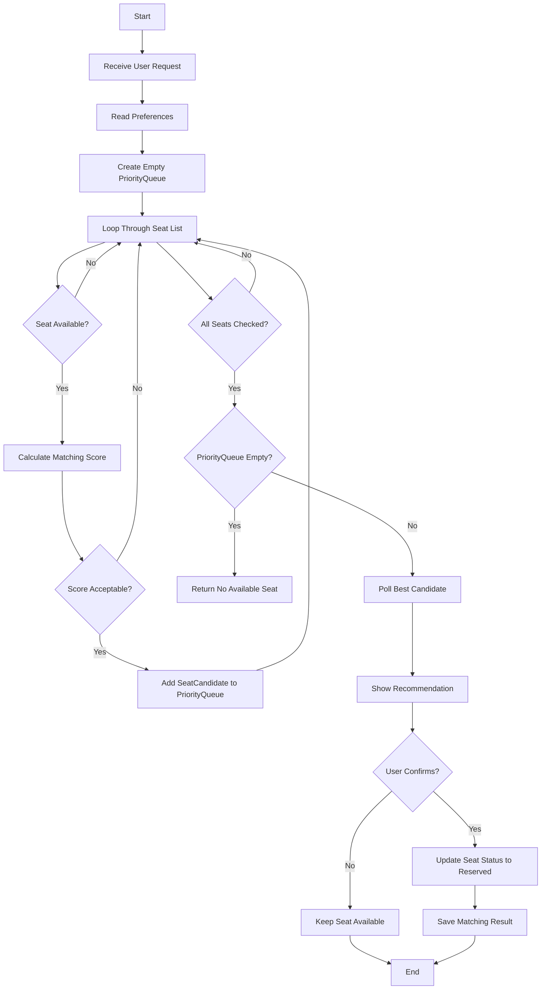
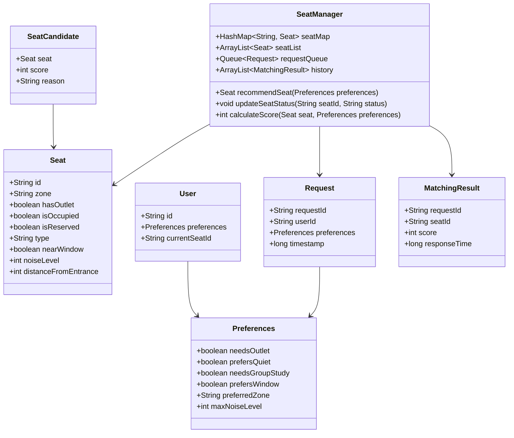

# CSD201 Research Planning — Real-Time Library Seat Management System

> **Chủ đề:** Real-Time Library Seat Management System  
> **Tên tiếng Việt:** Hệ thống quản lý chỗ ngồi trong thư viện theo thời gian thực  
> **Môn học:** CSD201 — Data Structures & Algorithms  
> **Quy mô:** Nhóm 4 thành viên, hoàn thành trong 7 tuần  
> **Deliverables:** Research paper, planning document, diagrams, prototype suggestion

---

## STEP 1 — Topic Analysis & Research Viability Assessment

### 1. Strengths of this topic — Vì sao đây là đề tài tốt?

Đây là một đề tài rất phù hợp cho nhóm sinh viên học **Data Structures & Algorithms** vì nó vừa gần gũi với đời sống đại học, vừa có đủ “đất” để áp dụng cấu trúc dữ liệu một cách tự nhiên. Vấn đề chỗ ngồi trong thư viện không chỉ là câu chuyện quản lý trạng thái `available/occupied`, mà còn liên quan đến **matching**, **ranking**, **searching**, **real-time updates**, và **optimization**.

Các điểm mạnh chính:

- **Vấn đề thực tế, dễ hiểu:** Sinh viên thường gặp cảnh đi quanh thư viện để tìm chỗ trống, tìm ổ cắm điện, hoặc tìm khu yên tĩnh. Vì vậy đề tài có tính ứng dụng rõ ràng.
- **Phù hợp với CSD201:** Có thể dùng `Priority Queue`, `Heap`, `Graph`, `Hash Map`, `Queue`, `Linked List`, `Tree`, thậm chí `Segment Tree` nếu muốn nâng cao.
- **Có thể làm prototype nhỏ:** Không cần triển khai IoT thật. Nhóm có thể mô phỏng dữ liệu chỗ ngồi và trạng thái theo thời gian.
- **Dễ đo lường kết quả:** Có thể đo `search time`, `matching accuracy`, `average response time`, `number of successful matches`, hoặc `user satisfaction score` giả lập.
- **Có tính nghiên cứu:** Nhóm có thể đặt câu hỏi: thuật toán nào phù hợp hơn để tìm chỗ ngồi theo nhiều tiêu chí trong môi trường thư viện nhỏ?
- **Dễ chia việc cho 4 người:** Một bạn nghiên cứu, một bạn thiết kế thuật toán, một bạn làm prototype, một bạn viết báo cáo/evaluation.

Nói ngắn gọn, đề tài này đủ thực tế để không bị “lý thuyết suông”, nhưng cũng đủ nhỏ để hoàn thành trong 7 tuần nếu nhóm biết giới hạn phạm vi.

---

### 2. Weaknesses / gaps — Điểm yếu hoặc phần còn thiếu

Hiện tại đề tài mới dừng ở mức ý tưởng ứng dụng. Để trở thành một nghiên cứu khoa học nhỏ, nhóm cần làm rõ thêm một số điểm:

| Vấn đề còn thiếu | Vì sao quan trọng? | Cần bổ sung |
|---|---|---|
| Chưa có research question rõ ràng | Không có câu hỏi nghiên cứu thì báo cáo dễ thành mô tả phần mềm | Xác định nhóm muốn so sánh, đánh giá, hoặc chứng minh điều gì |
| Chưa có giả thuyết | Nghiên cứu cần có điều có thể kiểm chứng | Ví dụ: dùng Priority Queue giúp giảm thời gian tìm ghế so với linear search |
| Chưa định nghĩa “best seat” | Mỗi người có tiêu chí khác nhau | Cần xây dựng scoring function |
| Chưa có phạm vi cụ thể | Nếu ôm cả IoT, mobile app, booking, user account thì quá lớn | Giới hạn ở simulation/prototype desktop hoặc console/web đơn giản |
| Chưa có dataset | Không có dữ liệu thì khó đánh giá | Tạo dữ liệu mô phỏng 50–100 ghế và 100–300 requests |
| Chưa có tiêu chí evaluation | Không thể kết luận thuật toán tốt hay không | Đo response time, match score, throughput, complexity |

Điểm quan trọng nhất: **đừng biến đề tài thành “làm app đặt chỗ thư viện” đơn thuần**. Với CSD201, trọng tâm nên là **thiết kế và đánh giá thuật toán/cấu trúc dữ liệu cho việc tìm ghế phù hợp theo thời gian thực**.

---

### 3. What needs to be added or refined

#### 3.1 Research question — Câu hỏi nghiên cứu

Một câu hỏi nghiên cứu tốt nên vừa cụ thể, vừa đo lường được. Nhóm có thể dùng câu hỏi chính sau:

> **How can data structures and algorithms be used to efficiently match students with suitable available library seats based on real-time occupancy and user preferences?**

Dịch tự nhiên:

> Làm thế nào có thể sử dụng cấu trúc dữ liệu và thuật toán để ghép sinh viên với chỗ ngồi phù hợp trong thư viện dựa trên trạng thái chỗ ngồi thời gian thực và nhu cầu cá nhân?

Có thể tách thành các câu hỏi phụ:

1. `Priority Queue` có giúp tìm ghế phù hợp nhanh hơn `Linear Search` không?
2. Mô hình `Graph` có hữu ích khi tiêu chí “gần vị trí hiện tại”, “gần ổ cắm”, hoặc “gần khu yên tĩnh” được đưa vào không?
3. `Hash Map` có phù hợp để cập nhật trạng thái ghế theo thời gian thực không?
4. Thuật toán đề xuất có đủ đơn giản để triển khai trong môi trường thư viện đại học nhỏ không?

#### 3.2 Hypothesis — Giả thuyết nghiên cứu

Giả thuyết nên có thể kiểm chứng bằng simulation:

> **H1:** A seat matching algorithm using `Hash Map` for real-time status lookup and `Priority Queue` for preference-based ranking can reduce seat recommendation time compared with a simple linear search approach while maintaining high matching quality.

Dịch:

> Thuật toán sử dụng `Hash Map` để tra cứu trạng thái ghế theo thời gian thực và `Priority Queue` để xếp hạng ghế theo độ phù hợp có thể giảm thời gian đề xuất chỗ ngồi so với cách duyệt tuần tự, đồng thời vẫn giữ chất lượng ghép chỗ cao.

Có thể thêm giả thuyết phụ:

- **H2:** Khi số lượng ghế tăng, `Priority Queue + Hash Map` mở rộng tốt hơn `Linear Search`.
- **H3:** Với thư viện nhỏ, thuật toán đề xuất đạt hiệu quả đủ tốt mà không cần hệ thống IoT phức tạp.

#### 3.3 Scope and limitations — Phạm vi & giới hạn

**Phạm vi nên chọn:**

- Mô phỏng một thư viện đại học nhỏ với khoảng **50–100 seats**.
- Mỗi seat có thuộc tính: `zone`, `hasOutlet`, `nearWindow`, `noiseLevel`, `seatType`, `isOccupied`.
- Người dùng gửi request với preferences như: cần ổ cắm, muốn khu yên tĩnh, muốn ngồi nhóm, muốn gần cửa sổ.
- Hệ thống trả về seat phù hợp nhất dựa trên scoring function.
- Prototype có thể là **console app**, **Java Swing app**, hoặc **simple web prototype**.
- Tập trung vào algorithm/data structures, không tập trung vào UI đẹp hoặc hardware.

**Giới hạn:**

- Không triển khai cảm biến IoT thật.
- Dữ liệu occupancy có thể là dữ liệu mô phỏng.
- Không xử lý authentication phức tạp.
- Không tối ưu cho thư viện rất lớn nhiều tầng.
- Không xử lý tranh chấp nhiều người bấm giữ ghế cùng lúc ở mức production-grade concurrency.

#### 3.4 Measurable objectives — Mục tiêu đo lường được

| Objective | Measurement |
|---|---|
| Thiết kế thuật toán matching ghế theo preference | Có pseudocode, complexity analysis, implementation |
| Cập nhật trạng thái ghế theo thời gian thực giả lập | Update operation chạy trong `O(1)` hoặc gần `O(1)` với `Hash Map` |
| So sánh với baseline `Linear Search` | Đo average response time với 50, 100, 500, 1000 seats mô phỏng |
| Đánh giá chất lượng ghép ghế | Tính average matching score trên nhiều user requests |
| Xây dựng prototype minh họa | Demo nhận request, trả seat, update occupancy |
| Viết research paper hoàn chỉnh | Có introduction, related work, methodology, results, discussion |

---

### 4. Related work / prior art

Dưới đây là các hướng hệ thống/công trình liên quan mà nhóm có thể dùng làm nền tảng. Khi viết báo cáo chính thức, nhóm nên tra cứu lại trên **Google Scholar**, **IEEE Xplore**, **ACM Digital Library**, hoặc thư viện số trường.

#### 4.1 Smart Library Seat Occupancy Detection using IoT Sensors

- **Mô tả:** Các nghiên cứu dạng này dùng cảm biến áp suất, PIR sensor, camera, hoặc RFID để phát hiện ghế có người ngồi hay không.
- **Điểm liên quan:** Cung cấp ý tưởng về real-time occupancy data.
- **Khác biệt của đề tài nhóm:** Nhóm không triển khai phần cứng, mà tập trung vào thuật toán matching và cấu trúc dữ liệu xử lý trạng thái ghế.

#### 4.2 Seat Reservation and Occupancy Management Systems in Smart Libraries

- **Mô tả:** Một số thư viện hiện đại có hệ thống đặt chỗ, check-in/check-out, hoặc hiển thị số chỗ trống theo khu vực.
- **Điểm liên quan:** Cho thấy nhu cầu thực tế và workflow đặt/giữ ghế.
- **Khác biệt:** Đề tài nhóm không chỉ hiển thị ghế trống, mà đề xuất ghế “phù hợp nhất” theo preference.

#### 4.3 Smart Campus / Smart Space Management Systems

- **Mô tả:** Các hệ thống smart campus quản lý phòng học, phòng họp, khu học tập, năng lượng, và occupancy.
- **Điểm liên quan:** Thư viện có thể xem là một smart space nhỏ.
- **Khác biệt:** Nhóm thu hẹp bài toán vào seat-level matching thay vì quản lý toàn bộ campus.

#### 4.4 Recommender Systems for Resource Allocation

- **Mô tả:** Các hệ thống recommendation thường xếp hạng tài nguyên dựa trên nhu cầu người dùng, độ sẵn có, khoảng cách, điểm phù hợp.
- **Điểm liên quan:** Seat matching có thể xem như một bài toán recommendation đơn giản.
- **Khác biệt:** Nhóm dùng data structures cơ bản thay vì machine learning.

#### 4.5 Graph-Based Indoor Navigation and Shortest Path Search

- **Mô tả:** Các nghiên cứu indoor navigation dùng graph để mô hình hóa vị trí trong tòa nhà và tìm đường đi ngắn nhất.
- **Điểm liên quan:** Nếu người dùng muốn ghế gần vị trí hiện tại, graph search rất hữu ích.
- **Khác biệt:** Nhóm có thể dùng graph đơn giản để minh họa khoảng cách giữa các khu vực, không cần bản đồ indoor chi tiết.

---

### 5. Academic framing

#### 5.1 Suggested formal research title

> **An Efficient Data Structure-Based Approach for Real-Time Library Seat Recommendation and Management**

Tên tiếng Việt có thể dùng trong báo cáo:

> **Phương pháp quản lý và đề xuất chỗ ngồi thư viện theo thời gian thực dựa trên cấu trúc dữ liệu**

#### 5.2 Abstract

> This research proposes a small-scale real-time library seat management system that recommends suitable available seats to students based on seat availability and user preferences such as quiet zone, power outlet, group study area, and window seat. The study focuses on applying fundamental data structures and algorithms, including Hash Map, Priority Queue, Graph, and Queue, to support fast seat status updates and preference-based matching. A simulated dataset is used to evaluate the proposed approach against a baseline linear search method in terms of response time, matching score, and implementation feasibility. The expected result is a practical prototype and an academic analysis showing that a data structure-based solution can improve seat recommendation efficiency in a university library context without requiring complex IoT infrastructure.

---

## STEP 2 — Research Direction & Methodology Planning

### 1. Research type

Đề tài này phù hợp nhất với loại **design-based research kết hợp experimental evaluation**.

- **Design-based:** Vì nhóm sẽ thiết kế một hệ thống/thuật toán cụ thể để giải quyết vấn đề thực tế.
- **Experimental:** Vì nhóm có thể chạy simulation để đo hiệu năng và so sánh với baseline.
- **Không nên chọn pure theoretical research:** Vì nhóm cần sản phẩm/prototype và đánh giá thực nghiệm.
- **Không nên chọn full IoT experimental research:** Vì 7 tuần là ngắn, phần cứng dễ gây rủi ro.

Lựa chọn hợp lý nhất:

> Nhóm xây dựng một mô hình hệ thống nhỏ, đề xuất thuật toán matching ghế, triển khai prototype, sau đó đánh giá bằng dữ liệu mô phỏng.

Đây là hướng vừa đủ khoa học, vừa khả thi trong 7 tuần.

---

### 2. Methodology — Quy trình nghiên cứu đề xuất

#### Step 1: Literature review

- Tìm hiểu smart library, seat occupancy detection, seat reservation systems.
- Tìm hiểu các thuật toán liên quan: `Priority Queue`, `Heap`, `Hash Map`, `Graph Search`, `BFS`, `Dijkstra`, `Queue`.
- Ghi lại research gap: nhiều hệ thống tập trung vào phát hiện occupancy, ít tập trung vào matching theo preference bằng cấu trúc dữ liệu cơ bản.

#### Step 2: Problem formulation

- Định nghĩa bài toán:
  - Input: danh sách seats, trạng thái occupancy, user preferences.
  - Output: seat phù hợp nhất hoặc danh sách top-k seats.
- Xác định constraints:
  - Seat phải available.
  - Seat nên match preference càng nhiều càng tốt.
  - Response time phải nhanh.

#### Step 3: System/algorithm design

- Chọn cấu trúc dữ liệu chính:
  - `HashMap<String, Seat>` để quản lý trạng thái ghế.
  - `PriorityQueue<SeatCandidate>` để xếp hạng ghế theo score.
  - `Queue<Request>` để mô phỏng real-time requests.
- Thiết kế scoring function:
  - `hasOutlet`: +30 điểm nếu match.
  - `quietZone`: +25 điểm nếu match.
  - `groupStudy`: +20 điểm nếu match.
  - `nearWindow`: +10 điểm nếu match.
  - `distance`: trừ điểm nếu xa.

#### Step 4: Prototype or simulation

- Tạo dataset 50–100 seats.
- Tạo 100–300 user requests mô phỏng.
- Chạy thuật toán đề xuất và baseline linear search.
- Lưu kết quả: response time, selected seat, matching score.

#### Step 5: Evaluation / testing

- Test correctness:
  - Không trả ghế occupied.
  - Không trả seat không tồn tại.
  - Khi seat được chọn, trạng thái đổi thành occupied/reserved.
- Test performance:
  - Với 50, 100, 500, 1000 seats.
- Compare:
  - Baseline Linear Search vs Priority Queue + Hash Map.

#### Step 6: Conclusion & future work

- Kết luận thuật toán có phù hợp không.
- Nêu giới hạn: simulation, chưa có IoT thật, chưa có concurrency production.
- Đề xuất mở rộng: sensor integration, mobile app, real-time dashboard, booking expiration.

---

### 3. Data collection plan

#### 3.1 Dữ liệu cần có

| Data type | Ví dụ | Cách lấy hoặc mô phỏng |
|---|---|---|
| Seat layout | A1, A2, B1, B2; zone Quiet/Group/Window | Vẽ sơ đồ thư viện giả lập hoặc quan sát thư viện trường |
| Seat attributes | hasOutlet, nearWindow, noiseLevel, type | Gán thủ công theo zone |
| Occupancy status | occupied/available/reserved | Random theo khung giờ |
| User preferences | outlet, quiet, group, window | Survey nhỏ hoặc tự tạo request |
| Peak hours | 8–10h, 13–15h, mùa thi | Hỏi sinh viên/thủ thư hoặc giả lập |
| Request history | timestamp, preference, assigned seat | Sinh tự động bằng simulation |

#### 3.2 Seat preference categories

Nhóm nên định nghĩa ít nhất 5 loại nhu cầu:

1. **Power Outlet Seat** — cần ổ cắm để dùng laptop.
2. **Quiet Zone Seat** — cần khu yên tĩnh để đọc sách/làm bài.
3. **Group Study Seat** — cần bàn nhóm, cho 2–6 người.
4. **Window Seat** — muốn gần cửa sổ, ánh sáng tự nhiên.
5. **Computer Area Seat** — cần gần máy tính hoặc khu tra cứu.
6. **Entrance-near Seat** — muốn gần cửa ra vào để tiện di chuyển.

#### 3.3 Occupancy rates và peak hours

Có thể mô phỏng theo 3 khung giờ:

| Time slot | Occupancy rate giả lập | Ý nghĩa |
|---|---:|---|
| Morning 7:00–10:00 | 40–60% | Sinh viên bắt đầu vào học |
| Noon 10:00–13:00 | 60–75% | Nhiều người học giữa buổi |
| Afternoon 13:00–17:00 | 70–90% | Cao điểm, đặc biệt mùa thi |
| Evening 17:00–20:00 | 50–70% | Giảm dần |

#### 3.4 Cách thu thập trong bối cảnh đại học

Nếu nhóm có thể khảo sát thực tế:

- Quan sát thư viện trong 3 ngày, mỗi ngày 3 khung giờ.
- Ghi số ghế trống theo khu vực, không ghi thông tin cá nhân.
- Làm Google Form hỏi 30–50 sinh viên:
  - Bạn thường cần ổ cắm không?
  - Bạn thích khu yên tĩnh hay học nhóm?
  - Bạn có sẵn sàng dùng app để tìm ghế không?

Nếu không có dữ liệu thật:

- Tạo simulation dataset.
- Ghi rõ trong báo cáo: “Due to limited access to real-time library data, this research uses simulated data based on common university library usage patterns.”

Cách này hoàn toàn chấp nhận được cho project CSD201 nếu nhóm minh bạch.

---

### 4. Reference sources — Nguồn tham khảo nên đọc

> Lưu ý: Nhóm nên tra cứu lại title chính xác trên Google Scholar/IEEE Xplore/ACM DL khi viết phần References. Dưới đây là danh sách định hướng đọc đáng tin cậy.

| # | Source / Title | Where to find | Why relevant |
|---:|---|---|---|
| 1 | **Introduction to Algorithms** — Cormen, Leiserson, Rivest, Stein | Library / Google Books | Nền tảng về heap, priority queue, graph algorithms, complexity |
| 2 | **Algorithms** — Robert Sedgewick, Kevin Wayne | Book / Princeton online materials | Giải thích trực quan về priority queue, graph, hash table |
| 3 | **Data Structures and Algorithm Analysis in Java** — Mark Allen Weiss | Library / Google Books | Rất phù hợp nếu prototype viết bằng Java |
| 4 | **Smart Library Management System using IoT** | Google Scholar / IEEE Xplore | Cung cấp bối cảnh smart library và IoT-based monitoring |
| 5 | **IoT Based Seat Occupancy Detection System** | IEEE Xplore / Google Scholar | Liên quan đến phát hiện ghế trống bằng sensor |
| 6 | **A Survey on Smart Campus and Smart Library Systems** | ACM DL / SpringerLink / Google Scholar | Giúp viết literature review rộng hơn |
| 7 | **Indoor Navigation using Graph-based Shortest Path Algorithms** | IEEE Xplore / Google Scholar | Hữu ích cho graph-based solution |
| 8 | **RFID Based Library Management System** | IEEE Xplore / Google Scholar | Cung cấp góc nhìn quản lý tài nguyên thư viện bằng RFID |
| 9 | **Priority Queue and Heap Applications in Resource Scheduling** | ACM DL / Google Scholar | Liên hệ seat recommendation với resource allocation |
| 10 | **Vietnamese university library digital transformation reports** | Website thư viện đại học / Bộ GD&ĐT / Google Scholar | Giúp đặt đề tài vào bối cảnh Việt Nam |

Khi đưa vào paper, nhóm nên dùng IEEE citation format, ví dụ:

```text
[1] T. H. Cormen, C. E. Leiserson, R. L. Rivest, and C. Stein, Introduction to Algorithms, 3rd ed. MIT Press, 2009.
```

---

## STEP 3 — Solution Proposals

Nhóm nên trình bày ít nhất 3 hướng giải pháp. Mục tiêu không phải triển khai tất cả hoàn chỉnh, mà là phân tích, so sánh, rồi chọn một hướng chính.

---

### Solution 1 — Priority Queue / Min-Heap Seat Matching

#### Short description

Hệ thống tính điểm phù hợp cho từng ghế còn trống dựa trên preference của người dùng, sau đó dùng `PriorityQueue` hoặc `Min-Heap/Max-Heap` để lấy ra ghế có điểm tốt nhất.

Nếu dùng Java `PriorityQueue`, có thể thiết kế sao cho seat có `score` cao nhất được ưu tiên. Vì Java mặc định là min-heap, nhóm có thể đảo comparator.

#### Core data structures

- `HashMap<String, Seat>`: lưu thông tin seat theo `seatId`.
- `PriorityQueue<SeatCandidate>`: xếp hạng các ghế available theo matching score.
- `Queue<Request>`: xử lý request đến theo thời gian.
- `ArrayList<Seat>`: danh sách tất cả ghế để duyệt khi cần build candidates.

#### How it works

1. User gửi preferences.
2. Hệ thống lấy danh sách seats.
3. Bỏ qua seat đang occupied/reserved.
4. Tính `score` cho từng seat available.
5. Đưa seat candidate vào `PriorityQueue`.
6. Lấy candidate có score cao nhất.
7. Gợi ý seat cho user.
8. Nếu user confirm, cập nhật seat thành `reserved` hoặc `occupied`.

#### Scoring function example

```text
score = 0
if user.needsOutlet and seat.hasOutlet: score += 30
if user.prefersQuiet and seat.zone == "QUIET": score += 25
if user.needsGroupStudy and seat.type == "GROUP": score += 20
if user.prefersWindow and seat.nearWindow: score += 10
score -= seat.distanceFromEntrance * 2
```

#### Pseudocode

```text
function recommendSeat(userPreferences):
    pq = new PriorityQueue(order by highest score)

    for each seat in seatList:
        if seat.isOccupied == false and seat.isReserved == false:
            score = calculateScore(seat, userPreferences)
            candidate = new SeatCandidate(seat, score)
            pq.add(candidate)

    if pq.isEmpty():
        return null

    bestCandidate = pq.poll()
    return bestCandidate.seat
```

#### Mermaid diagram



#### Pros

- Rất phù hợp với CSD201.
- Dễ giải thích bằng complexity.
- Dễ demo và test.
- Hỗ trợ nhiều preference linh hoạt.
- Có thể so sánh rõ với `Linear Search`.

#### Cons

- Nếu mỗi request đều build lại toàn bộ `PriorityQueue`, vẫn cần duyệt nhiều seats.
- Scoring function mang tính chủ quan.
- Chưa tối ưu tốt nếu thư viện cực lớn.

#### Implementation complexity

**Medium** — phù hợp nhất cho nhóm 4 người trong 7 tuần.

---

### Solution 2 — Graph-Based Library Floor Search

#### Short description

Mô hình thư viện như một `Graph`, trong đó mỗi khu vực hoặc mỗi seat là một node. Edge biểu diễn đường đi giữa các khu vực. Khi user cần ghế, hệ thống tìm ghế trống phù hợp gần nhất bằng `BFS` hoặc `Dijkstra`.

#### Core data structures

- `Graph`: adjacency list biểu diễn sơ đồ thư viện.
- `HashMap<String, Seat>`: tra cứu seat.
- `Queue<Node>`: dùng cho BFS.
- `PriorityQueue<NodeDistance>`: dùng cho Dijkstra nếu edge có trọng số.
- `Set<String>`: đánh dấu node đã thăm.

#### How it works

1. User có vị trí hiện tại, ví dụ `Entrance` hoặc `Floor1_AreaA`.
2. Hệ thống bắt đầu search từ node đó.
3. Duyệt các node gần trước bằng BFS.
4. Ở mỗi node, kiểm tra seats available và match preference.
5. Trả về seat phù hợp gần nhất.

#### Pseudocode — BFS version

```text
function findNearestMatchingSeat(startNode, preferences):
    queue = new Queue()
    visited = new Set()

    queue.enqueue(startNode)
    visited.add(startNode)

    while queue is not empty:
        current = queue.dequeue()

        for each seat in current.seats:
            if seat is available and matches(preferences, seat):
                return seat

        for each neighbor in graph[current]:
            if neighbor not in visited:
                visited.add(neighbor)
                queue.enqueue(neighbor)

    return null
```

#### Mermaid diagram



#### Pros

- Rất hay về mặt thuật toán.
- Có tính “thông minh” hơn vì xét khoảng cách.
- Phù hợp nếu thư viện có nhiều khu vực/tầng.
- Dễ minh họa bằng diagram.

#### Cons

- Cần thiết kế floor graph, hơi mất thời gian.
- Nếu chỉ có 50 ghế trong một phòng nhỏ, graph có thể hơi “overkill”.
- Matching nhiều preference vẫn cần scoring thêm.

#### Implementation complexity

**Medium to Hard** — tốt cho phần mở rộng hoặc so sánh, nhưng không nên là hướng chính nếu nhóm còn yếu code.

---

### Solution 3 — Hash Map + Linked List Real-Time Status Management

#### Short description

Hướng này tập trung vào cập nhật trạng thái ghế cực nhanh. Mỗi seat được lưu trong `HashMap` để lookup `O(1)`. Các seat available có thể được nối trong `LinkedList` theo từng zone để lấy nhanh danh sách ghế trống.

#### Core data structures

- `HashMap<String, Seat>`: tra cứu seat theo id.
- `HashMap<String, LinkedList<Seat>>`: danh sách ghế available theo zone.
- `Queue<SeatUpdateEvent>`: hàng đợi cập nhật trạng thái theo thời gian.
- `LinkedList<Seat>`: quản lý ghế trống trong từng khu.

#### How it works

1. Khi seat chuyển từ available sang occupied, cập nhật trong `seatMap`.
2. Xóa seat khỏi available list của zone tương ứng.
3. Khi seat trống lại, thêm vào available list.
4. Khi user request zone cụ thể, lấy list ghế available trong zone đó.
5. Có thể chọn ghế đầu tiên hoặc chạy scoring nhẹ.

#### Pseudocode

```text
function updateSeatStatus(seatId, newStatus):
    seat = seatMap.get(seatId)
    oldStatus = seat.status
    seat.status = newStatus

    if oldStatus == AVAILABLE and newStatus != AVAILABLE:
        availableByZone[seat.zone].remove(seat)

    if oldStatus != AVAILABLE and newStatus == AVAILABLE:
        availableByZone[seat.zone].add(seat)
```

```text
function findSeatByZone(preferredZone):
    list = availableByZone.get(preferredZone)
    if list is empty:
        return null
    return list.first()
```

#### Mermaid diagram



#### Pros

- Rất nhanh cho lookup và update.
- Dễ giải thích `HashMap` trong CSD201.
- Phù hợp với real-time status management.
- Code không quá khó.

#### Cons

- Matching theo preference chưa mạnh bằng Priority Queue.
- Xóa phần tử trong `LinkedList` có thể là `O(n)` nếu không giữ node reference.
- Có thể trả ghế “có sẵn” nhưng chưa chắc “tốt nhất”.

#### Implementation complexity

**Easy to Medium** — rất phù hợp làm nền tảng status management cho solution chính.

---

### Solution 4 — Segment Tree / Fenwick Tree for Zone Availability Queries

#### Short description

Nếu thư viện chia thành các zone hoặc hàng ghế, nhóm có thể dùng `Segment Tree` hoặc `Fenwick Tree` để truy vấn nhanh số ghế còn trống trong một khoảng. Ví dụ: khu A có ghế A1–A20, cần biết trong hàng A1–A10 còn bao nhiêu ghế trống.

#### Core data structures

- `SegmentTree`: range query số ghế available.
- `FenwickTree`: prefix sum occupancy/availability.
- `Array<Integer>`: biểu diễn trạng thái ghế, `1 = available`, `0 = occupied`.
- `HashMap<String, Integer>`: ánh xạ seatId sang index.

#### How it works

1. Mỗi seat được ánh xạ sang một index.
2. Nếu seat available, value = 1; occupied, value = 0.
3. Query range để biết khu/hàng còn bao nhiêu ghế.
4. Update khi seat thay đổi trạng thái.

#### Pseudocode

```text
function updateSeat(seatId, isAvailable):
    index = seatIndexMap.get(seatId)
    value = 1 if isAvailable else 0
    segmentTree.update(index, value)

function countAvailableSeats(leftSeatId, rightSeatId):
    left = seatIndexMap.get(leftSeatId)
    right = seatIndexMap.get(rightSeatId)
    return segmentTree.query(left, right)
```

#### Mermaid diagram



#### Pros

- Rất tốt để thể hiện kiến thức nâng cao.
- Query range nhanh: `O(log n)`.
- Update nhanh: `O(log n)`.
- Hay nếu muốn thống kê availability theo khu.

#### Cons

- Không trực tiếp giải quyết matching preference.
- Khó hơn để giải thích nếu nhóm chưa vững.
- Có thể không cần thiết cho thư viện nhỏ.

#### Implementation complexity

**Hard** — nên để làm bonus hoặc future work, không nên là core solution chính.

---

## STEP 4 — Feasibility Evaluation

### 1. Comparative evaluation table

| Solution | Technical feasibility | University compatibility | Data availability | Success probability | Complexity |
|---|---|---|---|---:|---|
| Priority Queue / Min-Heap | High | High | High | 85% | Medium |
| Graph-Based Search | Medium | Medium-High | Medium | 70% | Medium-Hard |
| Hash Map + Linked List | High | High | High | 80% | Easy-Medium |
| Segment Tree / Fenwick Tree | Medium | Medium | Medium | 55% | Hard |

---

### 2. Solution 1 feasibility — Priority Queue / Min-Heap

#### Technical feasibility

Rất khả thi. Nhóm chỉ cần hiểu class, comparator, priority queue, hash map, và cách tính score. Nếu dùng Java, đây là phần rất hợp với CSD201.

#### Compatibility with university context

Phù hợp với thư viện đại học Việt Nam vì người dùng thường có nhu cầu rất cụ thể: cần ổ cắm, cần yên tĩnh, cần bàn nhóm. Hệ thống không yêu cầu hạ tầng quá phức tạp.

Assumptions:

- Thư viện có sơ đồ ghế cố định.
- Trạng thái ghế có thể được cập nhật thủ công hoặc mô phỏng.
- Người dùng chọn preference trước khi tìm ghế.

#### Data availability

Dễ mô phỏng. Nhóm chỉ cần tạo file CSV/JSON hoặc hard-code dataset ban đầu.

#### Risk assessment

| Risk | Level | Mitigation |
|---|---|---|
| Scoring function thiếu thuyết phục | Medium | Giải thích trọng số dựa trên survey nhỏ hoặc assumption rõ ràng |
| Prototype chỉ demo đơn giản | Low | Tập trung vào algorithm evaluation thay vì UI |
| PriorityQueue phải rebuild mỗi request | Medium | Chấp nhận trong phạm vi nhỏ; nêu là limitation |

#### Success probability

**85%** — Đây là hướng cân bằng nhất giữa tính khoa học, tính khả thi, và độ liên quan đến CSD201.

---

### 3. Solution 2 feasibility — Graph-Based Search

#### Technical feasibility

Khả thi nếu nhóm có một bạn vững graph. Tuy nhiên cần thêm thời gian thiết kế floor map và adjacency list.

#### Compatibility with university context

Phù hợp nếu thư viện có nhiều khu hoặc nhiều tầng. Nếu chỉ mô phỏng một phòng nhỏ, graph có thể hơi phức tạp so với nhu cầu.

Assumptions:

- Có thể mô hình hóa thư viện thành các zones.
- Khoảng cách giữa zones có ý nghĩa với user.
- Người dùng có vị trí bắt đầu.

#### Data availability

Có thể mô phỏng graph đơn giản: Entrance, Quiet Zone, Group Zone, Window Zone, Computer Zone.

#### Risk assessment

| Risk | Level | Mitigation |
|---|---|---|
| Mô hình graph quá giả tạo | Medium | Vẽ sơ đồ thư viện đơn giản và giải thích assumption |
| Code BFS/Dijkstra lỗi | Medium | Chỉ dùng BFS nếu edge không trọng số |
| Không kết hợp tốt với preference | Medium | Dùng graph để lọc theo khoảng cách, sau đó scoring |

#### Success probability

**70%** — Hay về thuật toán, nhưng có rủi ro scope creep.

---

### 4. Solution 3 feasibility — Hash Map + Linked List

#### Technical feasibility

Rất khả thi. Đây là hướng dễ code và dễ demo. Đặc biệt tốt cho phần real-time update.

#### Compatibility with university context

Phù hợp vì thư viện cần cập nhật trạng thái ghế nhanh. Có thể dùng cho màn hình hiển thị số ghế trống theo khu.

Assumptions:

- Mỗi seat có ID cố định.
- Trạng thái seat được cập nhật đều đặn.
- User chủ yếu chọn theo zone.

#### Data availability

Dễ mô phỏng bằng event queue.

#### Risk assessment

| Risk | Level | Mitigation |
|---|---|---|
| Matching chưa đủ thông minh | Medium | Kết hợp với scoring hoặc Priority Queue |
| LinkedList remove không thật sự O(1) | Medium | Không claim quá mức; chỉ nói lookup bằng HashMap là O(1) |
| Báo cáo thiếu chiều sâu thuật toán | Medium | Dùng làm component, không làm toàn bộ solution |

#### Success probability

**80%** — Rất ổn nếu kết hợp với Priority Queue.

---

### 5. Solution 4 feasibility — Segment Tree / Fenwick Tree

#### Technical feasibility

Có thể làm nếu nhóm khá mạnh, nhưng không cần thiết cho mục tiêu chính.

#### Compatibility with university context

Phù hợp cho thống kê số ghế trống theo range hoặc zone. Tuy nhiên người dùng thường cần ghế cụ thể, không chỉ số lượng ghế trống.

Assumptions:

- Seat được sắp theo index tuyến tính.
- Query theo range có ý nghĩa.
- Nhóm cần thống kê availability nhanh theo khu.

#### Data availability

Có thể mô phỏng được, nhưng mapping seat sang index cần thiết kế cẩn thận.

#### Risk assessment

| Risk | Level | Mitigation |
|---|---|---|
| Quá khó so với thời gian | High | Chỉ đưa vào future work hoặc bonus |
| Không liên quan trực tiếp matching | Medium | Dùng cho dashboard zone availability |
| Dễ sai khi update/query | Medium | Test kỹ với dataset nhỏ |

#### Success probability

**55%** — Không nên chọn làm hướng chính.

---

### 6. Final recommendation

Nhóm nên chọn hướng:

> **Recommended Solution: Hybrid Hash Map + Priority Queue Seat Matching**

Cụ thể:

- Dùng `HashMap<String, Seat>` để quản lý và cập nhật trạng thái ghế theo `seatId`.
- Dùng `PriorityQueue<SeatCandidate>` để xếp hạng các ghế available theo độ phù hợp với user preferences.
- Dùng `Queue<Request>` để mô phỏng real-time user requests.
- Có thể thêm graph đơn giản trong phần future work, không nên làm core.

Lý do chọn:

1. **Phù hợp nhất với CSD201:** Có hash map, heap, queue, complexity analysis.
2. **Khả thi trong 7 tuần:** Không cần IoT thật, không cần UI phức tạp.
3. **Có thể đánh giá rõ:** So sánh với linear search bằng runtime và matching score.
4. **Có giá trị thực tế:** Dù nhỏ, hệ thống vẫn mô phỏng đúng nhu cầu thư viện.
5. **Dễ chia việc:** Một người research, một người algorithm, một người prototype, một người evaluation/report.

Kết luận mentor: nếu nhóm muốn điểm tốt và ít rủi ro, hãy làm thật chắc **Hybrid Hash Map + Priority Queue**. Đừng cố ôm quá nhiều như IoT thật, mobile app, multi-floor navigation nếu chưa hoàn thành core algorithm.

---

## STEP 5 — System Design for Recommended Solution

### 1. User stories

1. **As a laptop user**, I want to find an available seat with a power outlet, so that I can study without worrying about battery life.
2. **As a student preparing for exams**, I want to find a quiet zone seat, so that I can focus better.
3. **As a group study student**, I want to find a group table with enough available seats, so that my team can work together.
4. **As a student who prefers natural light**, I want to find a window seat, so that I can study in a comfortable environment.
5. **As a library staff member**, I want to update seat occupancy status quickly, so that the system reflects current availability.

---

### 2. Functional requirements

| ID | Requirement |
|---|---|
| FR1 | The system shall store all library seats with their attributes and current status. |
| FR2 | The system shall allow a user to submit seat preferences. |
| FR3 | The system shall recommend the best available seat based on matching score. |
| FR4 | The system shall not recommend occupied or reserved seats. |
| FR5 | The system shall update seat status when a user confirms or releases a seat. |
| FR6 | The system shall process simulated real-time seat update events. |
| FR7 | The system shall show availability statistics by zone. |
| FR8 | The system shall record matching results for evaluation. |

---

### 3. Non-functional requirements

| Category | Requirement |
|---|---|
| Performance | Seat lookup by ID should be approximately `O(1)` using `HashMap`. |
| Response time | Recommendation should be fast enough for small datasets, ideally under a few milliseconds in simulation. |
| Scalability | The algorithm should still work with 500–1000 simulated seats. |
| Simplicity | Prototype should be simple enough for a student team to explain and maintain. |
| Reliability | The system should avoid assigning the same seat to multiple users in sequential simulation. |
| Explainability | The selected seat should include a matching score and reasons. |
| Maintainability | Seat attributes and scoring weights should be easy to modify. |

---

### 4. Data model

#### 4.1 `Seat`

```java
class Seat {
    String id;
    String zone;
    boolean hasOutlet;
    boolean isOccupied;
    boolean isReserved;
    String type;        // INDIVIDUAL, GROUP, COMPUTER
    boolean nearWindow;
    int noiseLevel;     // 1 = quiet, 5 = noisy
    int distanceFromEntrance;
}
```

#### 4.2 `User`

```java
class User {
    String id;
    Preferences preferences;
    String currentSeatId;
}
```

#### 4.3 `Preferences`

```java
class Preferences {
    boolean needsOutlet;
    boolean prefersQuiet;
    boolean needsGroupStudy;
    boolean prefersWindow;
    String preferredZone;
    int maxNoiseLevel;
}
```

#### 4.4 `Request`

```java
class Request {
    String requestId;
    String userId;
    Preferences preferences;
    long timestamp;
}
```

#### 4.5 `SeatCandidate`

```java
class SeatCandidate {
    Seat seat;
    int score;
    String reason;
}
```

#### 4.6 `SeatManager`

```java
class SeatManager {
    HashMap<String, Seat> seatMap;
    ArrayList<Seat> seatList;
    Queue<Request> requestQueue;
    ArrayList<MatchingResult> history;

    Seat recommendSeat(Preferences preferences);
    void updateSeatStatus(String seatId, String status);
    int calculateScore(Seat seat, Preferences preferences);
}
```

---

### 5. Architecture diagram



---

### 6. Algorithm flowchart



---

### 7. Class diagram



---

## STEP 6 — Team Task Assignment

### 1. Main role assignment

| Member | Role | Responsibilities |
|---|---|---|
| Member 1 (Leader) | Research Lead + Algorithm Design | Chốt research question, hypothesis, scope; thiết kế scoring algorithm; quản lý tiến độ |
| Member 2 | Data Structure Specialist + Prototype | Code `Seat`, `SeatManager`, `PriorityQueue`, `HashMap`; demo prototype |
| Member 3 | Data Collection + Literature Review | Tìm tài liệu, khảo sát nhỏ, tạo/simulate dataset, viết related work |
| Member 4 | Report Writer + Evaluation + Testing | Viết report chính, test thuật toán, tạo bảng kết quả, chuẩn hóa references |

---

### 2. Detailed responsibility table

| Member | Research sections owned | Prototype modules | Diagrams responsible | Weekly effort |
|---|---|---|---|---:|
| Member 1 | Introduction, Problem Formulation, Methodology | Scoring logic, pseudocode, algorithm explanation | Algorithm flowchart | 6–8 hours/week |
| Member 2 | Proposed System / Algorithm implementation details | `Seat`, `Preferences`, `Request`, `SeatManager`, `PriorityQueue` | Class diagram, architecture diagram | 7–9 hours/week |
| Member 3 | Literature Review, Data Collection Plan, Related Work | Dataset generator, simulated occupancy events | Data flow diagram, dataset table | 5–7 hours/week |
| Member 4 | Evaluation, Discussion, Conclusion, References | Test runner, baseline linear search, result logging | Evaluation charts/tables | 6–8 hours/week |

---

### 3. Collaboration rules

- Mỗi tuần có ít nhất 1 buổi check-in nhóm.
- Mọi thuật toán phải có pseudocode trước khi code.
- Mọi kết quả evaluation phải lưu lại bằng bảng hoặc screenshot.
- Report writer không nên đợi đến tuần 6 mới viết; nên viết dần từ tuần 1.
- Leader cần đảm bảo scope không bị phình thành app quá lớn.

---

## STEP 7 — 7-Week Roadmap

### 1. Timeline overview

| Week | Goals | Deliverables | Milestone |
|---|---|---|---|
| Week 1 | Topic refinement, literature review | Research question, hypothesis, initial references | Research question locked |
| Week 2 | Data collection / simulation design | Seat dataset schema, simulated request design | Dataset ready |
| Week 3 | Algorithm design + pseudocode | Scoring function, Priority Queue algorithm, baseline design | Core algorithm done |
| Week 4 | Prototype implementation | Working prototype with seat recommendation | Working demo |
| Week 5 | Testing + evaluation | Runtime comparison, matching score results, tables | Evaluation results |
| Week 6 | Report writing | Full draft report, diagrams, references | Draft report |
| Week 7 | Review + polish + submission | Final paper, planning document, demo script | Final submission |

---

### 2. Week-by-week details

#### Week 1 — Topic refinement and literature review

**Goals:**

- Chốt tên đề tài.
- Viết research question và hypothesis.
- Đọc ít nhất 5 nguồn tham khảo ban đầu.
- Xác định phạm vi: simulation + prototype, không làm IoT thật.

**Deliverables:**

- 1 trang topic proposal.
- Danh sách references ban đầu.
- Draft Introduction.

**Milestone:** Research question locked.

---

#### Week 2 — Data collection and simulation design

**Goals:**

- Thiết kế dataset seats.
- Tạo 50–100 seats với attributes.
- Thiết kế 100–300 user requests.
- Nếu có thể, khảo sát nhanh 30 sinh viên.

**Deliverables:**

- Seat dataset.
- User preference categories.
- Occupancy simulation rules.

**Milestone:** Dataset ready.

---

#### Week 3 — Algorithm design and pseudocode

**Goals:**

- Thiết kế scoring function.
- Viết pseudocode cho recommended algorithm.
- Viết pseudocode baseline linear search.
- Phân tích complexity.

**Deliverables:**

- Algorithm section draft.
- Flowchart.
- Class diagram draft.

**Milestone:** Core algorithm done.

---

#### Week 4 — Prototype implementation

**Goals:**

- Code core classes.
- Implement `HashMap` seat storage.
- Implement `PriorityQueue` matching.
- Implement baseline linear search.
- Demo input request → output seat.

**Deliverables:**

- Working prototype.
- Demo screenshots/logs.
- Initial bug list.

**Milestone:** Working demo.

---

#### Week 5 — Testing and evaluation

**Goals:**

- Test với dataset 50, 100, 500, 1000 seats.
- Đo response time.
- Đo average matching score.
- So sánh recommended algorithm với baseline.

**Deliverables:**

- Evaluation tables.
- Charts nếu có.
- Draft Results section.

**Milestone:** Evaluation results.

---

#### Week 6 — Report writing

**Goals:**

- Hoàn thiện Introduction, Literature Review, Methodology.
- Viết Proposed System, Implementation, Evaluation.
- Chuẩn hóa references theo IEEE.
- Chèn diagrams.

**Deliverables:**

- Full draft report.
- Complete diagrams.
- Reference list.

**Milestone:** Draft report.

---

#### Week 7 — Review, polish, and submission

**Goals:**

- Review logic toàn report.
- Kiểm tra grammar, citation, format.
- Chuẩn bị demo script.
- Chạy lại prototype lần cuối.

**Deliverables:**

- Final research paper.
- Planning document.
- Prototype source code.
- Demo slides nếu cần.

**Milestone:** Final submission.

---

### 3. Buffer strategy — Nếu bị trễ thì làm gì?

Nếu nhóm bị trễ 1 tuần:

- **Ưu tiên giữ core:** `HashMap + PriorityQueue + simulation + evaluation`.
- **Cắt bớt:** Graph-based implementation, Segment Tree, UI đẹp, IoT discussion quá dài.
- **Không cắt:** Research question, methodology, evaluation, conclusion.
- **Giảm dataset:** Nếu chưa kịp tạo 1000 seats, dùng 50/100/500 seats vẫn đủ.
- **Viết report song song:** Đừng đợi code xong mới viết.

Một nguyên tắc rất thực tế: **bài nghiên cứu nhỏ nhưng hoàn chỉnh luôn tốt hơn bài tham vọng lớn nhưng dang dở**.

---

## STEP 8 — Report Outline for Final Research Paper

### 1. Title & Abstract

Phần này gồm tên đề tài, tên nhóm, môn học, và abstract khoảng 150–250 từ. Abstract cần nêu vấn đề, phương pháp, cấu trúc dữ liệu chính, cách đánh giá, và kết quả kỳ vọng/kết quả chính.

### 2. Introduction

Giới thiệu bối cảnh thư viện đại học, vấn đề thiếu thông tin chỗ ngồi, nhu cầu ổ cắm/khu yên tĩnh/học nhóm. Sau đó nêu motivation, research objectives, và đóng góp chính của đề tài.

### 3. Literature Review

Tóm tắt các nghiên cứu/hệ thống liên quan như smart library, IoT occupancy detection, seat reservation, graph-based indoor navigation, và resource recommendation. Quan trọng nhất là chỉ ra research gap: nhiều hệ thống theo dõi occupancy, nhưng nhóm tập trung vào matching ghế bằng data structures phù hợp CSD201.

### 4. Problem Formulation

Định nghĩa bài toán một cách formal: input là seats, statuses, preferences; output là best available seat. Nêu constraints như seat phải available, match preference, response time nhanh, và không cần hardware thật.

### 5. Proposed System / Algorithm

Trình bày kiến trúc hệ thống, data model, scoring function, và thuật toán `HashMap + PriorityQueue`. Cần có pseudocode, complexity analysis, và giải thích vì sao cấu trúc dữ liệu này phù hợp.

### 6. Implementation / Prototype

Mô tả prototype được xây dựng bằng ngôn ngữ nào, các class chính, dataset mô phỏng, và cách chạy demo. Không cần mô tả từng dòng code, chỉ cần trình bày module và workflow.

### 7. Evaluation & Results

Trình bày cách test: số lượng seats, số requests, metrics, baseline. Đưa bảng so sánh response time, matching score, và nhận xét thuật toán đề xuất có cải thiện gì so với linear search.

### 8. Discussion

Phân tích ý nghĩa kết quả, tính khả thi trong thư viện đại học Việt Nam, các assumptions, và giới hạn của nghiên cứu. So sánh ngắn với các hướng khác như graph-based hoặc IoT-based.

### 9. Conclusion & Future Work

Tóm tắt lại vấn đề, phương pháp, kết quả chính, và kết luận đề tài đạt mục tiêu gì. Future work có thể gồm IoT sensors, mobile app, QR check-in, multi-floor navigation, real-time dashboard, hoặc machine learning recommendation.

### 10. References

Liệt kê tài liệu theo IEEE format. Nên có ít nhất 8 nguồn, bao gồm sách thuật toán, paper smart library/IoT, và nguồn về thư viện số hoặc smart campus.

---

## STEP 9 — Tips, Pitfalls & Encouragement

### 1. Five common mistakes student teams make

1. **Ôm scope quá lớn:** Muốn làm cả IoT, web app, mobile app, AI recommendation, QR code, admin dashboard. Kết quả là phần thuật toán chính bị yếu.
2. **Code trước khi có research question:** Nếu không biết mình đang chứng minh điều gì, prototype sẽ chỉ là một app demo, không phải research project.
3. **Không có baseline:** Muốn nói thuật toán tốt hơn thì phải so sánh với cách đơn giản như `Linear Search`.
4. **Không đo lường:** Chỉ nói “fast” hoặc “efficient” mà không có bảng response time, complexity, hoặc matching score.
5. **Literature review quá chung chung:** Chỉ copy định nghĩa smart library mà không liên hệ với bài toán seat matching và data structures.

---

### 2. Three practical tips to make the research credible

#### Tip 1: Có dataset rõ ràng, dù là simulated

Một dataset mô phỏng nhưng có cấu trúc tốt vẫn làm bài nghiên cứu thuyết phục hơn rất nhiều. Hãy có bảng seat attributes, request samples, occupancy rates theo khung giờ.

#### Tip 2: Luôn so sánh với baseline

Baseline đơn giản nhất là `Linear Search`: duyệt từng ghế, tìm ghế đầu tiên phù hợp. Sau đó so sánh với `PriorityQueue + HashMap`. Dù kết quả chênh lệch không quá lớn ở dataset nhỏ, nhóm vẫn có cơ sở phân tích.

#### Tip 3: Giải thích quyết định thiết kế

Đừng chỉ nói “we use PriorityQueue”. Hãy nói vì sao:

- Vì cần lấy seat có score cao nhất.
- Vì heap hỗ trợ ranking tự nhiên.
- Vì hash map giúp update status nhanh.
- Vì queue mô phỏng request đến theo thời gian.

Giải thích được lý do chọn cấu trúc dữ liệu là điểm rất quan trọng trong CSD201.

---

### 3. Motivational note

Đây là một đề tài vừa thực tế, vừa đủ chiều sâu thuật toán. Nếu nhóm làm chắc phần research question, scoring function, `HashMap + PriorityQueue`, và evaluation, bài này hoàn toàn có thể trở thành một project CSD201 rất tốt. Các em không cần làm hệ thống thật hoành tráng; điều quan trọng là chứng minh được mình hiểu vấn đề, chọn đúng cấu trúc dữ liệu, đánh giá có số liệu, và trình bày rõ ràng. Làm nhỏ nhưng chắc, có phân tích, có kết quả — đó là tinh thần của một nghiên cứu tốt.
