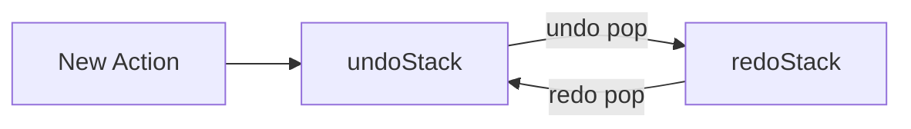

# 🗃️ Member 2 — Data Structure Specialist
**CSD201 — Undo/Redo Engine | Ước tính: ~10 giờ**

---

## 🎯 Trách nhiệm chính

Bạn là **nền tảng của toàn bộ project**. Nếu `Action` object của bạn thiếu thông tin, cả nhóm sẽ không undo/redo được đúng. File của bạn phải xong **sớm nhất** — Member 1 và 3 đều phụ thuộc vào bạn.

---

## 📁 Files bạn sở hữu

| File | Trách nhiệm |
|---|---|
| `Action.java` | **Bạn implement** |
| `ActionType.java` | **Bạn implement** |
| Stack behavior documentation | **Bạn viết** (cho report) |
| CT Analysis (Decomposition + Pattern Recognition) | **Bạn viết** (chuyển từ Member 4 sang) |

---

## ✅ Coding Checklist

### ActionType.java (đơn giản — làm trước)

- [ ] Khai báo enum `ActionType`
- [ ] Có 2 giá trị: `INSERT` và `DELETE`

### Action.java

- [ ] Field `type` — kiểu `ActionType`
- [ ] Field `content` — kiểu `String` (nội dung được insert hoặc bị delete)
- [ ] Field `position` — kiểu `int` (vị trí trong text buffer)
- [ ] Field `timestamp` — kiểu `LocalDateTime`
- [ ] Constructor nhận `(ActionType type, String content, int position)`
- [ ] Getter cho tất cả fields: `getType()`, `getContent()`, `getPosition()`, `getTimestamp()`
- [ ] Override `toString()` — output dễ đọc để debug và report

---

## 📌 Code Skeleton

### ActionType.java

```java
public enum ActionType {
    INSERT,
    DELETE
}
```

### Action.java

```java
import java.time.LocalDateTime;
import java.time.format.DateTimeFormatter;

public class Action {
    private ActionType type;
    private String content;
    private int position;
    private LocalDateTime timestamp;

    public Action(ActionType type, String content, int position) {
        this.type = type;
        this.content = content;
        this.position = position;
        this.timestamp = LocalDateTime.now();
    }

    public ActionType getType()      { return type; }
    public String getContent()       { return content; }
    public int getPosition()         { return position; }
    public LocalDateTime getTimestamp() { return timestamp; }

    @Override
    public String toString() {
        DateTimeFormatter fmt = DateTimeFormatter.ofPattern("HH:mm:ss");
        return type + "(\"" + content + "\", pos=" + position
               + ", time=" + timestamp.format(fmt) + ")";
    }
}
```

---

## ❓ Tại sao Action cần đủ 3 field: type + content + position?

> Đây là câu hỏi quan trọng trong report. Bạn cần hiểu và giải thích được.

### Trường hợp chỉ lưu `type`:
```
Action: INSERT
→ Undo: xóa gì? ở đâu? → KHÔNG BIẾT → BUG
```

### Trường hợp lưu đủ:
```
Action: INSERT, content="H", position=0
→ Undo: xóa "H" tại position 0 → CHÍNH XÁC
```

**Nguyên tắc:** Một Action phải tự chứa đủ thông tin để có thể **thực hiện ngược lại** mà không cần hỏi thêm bất kỳ thông tin nào.

---

## 🧪 Verify Stack LIFO behavior

Sau khi `Action.java` xong, bạn nên tự test nhanh logic LIFO bằng đoạn code đơn giản:

```java
import java.util.ArrayDeque;
import java.util.Deque;

public class StackTest {
    public static void main(String[] args) {
        Deque<Action> stack = new ArrayDeque<>();

        stack.push(new Action(ActionType.INSERT, "H", 0));
        stack.push(new Action(ActionType.INSERT, "e", 1));
        stack.push(new Action(ActionType.INSERT, "l", 2));

        System.out.println("Stack: " + stack);
        System.out.println("Pop: " + stack.pop()); // phải ra INSERT l
        System.out.println("Pop: " + stack.pop()); // phải ra INSERT e
        System.out.println("Stack còn: " + stack);
    }
}
```

**Kết quả đúng:**
```
Pop: INSERT("l", pos=2, time=...)   ← l là phần tử mới nhất → ra trước = LIFO
Pop: INSERT("e", pos=1, time=...)
```

---

## 📝 Report sections của bạn

### 1. Data Structure Design

- [ ] Giải thích tại sao chọn Stack (vì LIFO)
- [ ] Mô tả Two-Stack Model (undoStack + redoStack)
- [ ] Giải thích push/pop behavior cho 6 cases:
  - Perform INSERT
  - Perform DELETE
  - Undo INSERT
  - Undo DELETE
  - Redo INSERT
  - Redo DELETE
- [ ] Edge cases:
  - Undo khi stack rỗng
  - Redo khi stack rỗng
  - Redo sau action mới
  - Delete vị trí không hợp lệ
  - Max history limit (giải thích concept là đủ)

### 2. CT Analysis — Decomposition + Pattern Recognition (chuyển từ Member 4)

**Decomposition** — Chia nhỏ hệ thống thành:
- Text Buffer
- Action / Command object
- undoStack
- redoStack
- Engine Logic
- UI Layer

**Pattern Recognition** — Nhận ra 4 pattern:
- Pattern 1: LIFO → thao tác mới nhất undo trước
- Pattern 2: Redo chỉ có sau Undo
- Pattern 3: Action mới xóa redo history
- Pattern 4: INSERT và DELETE đối xứng nhau

---

## 🎨 Diagrams bạn phụ trách

### Stack State Diagram (Mermaid)

```mermaid
flowchart TD
    S0[Start<br/>Text: ""<br/>Undo: []<br/>Redo: []]
    S1[Type H<br/>Text: "H"<br/>Undo: [INSERT H]<br/>Redo: []]
    S2[Type e<br/>Text: "He"<br/>Undo: [INSERT H, INSERT e]<br/>Redo: []]
    S3[Undo<br/>Text: "H"<br/>Undo: [INSERT H]<br/>Redo: [INSERT e]]
    S4[Redo<br/>Text: "He"<br/>Undo: [INSERT H, INSERT e]<br/>Redo: []]

    S0 --> S1 --> S2 --> S3 --> S4
```

### Two-Stack Model Diagram



---

## 🗓️ Timeline của bạn

| Tuần | Việc cần làm | Output |
|---|---|---|
| Week 1 (ưu tiên cao) | Implement `Action.java` + `ActionType.java` | Files compile, Member 1 có thể dùng |
| Week 1 | Vẽ Stack State Diagram + Two-stack diagram | Mermaid diagrams |
| Week 2 | Verify LIFO bằng StackTest | Xác nhận output đúng |
| Week 2–3 | Viết Data Structure section + CT Analysis cho report | Report sections |

---

## 🤝 Dependency với team

| Bạn cần giao cho | Deadline |
|---|---|
| `Action.java` + `ActionType.java` → Member 1 và Member 3 | **Cuối Week 1** |

**Giao tiếp:** Confirm với Member 1 về `toString()` format sớm — format này ảnh hưởng đến cách `printStacks()` hiển thị.

---

*Xem thêm context đầy đủ tại: `01_Project_Overview.md`*
