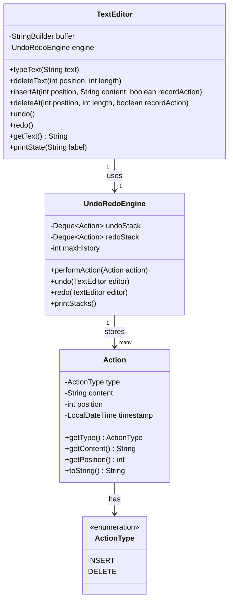

# 📝 Member 4 — Report Writer + Tester (Phiên bản nhẹ)
**CSD201 — Undo/Redo Engine | Ước tính: ~6–7 giờ**

> ⚠️ **Lưu ý:** File này đã được điều chỉnh phù hợp với bạn đang đi làm và có ít thời gian hơn. Phần CT Analysis đã được chuyển sang Member 2 thực hiện. Bạn chỉ cần tập trung vào các phần được đánh dấu dưới đây.

---

## 🎯 Trách nhiệm chính

Bạn đảm nhận **Introduction, Testing, Conclusion, và định dạng cuối** của report. Không cần code. Không cần diagram phức tạp. Chỉ cần hiểu đủ để viết report rõ ràng.

---

## 📁 Bạn phụ trách

| Việc | Thời gian ước tính |
|---|---|
| Viết Introduction | ~1h |
| Chuẩn bị bảng Test Cases | ~1.5h |
| Chạy test và ghi kết quả | ~1h |
| Viết Conclusion + Lessons Learned | ~1h |
| Format + References | ~1h |
| Class/Object Diagram (Mermaid) | ~1h |
| **Tổng** | **~6.5h** |

---

## ✅ Checklist của bạn

### 📄 Report — Introduction

- [ ] Giới thiệu bối cảnh: text editors hiện đại cần Undo/Redo
- [ ] Nêu bài toán: xây dựng engine mô phỏng Undo/Redo bằng Stack
- [ ] Nêu objectives của project (xem template bên dưới)

**Template Introduction:**
```
The purpose of this project is to simulate the Undo/Redo mechanism 
commonly found in text editors such as Microsoft Word and VS Code. 
The project focuses on using two stacks to manage editing history: 
one stack (undoStack) for actions that can be undone, and another 
stack (redoStack) for actions that can be redone.

The main objectives are:
1. Apply the Stack data structure to solve a real-world problem.
2. Implement Insert and Delete operations with full Undo/Redo support.
3. Design an Action object that stores enough information for reversal.
4. Demonstrate the solution through a console simulation.
```

---

### 🧪 Testing — Test Cases Table

> Bạn **không cần tự chạy code**. Sau khi Member 3 hoàn thành `Main.java` (cuối Week 2), bạn chạy chương trình và ghi kết quả vào bảng.

**Bảng test cases cần điền:**

| Test ID | Actions | Expected Result | Actual Result | Status |
|---|---|---|---|---|
| TC01 | Khởi động chương trình | Text rỗng, cả 2 stack rỗng | _(điền sau)_ | _(Pass/Fail)_ |
| TC02 | Type H, e, l, l, o | Text = "Hello", undoStack có 5 actions | _(điền sau)_ | |
| TC03 | Undo 1 lần (sau Hello) | Text = "Hell", redoStack có INSERT o | _(điền sau)_ | |
| TC04 | Undo 2 lần (sau Hello) | Text = "Hel", redoStack có 2 actions | _(điền sau)_ | |
| TC05 | Redo 1 lần | Text = "Hell", redoStack còn 1 action | _(điền sau)_ | |
| TC06 | Type "!" sau undo/redo | Text = "Hell!", redoStack bị clear | _(điền sau)_ | |
| TC07 | Undo khi stack rỗng | In "Nothing to undo", không crash | _(điền sau)_ | |
| TC08 | Redo khi stack rỗng | In "Nothing to redo", không crash | _(điền sau)_ | |
| TC09 | Delete 1 ký tự rồi undo | Ký tự được khôi phục | _(điền sau)_ | |
| TC10 | Delete ở vị trí không hợp lệ | In lỗi, text không thay đổi | _(điền sau)_ | |

**Cách điền:** Chạy `java Main`, copy output vào cột "Actual Result", so sánh với "Expected", điền Pass/Fail.

---

### 📄 Report — Conclusion + Lessons Learned

- [ ] Tóm tắt project đã làm được gì
- [ ] Khẳng định Stack phù hợp với Undo/Redo vì LIFO
- [ ] Nêu bài học của nhóm

**Template Conclusion:**
```
Through this project, our team learned how a simple data structure 
such as Stack can be used to implement a practical feature found in 
modern text editors. The two-stack model provides a clear and efficient 
way to manage undo and redo history.

Key lessons learned:
1. An Action object must store type, content, AND position to enable 
   correct reversal.
2. The redoStack must always be cleared when a new action is performed, 
   because the user has started a new editing path.
3. The recordAction flag prevents undo/redo from accidentally creating 
   new history entries.
4. Testing edge cases (empty stack, invalid position) is as important 
   as testing the happy path.
```

---

### 📄 Report — References

**Format:**
```
[1] Oracle Java Documentation. ArrayDeque Class. 
    https://docs.oracle.com/javase/8/docs/api/java/util/ArrayDeque.html

[2] CSD201 Lecture Notes. Stack Data Structure. FPT University.

[3] Mermaid.js Documentation. Flowchart and Class Diagram Syntax.
    https://mermaid.js.org
```

---

### 🎨 Class Diagram (Mermaid — bạn phụ trách format)

Dán đoạn diagram này vào report và kiểm tra render trong Obsidian:



---

## 🗓️ Timeline của bạn

| Tuần | Việc | Ghi chú |
|---|---|---|
| Week 1 | Viết draft Introduction | Có thể làm offline, không cần code |
| Week 2 | Chuẩn bị bảng test cases (Expected Result) | Dựa vào planning, không cần chạy code |
| Week 3 (đầu) | Chạy code → điền Actual Result vào bảng | Cần máy có Java |
| Week 3 (cuối) | Viết Conclusion + format report + References | |

---

## 💡 Tips cho bạn

1. **Không cần hiểu sâu code** — chỉ cần hiểu flow: User gõ → Action được lưu → Undo lấy ra làm ngược.
2. **Introduction và Conclusion** có thể viết ngay bây giờ mà không cần đợi code xong.
3. **Test cases** — Expected Result có thể điền ngay từ bây giờ dựa vào planning. Actual Result điền sau khi có code.
4. **Class Diagram** — chỉ cần copy Mermaid code ở trên và verify nó render đúng trong Obsidian.

---

## 🤝 Bạn cần từ team

| Cần từ | Việc |
|---|---|
| Member 3 | Báo khi `Main.java` chạy được → bạn mới chạy test |
| Member 1 | Confirm tên method chính xác để viết vào report |

---

*Xem thêm context đầy đủ tại: `01_Project_Overview.md`*
