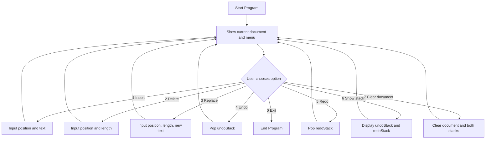
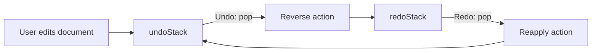

# Redo / Undo Engine of Text Editor

## 1. Muc tieu project

Project nay mo phong co che **Undo** va **Redo** trong cac trinh soan thao van ban nhu Word, VS Code hoac Notepad.

Nguoi dung co the:

- Them text vao van ban.
- Xoa mot doan text.
- Thay the mot doan text.
- Undo thao tac vua lam.
- Redo thao tac vua undo.
- Xem noi dung cua hai stack Undo va Redo.

Core data structure duoc su dung la **Stack**. Project dung hai stack rieng:

- `undoStack`: luu cac thao tac da thuc hien, de co the hoan tac.
- `redoStack`: luu cac thao tac vua bi undo, de co the lam lai.

## 2. Computational Thinking

### Step 1: Decomposition - Chia nho bai toan

Bai toan lon: mo phong Undo / Redo Engine.

Chia thanh cac phan nho:

1. Quan ly noi dung van ban.
2. Mo ta mot thao tac edit.
3. Luu lich su thao tac bang stack.
4. Xu ly Undo bang cach dao nguoc thao tac gan nhat.
5. Xu ly Redo bang cach thuc hien lai thao tac vua Undo.
6. Tao menu console de nguoi dung tuong tac.

### Step 2: Pattern Recognition - Nhan dien mau lap lai

Moi thao tac edit deu co cac thong tin chung:

- Loai thao tac: Insert, Delete, Replace.
- Vi tri bat dau.
- Text cu bi anh huong.
- Text moi duoc them vao.

Undo va Redo deu la qua trinh lay thao tac tren dinh stack:

- Undo: lay tu `undoStack`, dao nguoc thao tac, dua sang `redoStack`.
- Redo: lay tu `redoStack`, thuc hien lai thao tac, dua sang `undoStack`.

### Step 3: Abstraction - Truu tuong hoa

Thay vi viet rieng tung logic roi rac trong `main`, project tach thanh cac lop:

- `TextDocument`: chi quan ly noi dung text.
- `EditAction`: chi luu thong tin mot thao tac.
- `ActionType`: danh sach cac loai thao tac.
- `SimpleStack<T>`: stack tu cai dat.
- `UndoRedoEngine`: dieu phoi thao tac edit, undo va redo.
- `Main`: hien thi menu va nhan input tu nguoi dung.

### Step 4: Algorithm - Thiet ke thuat toan

#### Insert

1. Nhan vi tri va text can chen.
2. Kiem tra vi tri hop le.
3. Chen text vao document.
4. Tao `EditAction` voi:
   - type = `INSERT`
   - oldText = rong
   - newText = text vua chen
5. Push action vao `undoStack`.
6. Clear `redoStack`.

#### Delete

1. Nhan vi tri va do dai can xoa.
2. Kiem tra range hop le.
3. Lay text sap bi xoa va luu vao `oldText`.
4. Xoa text khoi document.
5. Tao `EditAction` voi:
   - type = `DELETE`
   - oldText = text vua bi xoa
   - newText = rong
6. Push action vao `undoStack`.
7. Clear `redoStack`.

#### Replace

1. Nhan vi tri, do dai can thay the va text moi.
2. Kiem tra range hop le.
3. Lay text sap bi thay the va luu vao `oldText`.
4. Thay the text cu bang text moi.
5. Tao `EditAction` voi:
   - type = `REPLACE`
   - oldText = text cu
   - newText = text moi
6. Push action vao `undoStack`.
7. Clear `redoStack`.

#### Undo

1. Neu `undoStack` rong, bao khong co thao tac de Undo.
2. Pop action gan nhat tu `undoStack`.
3. Dao nguoc action:
   - Undo Insert: xoa text vua chen.
   - Undo Delete: chen lai text vua xoa.
   - Undo Replace: thay text moi bang text cu.
4. Push action sang `redoStack`.

#### Redo

1. Neu `redoStack` rong, bao khong co thao tac de Redo.
2. Pop action gan nhat tu `redoStack`.
3. Thuc hien lai action:
   - Redo Insert: chen lai text.
   - Redo Delete: xoa lai text.
   - Redo Replace: thay text cu bang text moi.
4. Push action sang `undoStack`.

## 3. Cau truc folder

```text
TestUndoRedoEngine/
|-- doc.md
|-- src/
    |-- runtime/
    |   |-- Main.java
    |-- datastructure/
    |   |-- SimpleStack.java
    |-- model/
    |   |-- ActionType.java
    |   |-- EditAction.java
    |   |-- TextDocument.java
    |-- engine/
        |-- UndoRedoEngine.java
```

## 4. Diagram

### 4.1 Flow menu chinh



### 4.2 Mo hinh hai stack



## 5. Pseudocode

### 5.1 Main menu

```text
WHILE userChoice != 0
    show current document
    show menu
    read userChoice

    IF choice = 1
        input position, text
        engine.insert(position, text)
    ELSE IF choice = 2
        input position, length
        engine.delete(position, length)
    ELSE IF choice = 3
        input position, length, newText
        engine.replace(position, length, newText)
    ELSE IF choice = 4
        engine.undo()
    ELSE IF choice = 5
        engine.redo()
    ELSE IF choice = 6
        engine.showStacks()
    ELSE IF choice = 7
        engine.clearAll()
    ELSE IF choice = 0
        exit program
    ELSE
        show invalid option
END WHILE
```

### 5.2 Undo / Redo core

```text
FUNCTION undo()
    IF undoStack is empty
        return false

    action = undoStack.pop()
    reverseAction(action)
    redoStack.push(action)
    return true

FUNCTION redo()
    IF redoStack is empty
        return false

    action = redoStack.pop()
    applyAction(action)
    undoStack.push(action)
    return true
```

## 6. Vi du chay mau

Ban dau document rong:

```text
""
```

Nguoi dung insert `"Hello"` tai vi tri `0`:

```text
Document: "Hello"
undoStack: [INSERT Hello at 0]
redoStack: []
```

Nguoi dung insert `" World"` tai vi tri `5`:

```text
Document: "Hello World"
undoStack: [INSERT Hello at 0, INSERT World at 5]
redoStack: []
```

Nguoi dung Undo:

```text
Document: "Hello"
undoStack: [INSERT Hello at 0]
redoStack: [INSERT World at 5]
```

Nguoi dung Redo:

```text
Document: "Hello World"
undoStack: [INSERT Hello at 0, INSERT World at 5]
redoStack: []
```

## 7. Tieu chi hoan thanh

- Co tai lieu `doc.md` giai thich step-by-step bang Computational Thinking.
- Co menu console de demo truc tiep.
- Co tu cai dat Stack, khong chi dung san `java.util.Stack`.
- Undo va Redo dung hai stack rieng.
- Chuong trinh khong crash khi nguoi dung nhap vi tri hoac do dai khong hop le.
- Code ro rang, vua tam cho sinh vien hoc cau truc du lieu va giai thuat.
